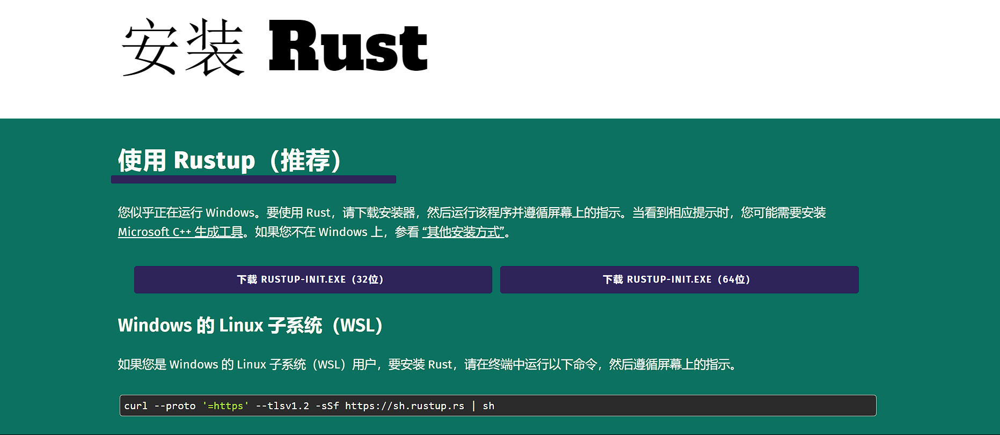
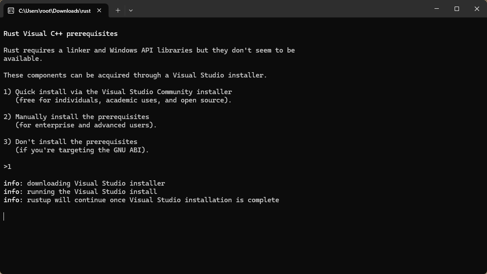
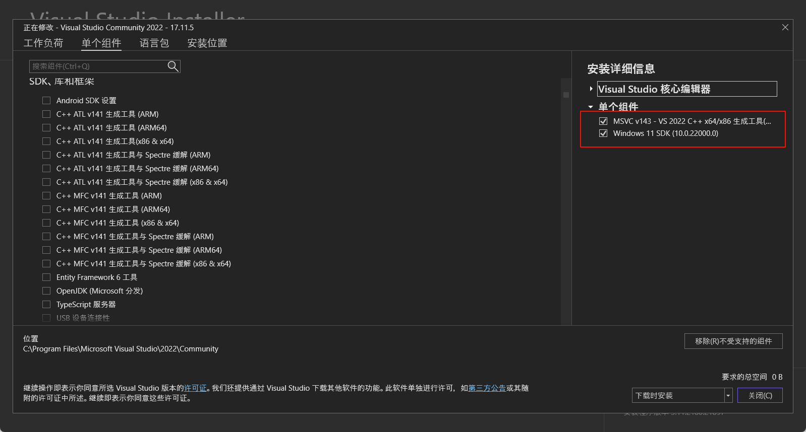
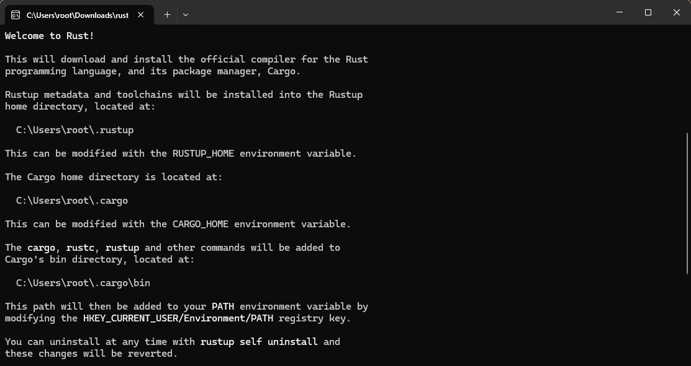
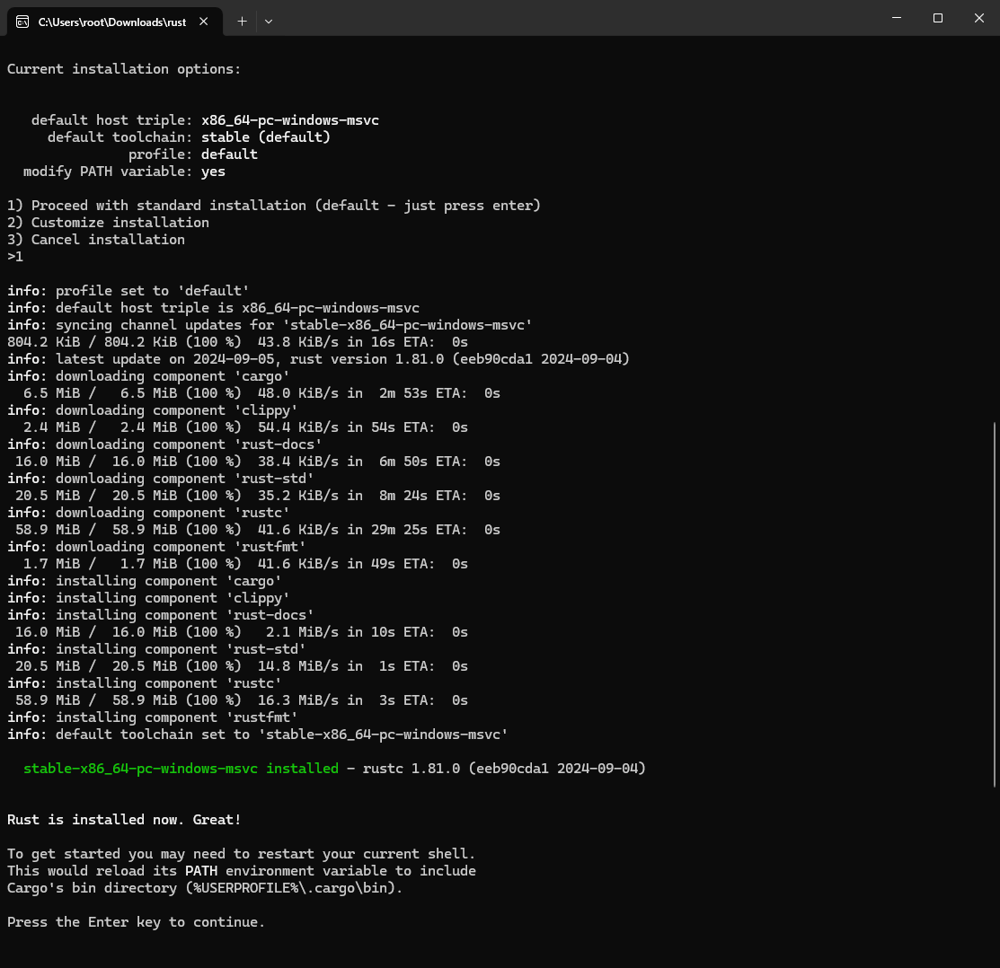

Windows 上安装 Rust 需要有 `C++` 环境，可以选择 GNU 和 MSVC。

::: info GNU 和 MSVC 

GNU 和 MSVC 都是编译器工具链，它们提供一套工具和库，这些工具和库被用来构建、链接和调试应用程序。

- GNU: 使用的是来自 MinGW 的工具（如 GCC 等），偏向于在 Windows 上构建与 Unix 类系统兼容的二进制文件。MinGW 模拟了大量 POSIX API，使得使用 GNU 工具链的 Rust 项目更适合那些需要 Unix 类兼容性的程序。
- MSVC: MSVC（Microsoft Visual C++）是 Microsoft 提供官方编译工具链，它是 Visual Studio IDE 的一部分。使用 MSVC 编译的 Rust 程序与 Windows 系统的集成更好，能够更容易地调用 Windows 的原生 API。

:::

> 这里选择 MSVC

在 rust 官网下载 [rustup-init](https://www.rust-lang.org/zh-CN/tools/install)

下载完成后运行`rustup-init.exe`, 会让你选择如何安装 MSVC

::: info 三个选项

1. 快速安装 Visual Studio 社区版

2. 手动安装所需依赖

   > 如果电脑上已经有了 Visual Studio, 可以在 Visual Studio Install 中手动安装
   >
   > 

3. 不安装依赖

   > 如果你不需要使用 Windows 的 C++ 工具链，而是打算使用 GNU ABI（如在 Windows 上使用 MinGW 或 WSL），可以选择此选项，不会安装额外的工具链和库。

:::

由于我电脑上没有 Visual Studio , 这里选择1。

安装完这些后，接下来会安装 Rust 相关内容，一路默认即可。

- **rustc**: Rust 的编译器，用于将 Rust 代码编译为可执行的机器代码。
- **cargo**: Rust 的包管理器和构建工具，用于管理依赖、编译项目、运行测试等。
- **Clippy**: 一个 Rust 的代码静态分析工具，用来提供代码风格和潜在错误的建议。
- **rustfmt**: Rust 的代码格式化工具。
- **rust-docs**: Rust 的文档工具。