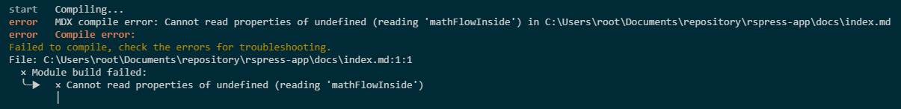
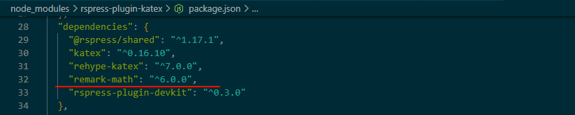

# LaTeX无法使用$$语法

## 现象

在使用 `rspress-plugin-katex` 插件时无法使用以下语法

```markdown
$$
 a \times b
$$
```

报错：`MDX compile error: Cannot read properties of undefined (reading 'mathFlowInside')`



## 原因

主要原因是`remark-math`的版本过高，移除了对`$$`语法的支持。



## 解决方法

### 方法 1：降低 remark-math 版本，重写插件

1. 手动安装低版本`remark-math`

   ```bash
   npm i remark-math@5
   ```

2. 复制[rspress-plugin-katex](https://github.com/linbudu599/rspress-plugins/blob/main/packages/rspress-plugin-katex/src/index.ts)源码

   ```ts title="plugin.ts"
   import { PresetConfigMutator } from 'rspress-plugin-devkit';

   import remarkMath, { Options as RemarkMathOptions } from 'remark-math';
   import rehypeKatex, { Options as RehypeKatexOptions } from 'rehype-katex';

   import type { RspressPlugin } from '@rspress/shared';

   export interface RspressPluginKatexOptions extends RemarkMathOptions, RehypeKatexOptions {}

   export function rspressPluginKatex(options: RspressPluginKatexOptions = {}): RspressPlugin{
   	const katexCss = require.resolve('katex/dist/katex.min.css');

   	return {
   		name: 'rspress-plugin-katex',
   		config(config, utils, isProd) {
   			return new PresetConfigMutator(config).disableMdxRs().toConfig();
   		},
   		globalStyles: katexCss,
   		markdown: {
   			remarkPlugins: [[remarkMath, options]],
   			// @ts-expect-error
   			rehypePlugins: [[rehypeKatex, options]]
   		}
   	};
   }
   ```

3. 导入组件

   ```ts title="rspress.config.ts"
   import { rspressPluginKatex } from './plugins.ts';
   
   export default defineConfig({
   	plugin: [rspressPluginKatex()]
   });
   ```

### 方法 2：更改语法

```markdown
$$
...
$$
```

更改为

````markdown
```math
...
```
````
