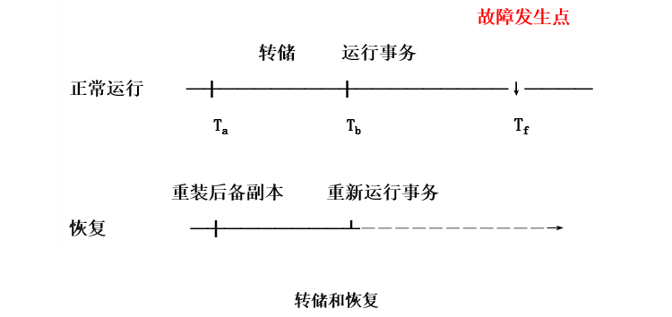
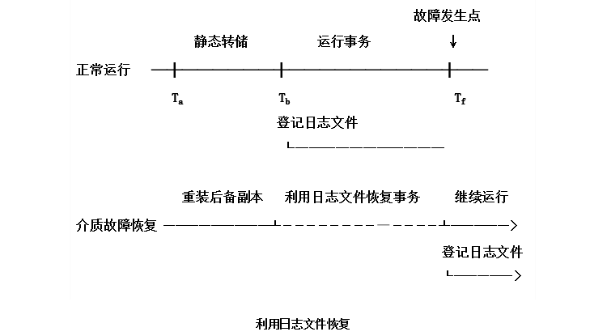
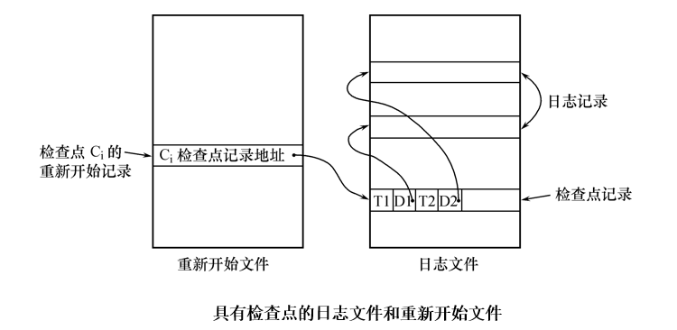

# 事务的基本概念

## 事务

事务(Transaction)是用户定义的一个数据库操作序列，这些操作要么全做，要么全不做，是一个不可分割的工作单位。

事务和程序是两个概念：在关系数据库中，一个事务可以是一条SQL语句，一组SQL语句或整个程序，一个程序通常包含多个事务。

事务是恢复和并发控制的基本单位。

## 事务的ACID特性

事务的ACID特性：

- 原子性（Atomicity）

  事务是数据库的逻辑工作单位，事务中包括的诸操作要么都做，要么都不做。

- 一致性（Consistency）

  事务执行的结果必须是使数据库从一个一致性状态变到另一个一致性状态。

  一致性状态：数据库中只包含成功事务提交的结果。

  不一致状态：数据库系统运行中发生故障，有些事务尚未完成就被迫中断。这些未完成事务对数据库所做的修改有一部分已写入物理数据库，这时数据库就处于一种不正确的状态。 

- 隔离性（Isolation）

  一个事务的执行不能被其他事务干扰，即一个事务内部的操作及使用的数据对其他并发事务是隔离的，并发执行的各个事务之间不能互相干扰。

- 持续性（Durability ）

  持续性也称**永久性**，一个事务一旦提交，它对数据库中数据的改变就应该是永久性的。接下来的其他操作或故障不应该对其执行结果有任何影响。

保证事务ACID特性是事务处理的任务。

破坏事务ACID特性的因素：

- 多个事务并行运行时，不同事务的操作交叉执行

  数据库管理系统必须保证多个事务的交叉运行不影响这些事务的隔离性

- 事务在运行过程中被强行停止

  数据库管理系统必须保证被强行终止的事务对数据库和其他事务没有任何影响 

# 数据库恢复概述

故障是不可避免的。

故障的影响：运行事务非正常中断，影响数据库中数据的正确性；破坏数据库，全部或部分丢失数据。

数据库管理系统必须具有把数据库从错误状态恢复到某一已知的正确状态(亦称为一致状态或完整状态)的功能，这就是数据库的恢复管理系统对故障的对策。

恢复子系统是数据库管理系统的一个重要组成部分。

恢复技术是衡量系统优劣的重要指标。

# 故障的种类

各类故障，对数据库的影响有两种可能性

1. 数据库本身被破坏；
2. 数据库没有被破坏，但数据可能不正确，这是由于事务的运行被非正常终止造成的；

## 事务内部的故障

事务内部的故障

- 有的是可以通过事务程序本身发现的；
- 有的是非预期的，不能由事务程序处理的； 

事务内部更多的故障是非预期的，是不能由应用程序处理的。例如，运算溢出，并发事务发生死锁而被选中撤销该事务，违反了某些完整性限制而被终止等。

以后，事务故障仅指这类非预期的故障。

事务故障意味着事务没有达到预期的终点，即数据库可能处于不正确状态。 

**事务撤消**（UNDO）：恢复程序在不影响其它事务运行的情况下，强行回滚出故障的事务，即撤销该事务已经作出的任何对数据库的修改，使得该事务象根本没有启动一样。

## 系统故障

系统故障称为**软故障**，是指造成系统停止运转的任何事件，使得系统要重新启动。 例如：特定类型的硬件错误（如CPU故障），操作系统故障，数据库管理系统代码错误，系统断电。

- 发生系统故障时，一些尚未完成的事务的结果可能已送入物理数据库，造成数据库可能处于不正确状态。 

  恢复策略：系统重新启动时，恢复程序让所有非正常终止的事务回滚，强行撤消（UNDO）所有未完成事务。

- 发生系统故障时，有些已完成的事务可能有一部分甚至全部留在缓冲区，尚未写回到磁盘上的物理数据库中，系统故障使得这些事务对数据库的修改部分或全部丢失

  恢复策略：系统重新启动时，恢复程序需要重做（REDO）所有已提交的事务。

## 介质故障

介质故障称为**硬故障**，指外存故障。例如：磁盘损坏，磁头碰撞，瞬时强磁场干扰。

介质故障破坏数据库或部分数据库，并影响正在存取这部分数据的所有事务。介质故障比前两类故障的可能性小得多，但破坏性大得多。

## 计算机病毒

一种人为的故障或破坏，是一些恶作剧者研制的一种计算机程序，可以繁殖和传播，造成对计算机系统包括数据库的危害。

计算机病毒是数据库系统的主要威胁。

数据库一旦被破坏仍要用恢复技术把数据库加以恢复。

# 恢复的实现技术

恢复操作的基本原理：**冗余**，即利用存储在系统别处的冗余数据来重建数据库中已被破坏或不正确的那部分数据。

一个大型数据库产品，恢复子系统的代码要占全部代码的10%以上。

恢复机制涉及的关键问题：

1. 如何建立冗余数据
2. 如何利用这些冗余数据实施数据库恢复

## 数据转储

**转储**是指数据库管理员定期地将整个数据库复制到磁带、磁盘或其他存储介质上保存起来的过程。

备用的数据文本称为**后备副本**(backup)或后援副本。

数据库遭到破坏后可以将后备副本重新装入，重装后备副本只能将数据库恢复到转储时的状态，要想恢复到故障发生时的状态，必须重新运行自转储以后的所有更新事务。

> 例：
>
> 
>
> 系统在$T_a$时刻停止运行事务，进行数据库转储，在$T_b$时刻转储完毕，得到$T_b$时刻的数据库一致性副本。
>
> 系统运行到$T_f$时刻发生故障。
>
> 为恢复数据库，首先由数据库管理员重装数据库后备副本，将数据库恢复至$T_b$时刻的状态重新运行自$T_b$～$T_f$时刻的所有更新事务，把数据库恢复到故障发生前的一致状态。

转储是十分耗费时间和资源的，不能频繁进行。

转储可以分为：

1. **静态转储**

   在系统中无运行事务时进行的转储操作。

   转储开始时数据库处于一致性状态，转储期间不允许对数据库的任何存取、修改活动，得到的一定是一个数据一致性的副本。

   转储必须等待正运行的用户事务结束，新的事务必须等转储结束。

   优点：实现简单

   缺点：降低了数据库的可用性

2. **动态转储**

   转储操作与用户事务并发进行，转储期间允许对数据库进行存取或修改。

   优点：不用等待正在运行的用户事务结束，不会影响新事务的运行

   缺点：不能保证副本中的数据正确有效

   利用动态转储得到的副本进行故障恢复，需要把动态转储期间各事务对数据库的修改活动登记下来，建立**日志文件**。后备副本加上日志文件就能把数据库恢复到某一时刻的正确状态。

转储还可以分为：

1. 海量转储：每次转储全部数据库
2. 增量转储：只转储上次转储后更新过的数据

海量转储与增量转储比较：从恢复角度看，使用海量转储得到的后备副本进行恢复往往更方便。
如果数据库很大，事务处理又十分频繁，则增量转储方式更实用更有效。

## 登记日志文件

日志文件是用来记录事务对数据库的更新操作的文件。

### 格式

日志文件的格式：

1. 以记录为单位的日志文件

   各个事务的开始标记，各个事务的结束标记，各个事务的所有更新操作均作为日志文件中的一个日志记录。

   每个日志记录的内容包括：

   - 事务标识（标明是哪个事务） 
   - 操作类型（插入、删除或修改）
   - 操作对象（记录ID、Block NO.）
   - 更新前数据的旧值（对插入操作而言，此项为空值）
   - 更新后数据的新值（对删除操作而言, 此项为空值）

2. 以数据块为单位的日志文件

   每条日志记录的内容包括：

   - 事务标识
   - 被更新的数据块

### 作用

用途：进行事务故障恢复，进行系统故障恢复，协助后备副本进行介质故障恢复。

具体作用：

- 事务故障恢复和系统故障恢复必须用日志文件。

- 在动态转储方式中必须建立日志文件，后备副本和日志文件结合起来才能有效地恢复数据库。

- 在静态转储方式中，也可以建立日志文件。

  当数据库毁坏后可重新装入后援副本把数据库恢复到转储结束时刻的正确状态。利用日志文件，把已完成的事务进行重做处理。对故障发生时尚未完成的事务进行撤销处理，不必重新运行那些已完成的事务程序就可把数据库恢复到故障前某一时刻的正确状态。

### 登记日志文件

为保证数据库是可恢复的，登记日志文件时必须遵循两条原则：

1. 登记的次序严格按并发事务执行的时间次序

2. 必须先写日志文件，后写数据库

   写日志文件操作：把表示这个修改的日志记录写到日志文件中；

   写数据库操作：把对数据的修改写到数据库中；

为什么要先写日志文件：因为写数据库和写日志文件是两个不同的操作，在这两个操作之间可能发生故障

- 如果先写了数据库修改，而在日志文件中没有登记下这个修改，则以后就无法恢复这个修改了。
- 如果先写日志，但没有修改数据库，按日志文件恢复时只不过是多执行一次不必要的UNDO操作，并不会影响数据库的正确性。

# 恢复策略

## 事务故障的恢复

事务故障：事务在运行至正常终止点前被终止。

恢复方法：由恢复子系统利用日志文件撤消此事务已对数据库进行的修改。

事务故障的恢复由系统自动完成，对用户是透明的，不需要用户干预。

恢复步骤：

1. 反向扫描文件日志（即从最后向前扫描日志文件），查找该事务的更新操作。
2. 对该事务的更新操作执行逆操作，即将日志记录中“更新前的值” 写入数据库。
3. 继续反向扫描日志文件，查找该事务的其他更新操作，并做同样处理。
4. 如此处理下去，直至读到此事务的开始标记，事务故障恢复就完成了。

## 系统故障的恢复

系统故障造成数据库不一致状态的原因：

- 未完成事务对数据库的更新可能已写入数据库
- 已提交事务对数据库的更新可能还留在缓冲区没来得及写入数据库

恢复方法：
1. 撤销故障发生时未完成的事务
2. 重做已完成的事务

系统故障的恢复由系统在重新启动时自动完成，不需要用户干预。

恢复步骤：

1. 正向扫描日志文件（即从头扫描日志文件）
2. 对撤销队列事务进行撤销处理
3. 对重做队列事务进行重做处理

## 介质故障的恢复

恢复方法是重装数据库，然后重做已完成的事务。

恢复步骤：

1. 装入最新的后备数据库副本(离故障发生时刻最近的转储副本) ，使数据库恢复到最近一次转储时的一致性状态。

   对于静态转储的数据库副本，装入后数据库即处于一致性状态。

   对于动态转储的数据库副本，还须同时装入转储时刻的日志文件副本，利用恢复系统故障的方法（即REDO+UNDO），才能将数据库恢复到一致性状态。

2. 装入有关的日志文件副本(转储结束时刻的日志文件副本) ，重做已完成的事务。

   首先扫描日志文件，找出故障发生时已提交的事务的标识，将其记入重做队列。

   然后正向扫描日志文件，对重做队列中的所有事务进行重做处理。即将日志记录中“更新后的值”写入数据库。

介质故障的恢复需要数据库管理员介入。

数据库管理员的工作：重装最近转储的数据库副本和有关的各日志文件副本，执行系统提供的恢复命令。

# 具有检查点的恢复技术

利用日志技术恢复数据库时，有两个问题：

1. 搜索整个日志将耗费大量的时间
2. 重做处理浪费了大量时间

为了解决这些问题，出现了具有检查点的恢复技术。

具有检查点的恢复技术：

- 在日志文件中增加检查点记录（checkpoint）

  内容包括：建立检查点时刻所有正在执行的事务清单，这些事务最近一个日志记录的地址。

- 增加重新开始文件

  内容包括：记录各个检查点记录在日志文件中的地址。

- 恢复子系统在登录日志文件期间动态地维护日志

动态维护日志文件的方法：周期性地建立检查点，保存数据库状态。

具体步骤是：

1. 将当前日志缓冲区中的所有日志记录写入磁盘的日志文件上
2. 在日志文件中写入一个检查点记录
3. 将当前数据缓冲区的所有数据记录写入磁盘的数据库中
4. 把检查点记录在日志文件中的地址写入一个重新开始文件

恢复子系统可以定期或不定期地建立检查点，保存数据库状态 

- 定期：按照预定的一个时间间隔，如每隔一小时建立一个检查点。
- 不定期：按照某种规则，如日志文件已写满一半建立一个检查点。

使用检查点方法可以改善恢复效率。

当事务T在一个检查点之前提交，T对数据库所做的修改已写入数据库。写入时间是在这个检查点建立之前或在这个检查点建立之时 。那么在进行恢复处理时，就没有必要对事务T执行重做操作。

> 
>
> - T1：在检查点之前提交
> - T2：在检查点之前开始执行，在检查点之后故障点之前提交
> - T3：在检查点之前开始执行，在故障点时还未完成
> - T4：在检查点之后开始执行，在故障点之前提交
> - T5：在检查点之后开始执行，在故障点时还未完成
>
> T3和T5在故障发生时还未完成，所以予以撤销。
>
> T2和T4在检查点之后才提交，它们对数据库所做的修改在故障发生时可能还在缓冲区中，尚未写入数据库，所以要重做。
>
> T1在检查点之前已提交，所以不必执行重做操作。

系统使用检查点方法进行恢复的步骤：

1.   从重新开始文件中找到最后一个检查点记录在日志文件中的地址，由该地址在日志文件中找到最后一个检查点记录。

2. 由该检查点记录得到检查点建立时刻所有正在执行的事务清单ACTIVE-LIST。

   建立两个事务队列：UNDO-LIST，REDO-LIST。把ACTIVE-LIST暂时放入UNDO-LIST队列，REDO-LIST队列暂为空。

3. 从检查点开始正向扫描日志文件，直到日志文件结束。

   如有新开始的事务$T_i$，把$T_i$暂时放入UNDO-LIST队列。

   如有提交的事务$T_j$，把$T_j$从UNDO-LIST队列移到REDO-LIST队列；直到日志文件结束。

4. 对UNDO-LIST中的每个事务执行UNDO操作，对REDO-LIST中的每个事务执行REDO操作。

# 数据库镜像

介质故障是对系统影响最为严重的一种故障，严重影响数据库的可用性。由于介质故障恢复比较费时，为了预防介质故障，数据库管理员必须周期性地转储数据库。

提高数据库可用性的解决方案：**数据库镜像**

- 数据库管理系统自动把整个数据库或其中的关键数据复制到另一个磁盘上
- 数据库管理系统自动保证镜像数据与主数据的一致性，每当主数据库更新时，数据库管理系统自动把更新后的数据复制过去。

出现介质故障时，可由镜像磁盘继续提供使用，同时数据库管理系统自动利用镜像磁盘数据进行数据库的恢复，不需要关闭系统和重装数据库副本。

没有出现故障时，可用于并发操作。一个用户对数据加排他锁修改数据，其他用户可以读镜像数据库上的数据，而不必等待该用户释放锁。

频繁地复制数据自然会降低系统运行效率，因此在实际应用中用户往往只选择对关键数据和日志文件镜像，而不是对整个数据库进行镜像。