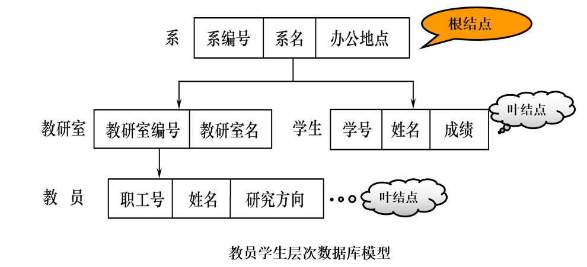
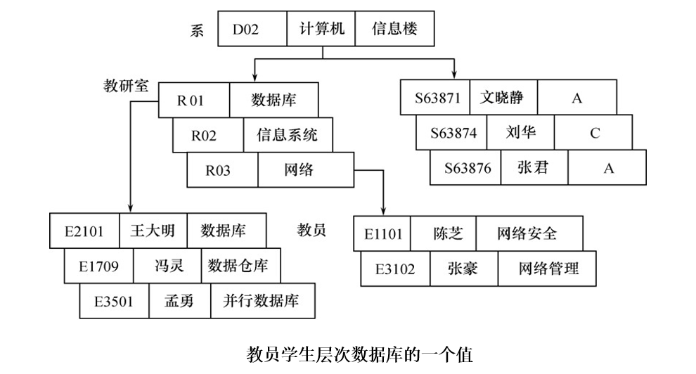
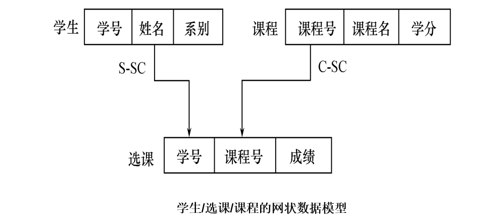
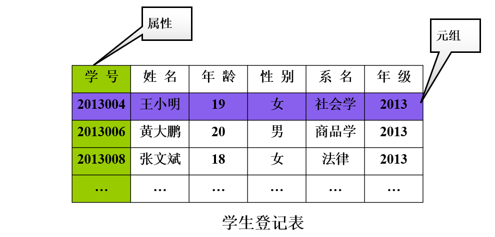
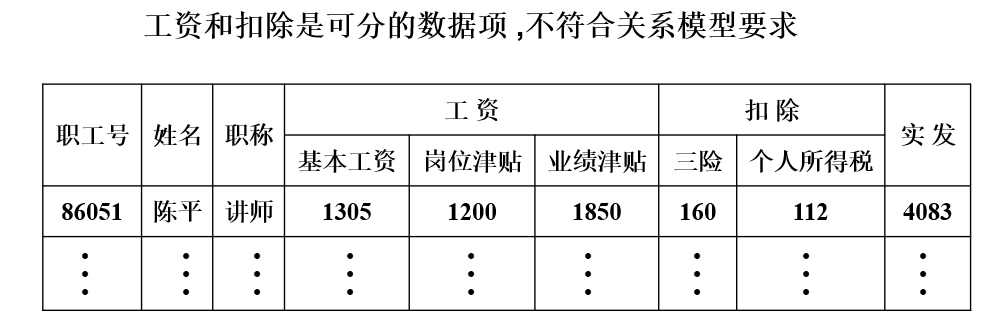
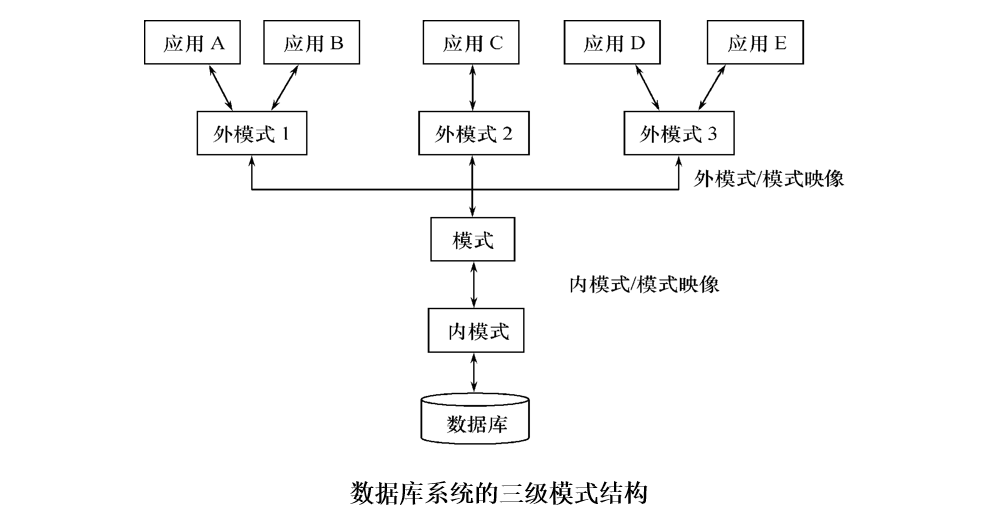

# 数据库系统概述

## 数据库的 4 个基本概念

1. **数据**（Data）

   数据是数据库中存储的**基本对象**。数据的含义称为数据的语义，数据与其语义是不可分的。

   定义：描述事物的符号记录。

   种类：数字、文字、图形、图像、音频、视频（可以经过数字化后存入计算机）。

   ***

2. **数据库**（Database，DB）

   数据库是长期储存在计算机内、有组织的、可共享的大量数据的集合。数据库具有**永久存储**、**有组织**、**可共享**三个特点。

   基本特征：

   - 数据按一定的数据模型组织、描述和储存
   - 可为各种用户共享
   - 冗余度较小
   - 数据独立性较高
   - 易扩展

   ***

3. **数据库管理系统**（DataBase Managerment System，DBMS）

   数据库管理系统是位于用户与操作系统之间的一层数据管理软件。与操作系统一样是计算机的基础软件，是一个大型复杂的软件系统。

   主要功能：

   1. 数据定义功能

      用户通过 DBMS 提供的**数据定义语言**（Data Definition Language，DDL）可以方便地对数据库中的**数据对象**进行定义。

   2. 数据组织、存储和管理

      DBMS 要分类组织、存储和管理各种数据。要确定组织数据的文件结构和存取方式，实现数据之间的联系。

      数据组织和存储的基本目标：

      - 提高存储空间利用率和方便存取
      - 提供多种存取方法提高存取效率

   3. 数据操纵功能

      用户通过 DBMS 提供的**数据操纵语言**（Data Manipulation Language，DML）操纵数据，实现对数据库的基本操作 （查询、插入、删除和修改等）。

   4. 数据库的事务管理和运行管理

      - 数据库在建立、运行和维护时由数据库管理系统统一管理和控制
      - 保证数据的安全性、完整性、多用户对数据的并发使用
      - 发生故障后的系统恢复

   5. 数据库的建立和维护功能

      - 数据库初始数据的装载和转换
      - 数据库转储、恢复功能
      - 数据库的重组织
      - 性能监视、分析等

   ***

4. **数据库系统**（Database System，DBS）

   数据库系统的构成：

   - 数据库

   - 数据库管理系统
   - 应用程序
   - 数据库管理员

   ***

## 数据管理技术的产生和发展

- 人工管理阶段

  20 世纪 50 年代中之前

  特点：

  1. 数据不保存
  2. 应用程序管理数据
  3. 数据不共享
  4. 数据不具有独立性

  缺点：数据的逻辑结构或物理结构发生变化后，必须对应用程序作相应的修改，数据完全依赖于应用程序，称之为数据缺乏独立性，加重了程序员的负担。

  ***

- 文件系统阶段

  20 世纪 50 年代末--60 年代中

  特点：

  1. 数据可以长期保存
  2. 有文件系统管理数据

  缺点：

  1. 数据共享性差，冗余度大
  2. 数据独立性差

  ***

- 数据库系统阶段

  20 世纪 60 年代末--现在

  特点：

  1. 数据结构化
  2. 数据的共享性高，冗余度低，易扩充
  3. 数据的独立性高
  4. 数据右 DBMS 统一管理和控制

  ***

|                |        人工管理阶段        |       文件系统阶段       |                      数据库系统阶段                      |
| :------------: | :------------------------: | :----------------------: | :------------------------------------------------------: |
|    应用背景    |          科学计算          |    科学计算、数据管理    |                      大规模数据管理                      |
|    硬件背景    |     无直接存取存储设备     |        磁盘、磁鼓        |                   大容量磁盘、磁盘阵列                   |
|    软件背景    |        没有操作系统        |        有文件系统        |                     有数据库管理系统                     |
|    处理方式    |           批处理           |   联机实时处理，批处理   |              联机实时处理、分布处理、批处理              |
|  数据的管理者  |       用户（程序员）       |         文件系统         |                      数据库管理系统                      |
| 数据面向的对象 |        某一应用程序        |         某一应用         |               现实世界（部门、企业、国家）               |
| 数据的共享程度 |     无共享，冗余度极大     |    共享性差，冗余度大    |                    共享性高，冗余度小                    |
|  数据的独立性  | 不独立，完全依赖于应用程序 |         独立性差         |          具有高度的物理独立性和一定的逻辑独立性          |
|  数据的结构化  |           无结构           | 记录内有结构，整体无结构 |                整体结构化，用数据模型描述                |
| 数据的控制能力 |      应用程序自己控制      |     应用程序自己控制     | 由据库管理系统提供数据安全性、完整性、并发控制和恢复能力 |

## 数据库系统的特点

1. 数据结构化

   整体数据的结构化是数据库的主要特征之一，也是数据库系统与文件系统的本质区别。

   整体结构化：

   - 不再仅仅针对某一个应用，而是面向全组织
   - 不仅数据内部结构化，整体是结构化的，数据之间具有联系
   - 数据记录可以变长
   - 数据的最小存取单位是**数据项**

2. 数据的共享性高，冗余度低且易扩充

   - 可以减少数据冗余，节约存储空间
   - 避免数据之间的不相容性与不一致性
   - 使系统易于扩充

3. 数据独立性高

   数据独立性是借助数据库管理数据的一个显著优点。

   数据独立性包括：

   - **物理独立性**：用户的应用程序与数据库中数据的物理存储是相互独立的。即当数据的物理存储改变了，应用程序不用改变。
   - **逻辑独立性**：用户的应用程序与数据库的逻辑结构是相互独立的。即数据的逻辑结构改变了，应用程序不用改变。

4. 数据由数据库管理系统统一管理和控制

   - 数据的安全性保护

     保护数据以防止不合法的使用造成的数据的泄密和破坏。

   - 数据的完整性检查

     保证数据的正确性、有效性和相容性。

   - 并发控制

     对多用户的并发操作加以控制和协调，防止相互干扰而得到错误的结果。

   - 数据库恢复

     将数据库从错误状态恢复到某一已知的正确状态。

# 数据模型

数据模型是对现实世界数据特征的抽象。通俗地讲数据模型就是现实世界的模拟。

数据模型是数据库系统的核心和基础。

 

数据模型应满足三方面要求：

1. 能比较真实地模拟现实世界
2. 容易为人所理解
3. 便于在计算机上实现

## 两类数据模型

根据模型应用的不同目的，数据模型分为两类（两个不同的层次）：

1. **概念模型**

   也称信息模型，它是按用户的观点来对数据和信息建模，主要用于数据库设计。

2. **逻辑模型**和**物理模型**

   - 逻辑模型主要包括网状模型、层次模型、关系模型、面向对象数据模型、对象关系数据模型、半结构化数据模型等。**按计算机系统的观点对数据建模，主要用于 DBMS 实现**。
   - 物理模型是对数据最底层的抽象，描述数据在系统内部的表示方式和存取方法，或在磁盘或磁带上的存储方式和存取方法，是**面向计算机系统的**。

## 概念模型

概念模型是现实世界到机器世界的一个中间层次，表现为：

1. 概念模型用于信息世界的建模
2. 现实世界到信息世界的第一层抽象
3. 数据库设计人员进行数据库设计的有力工具
4. 数据库设计人员和用户之间进行交流的语言

 

概念模型的基本要求：

1. 较强的语义表达能力
2. 能够方便直接地表达应用中的各种语义知识
3. 简单、清晰、易于用户理解

### 信息世界中的基本概念

- **实体**（Entity）

  **客观存在并可相互区别的事物**称为实体。可以是具体的人、事、物或抽象的概念。

- **属性**（Attribute）

  **实体所具有的某一特性**称为属性。一个实体可以由若干个属性来刻画。

- **码**（Key）

  **唯一标识实体的属性集**称为码。

- **域**（Domain）

  域是**一组具有相同数据类型的值的集合**。属性的取值范围来自某个域。

- **实体型**（Entity Type）

  **用实体名及其属性名集合来抽象和刻画同类实体**称为实体型。

- **实体集**（Entity Set）

  **同一类型实体的集合**称为实体集。

- **联系**（Relationship）

  现实世界中，事物内部以及事物之间的联系在信息世界中反映为**实体（型）内部的联系**和**实体（型）之间的联系**。

  - 实体内部的联系：通常指组成实体的各属性之间的联系。
  - 实体之间的联系：通常指不同实体集之间的联系。
    - 两个实体之间之间一对一、一对多和多对多的联系。
    - 两个以上的实体之间也存在一对一、一对多和多对多的联系。
    - 同一个实体集内的各实体之间也可以存在一对一、一对多和多对多的联系。

### 概念模型的表示方法

**实体-联系方法**（Entity-Relationship Approach），该方法用 E-R 图来描述概念模型。E-R 方法也被称为 E-R 模型。

E-R 图提供了表示是实体型、属性和联系的方法。

- 实体型：用矩形表示。
- 属性：用椭圆形表示。
- 联系：用菱形表示。

## 数据模型的组成要素

数据模型通常由**数据结构**、**数据操作**、**数据的完整性约束条件**三部分组成。

- 数据结构

  **描述数据库的组成对象，以及对象之间的联系。**

  数据结构是**对系统静态特性的描述**。描述的内容有两类：

  1. 与对象的类型、内容、性质有关；
  2. 与数据之间联系有关；

  ***

- 数据操作

  **对数据库中各种对象（型）的实例（值）允许执行的操作的集合，包括操作及有关的操作规则。**

  主要有**查询**和**更新**（包括插入、删除、修改）两大类操作。

  数据操作是**对系统动态特性的描述**。

  ***

- 数据的完整性约束条件

  **数据的完整性约束条件是一组完整性规则的集合**。

  完整性规则：给定的数据模型中数据及其联系所具有的制约和依存规则。

  ::: info 数据模型对完整性约束条件的定义

  - 反映和规定必须遵守的基本的通用的完整性约束条件。
  - 提供定义完整性约束条件的机制，以反映具体应用所涉及的数据必须遵守的特定的语义约束条件。

  :::

## 常用的数据模型

- 层次模型（Hierarchical Model）
- 网状模型（Network Model）
- 关系模型（Relational Model)）
- 面向对象数据模型（Object Oriented Data Model）
- 对象关系数据模型（Object Relational Data Model）
- 半结构化数据模型（SemistrutureData Model）

> 其中，层次模型和网状模型是非关系模型

### 层次模型

层次模型是数据库系统中最早出现的数据模型。层次模型用**树形结构**来表示各类实体以及实体间的联系，如行政机构和家族关系等。

- **层次模型的数据结构**

  满足：

  1. 有且只有一个结点没有双亲结点，这个结点称为根结点；

  2. 根以外的其它结点有且只有一个双亲结点；

  在层次模型中，每个结点表示一个记录类型，每个记录类型可包含若干个字段，记录类型之间的联系用结点之间的连线（有向边）表示。

  特点：

  - 只有一个双亲结点
  - 只能处理一对多的实体联系
  - 每个记录类型可以定义一个排序字段，也称为码字段
  - 任何记录值只有按其路径查看时，才能显出它的全部意义
  - 没有一个子女记录值能够脱离双亲记录值而独立存在

  

  

  

- **层次模型的数据操纵**

  主要有查询、插入、删除、更新。进行操作时要满足层次模型的完整性约束条件。

- **层次模型的完整性约束条件**

  - 无相应的双亲结点值就不能插入子女结点值
  - 删除双亲结点值时，删除相应的子女结点
  - 更新操作时，应更新所有相应记录，以保证数据的一致性

- **层次模型的优点**：

  1. 数据结构比较简单清晰
  2. 查询效率高，性能优于关系模型，不低于网状模型
  3. 提供了良好的完整性支持

- **层次模型的缺点**：

  1. 结点之间的多对多联系表示不自然
  2. 对插入和删除操作的限制多，应用程序的编写比较复杂
  3. 查询子女结点必须通过双亲结点
  4. 层次命令趋于程序化

---

### 网状模型

网状数据库系统采用网状模型作为数据的组织方式。网状模型是一种比层次模型更具普遍性的结构。

- **网状模型的数据结构**

  满足：

  1. 允许一个以上的结点无双亲；
  2. 一个结点可以有多于一个的双亲；

  网状模型的表示方法与层次数据模型相同。

  ::: info 网状模型与层次模型的区别

  - 网状模型允许多个结点没有双亲结点
  - 网状模型允许结点有多个双亲结点
  - 网状模型允许两个结点之间有多种联系（复合联系）
  - 网状模型可以更直接地描述现实世界
  - 层次模型实际上是网状模型的一个特例

  :::

  可以使用网状模型**间接表示多对多联系**，方法是将多对多联系直接分解成一对多联系。例如学生与课程之间是多对多联系。

  

- **网状模型的数据操纵与完整性约束**

  网状数据库系统对数据操纵加了一些限制，提供了一定的完整性约束。

  1. 支持记录码（码：唯一标识记录的数据项的集合）
  2. 一个联系中双亲记录与子女记录之间是一对多联系
  3. 支持双亲记录和子女记录之间某些约束条件

- **网状模型的优点**

  1. 能够更为直接地描述现实世界，如一个结点可以有多个双亲
  2. 具有良好的性能，存取效率较高

- **网状模型的缺点**

  1. 结构比较复杂，，不利于最终用户掌握
  2. 语言复杂，用户不容易使用
  3. 记录之间联系是通过存取路径实现的，用户必须了解系统结构的细节

---

### 关系模型

关系数据库系统采用关系模型作为数据的组织方式。

- **关系模型的数据结构**

  - **关系**（Relation）

    一个关系对应通常说的一张表。

  - **元组**（Tuple）

    表中的一行即为一个元组。

  - **属性**（Attribute）

    表中的一列即为一个属性，给每一个属性起一个名称即属性名。

  - **码**（Key）

    也称码键。表中的某个属性组，它可以唯一确定一个元组。

  - **域**（Domain）

    是一组具有相同数据类型的值的集合。属性的取值范围来自某个域。

  - **分量**

    元组中的一个属性值。

  - **关系模式**

    对关系的描述，一般表示为：关系名（属性 1，属性 2，…，属性 n），例如：学生（学号，姓名，年级）

    

    |  关系术语  |       一般表格的术语       |
    | :--------: | :------------------------: |
    |   关系名   |            表名            |
    |  关系模式  |     表头（表格的描述）     |
    |    关系    |       （一张）二维表       |
    |    元组    |          记录或行          |
    |    属性    |             列             |
    |   属性名   |            列名            |
    |   属性值   |            列值            |
    |    分量    |    一条记录中的一个列值    |
    | 非规范关系 | 表中有表（大表中嵌有小表） |

  关系必须是规范化的，即关系关系满足一定的规范条件。

  最基本的规范条件：关系的每一个分量必须是一个不可分的数据项，不允许表中还有表。

  

- **关系模型的数据操纵与完整性约束**

  关系模型的数据操作是集合操作，操作对象和操作结果都是关系。

  关系模型的数据操纵主要包括查询、插入、删除和更新数据。这些数据操作必须满足关系的完整性约束条件。

  关系的完整性约束条件包括：

  1. 实体完整性
  2. 参照完整性
  3. 用户定义的完整性

- **关系模型的优点**：

  1. 建立在严格的数学概念的基础上
  2. 概念单一
     - 实体和各类联系都用关系来表示
     - 对数据的检索结果也是关系
  3. 关系模型的存取路径对用户透明
     - 具有更高的数据独立性，更好的安全保密性
     - 简化了程序员的工作和数据库开发建立的工作

- **关系模型的缺点**：

  1. 查询效率往往不如格式化数据模型
  2. 为提高性能，必须对用户的查询请求进行优化，增加了开发数据库管理系统的难度

# 数据库系统的结构

- 从开发人员角度看，数据库系统通常采用**三级模式结构**，是数据库系统内部的系统结构。
- 从数据库最终用户角度看，数据库系统的结构分为：单用户结构、主从式结构、分布式结构、客户-服务器、浏览器-应用服务器／数据库服务器多层结构等。

## 数据库系统模式的概念

- **型**（Type）：对某一类数据的结构和属性的说明；
- **值**（Value）：是型的一个具体赋值；
- **模式**（Schema）：数据库中**全体数据的逻辑结构和特征的描述**，仅涉及型的描述，不涉及具体值。
- **实例**（Instance）：**模式的一个具体值**，同一个模式可以有很多实例，实例随数据库中的数据的更新而变动。

## 数据库系统的三级模式结构

数据库系统的三级模式结构是模式、外模式、内模式。

- **模式**

  模式也称**逻辑模式**，是数据库中**全体数据**的逻辑结构和特征的描述，是所有用户的公共数据视图。

  模式处于数据库系统模式结构的中间层，与数据的物理存储细节和硬件环境无关，与具体的应用程序、开发工具及高级程序设计语言无关。

  一个数据库只有一个模式。

  > 数据库模式是全局逻辑结构是数据库的中心与关键，独立于数据库的其他层次。设计数据库模式结构时应首先确定数据库的逻辑模式。

  ***

- **外模式**

  外模式也称子模式或**用户模式**，是数据库用户（包括程序员和最终用户）使用的**局部数据**的逻辑结构和特征的描述，是数据库用户的数据视图，是与某一应用有关的数据的逻辑表示。

  1. 外模式通常是模式的子集，一个数据库可以有多个外模式；
  2. 同一外模式也可以为某一用户的多个应用系统所使用，但一个应用只能使用一个外模式；

  > 数据库的外模式面向具体的应用程序，定义在逻辑模式之上，独立于存储模式和存储设备。当应用需求发生较大变化，相应外模式不能满足其视图要求时，该外模式就得做相应改动。

  ***

- **内模式**

  内模式也称**存储模式**，是数据物理结构和存储方式的描述，是数据在数据库内部的表示方式。

  一个数据库只有一个内模式。

  > 数据库的内模式依赖于它的全局逻辑结构，独立于数据库的用户视图（外模式），独立于具体的存储设备。它将全局逻辑结构中所定义的数据结构及其联系按照一定的物理存储策略进行组织，以达到较好的时间与空间效率。

## 数据库的二级映像功能与数据独立性

数据库系统的三级模式是对数据的三个抽象级别。

二级映象在数据库管理系统内部实现这三个抽象层次的联系和转换，分别是：

- **模式／内模式映像**

  模式／内模式映象定义了**数据全局逻辑结构与存储结构之间的对应关系**。

  映象定义通常**包含在模式描述中**。

  模式／内模式映象是唯一的。

- **外模式／模式映像**

  模式描述的是数据的全局逻辑结构，外模式描述的是数据的局部逻辑结构，同一个模式可以有任意多个外模式。

  对于每一个外模式，数据库系统都有一个外模式／模式映象，定义**外模式与模式之间的对应关系**。

  映象定义通常**包含在各自外模式的描述中**。

数据库的二级映像**保证了数据库外模式的稳定性**，从底层保证了应用程序的稳定性，除非应用需求本身发生变化，否则应用程序一般不需要修改。

# 数据库系统的组成

数据库系统一般由**数据库**、**数据库管理系统**（及其开发工具）、**应用程序**、**数据库管理员**构成。

- 硬件平台及数据库

  硬件资源的要求：

  1. 足够大的内存（放系统）
  2. 足够的大的磁盘或磁盘阵列等设备（放数据）
  3. 较高的通道能力（提高数据传送率）

- 软件

  数据库系统的软件主要包括：

  1. DBMS（数据库管理系统）
  2. 操作系统（支持 DBMS）
  3. 高级语言及编译系统（开发程序）
  4. 应用开发工具
  5. 数据库应用系统

- 人员

  主要包括：

  1. 数据库管理员

     职责：决定数据库中的信息内容和结构，决定数据库的存储结构和存取策略，定义数据的安全性要求和完整性约束条件，监控数据库的使用和运行，数据库的改进和重组。

  2. 系统分析员

     职责：负责应用系统的需求分析和规范说明，与用户及数据库管理员结合，确定系统的硬软件配置，参与数据库系统的概要设计。

  3. 数据库设计人员

     职责：参加用户需求调查和系统分析，确定数据库中的数据，设计数据库各级模式。

  4. 应用程序员

     职责：设计和编写应用系统的程序模块，进行调试和安装。

  5. 最终用户

     通过应用系统的用户接口使用数据库。

     
