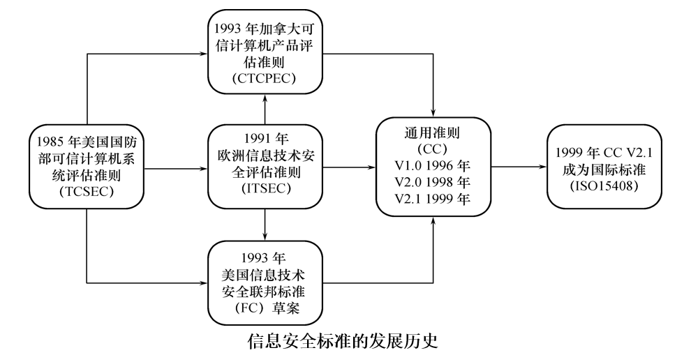
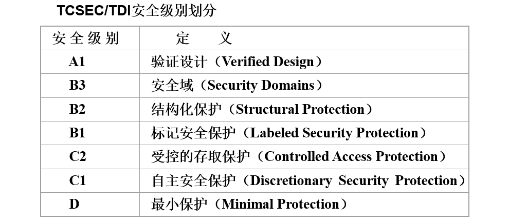
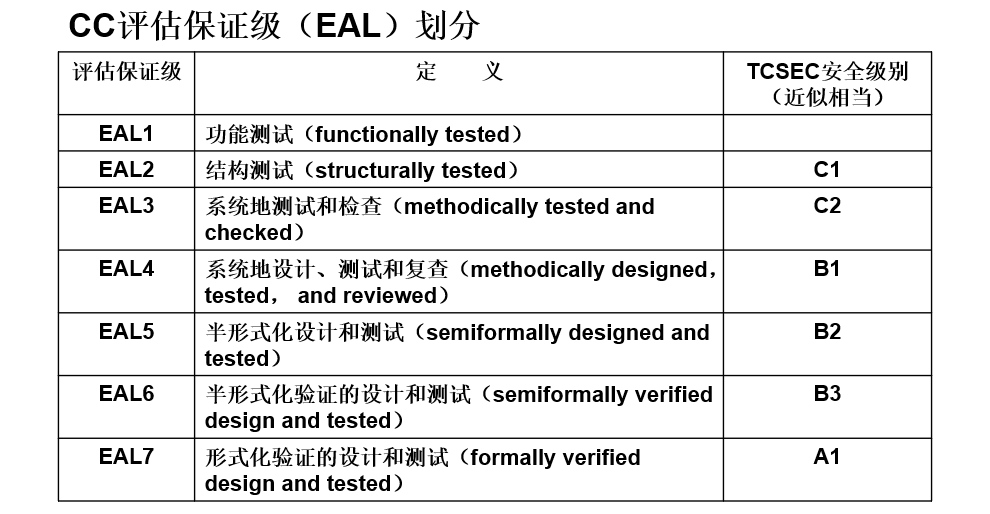
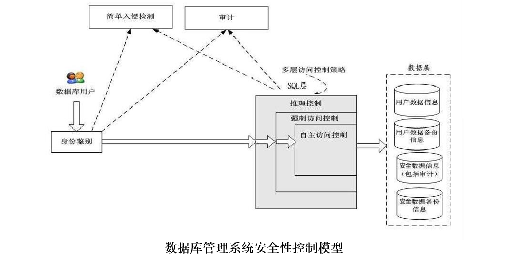
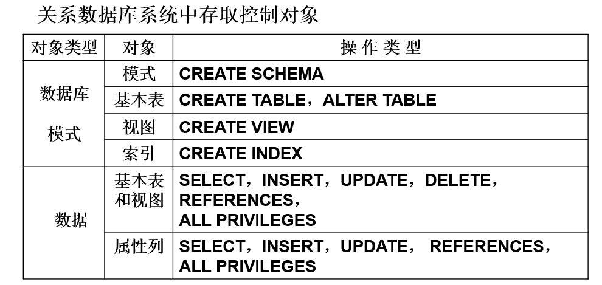
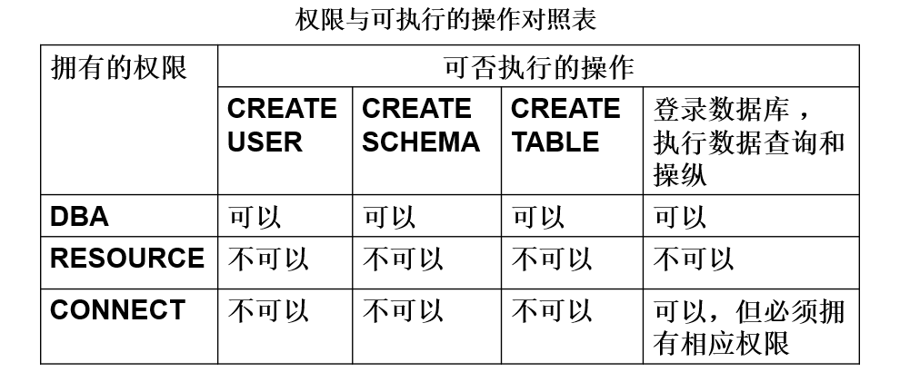
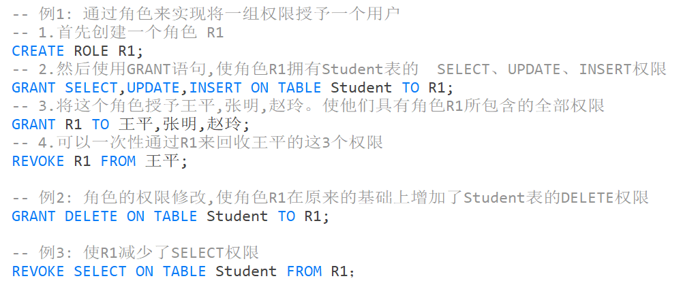

数据库的安全性是指保护数据库以防止不合法使用所造成的数据泄露、更改或破坏 。

系统安全保护措施是否有效是数据库系统主要的性能指标之一

# 数据库安全性概述

数据库的不安全因素：

- 非授权用户对数据库的恶意存取和破坏
- 数据库中重要或敏感的数据被泄露
- 安全环境的脆弱性

---

1985年美国国防部（DoD）正式颁布《DoD可信计算机系统评估准则》（简称**TCSEC**或DoD85）。ITSEC，CTCPEC，FC都是建立在TCSEC概念上的评估准则。

1993年，CTCPEC、FC、TCSEC和ITSEC联合行动，解决原标准中概念和技术上的差异，称为**CC**项目。目前CC已基本取代了TCSEC，成为评估信息产品安全性的主要标准。



1991年4月美国国家计算机安全中心颁布了《可信计算机系统评估标准关于可信数据库系统的解释》（Trusted Database Interpretation，**TDI**），它将TCSEC扩展到数据库管理系统。

TDI中定义了数据库管理系统的设计与实现中需满足和用以进行安全性级别评估的标准。

TCSEC/TDI，从四个方面来描述安全性级别划分的指标：安全策略、责任、保证、文档。



CC提出国际公认的表述信息技术安全性的结构，即把信息产品的安全要求分为

- 安全功能要求
- 安全保证要求

CC文本组成

- 简介和一般模型
- 安全功能要求
- 安全保证要求



# 数据库安全性控制

非法使用数据库的情况：

- 编写合法程序绕过数据库管理系统及其授权机制
- 直接或编写应用程序执行非授权操作
- 通过多次合法查询数据库从中推导出一些保密数据

计算机系统中，安全措施是一级一级层层设置

- 系统根据用户标识鉴定用户身份，合法用户才准许进入计算机系统
- 数据库管理系统还要进行存取控制，只允许用户执行合法操作
- 操作系统有自己的保护措施
- 数据以密码形式存储到数据库中


下图是数据库安全保护的一个存取控制流程

- 首先，数据库管理系统对提出SQL访问请求的数据库用户进行身份鉴别，防止不可信用户使用系统。
- 然后，在SQL处理层进行自主存取控制和强制存取控制，进一步可以进行推理控制。还可以对用户访问行为和系统关键操作进行审计，对异常用户行为进行简单入侵检测。



数据库安全性控制的常用方法：

- 用户标识和鉴定
- 存取控制
- 视图
- 审计
- 数据加密

## 用户标识和鉴定

用户身份鉴别是数据库管理系统提供的**最外层安全保护措施**。

每个用户在系统中都有一个**用户标识**，用户标识由**用户名**和**用户标识号**组成，用户标识号在系统整个生命周期内唯一。

常用的用户身份鉴别的方法：

1. 静态口令鉴别

   静态口令一般由用户自己设定，这些口令是静态不变的

2. 动态口令鉴别

   口令是动态变化的，每次鉴别时均需使用动态产生的新口令登录数据库管理系统，即采用一次一密的方法

3. 生物特征鉴别

   通过生物特征进行认证的技术，生物特征如指纹、虹膜和掌纹等

4. 智能卡鉴别

   智能卡是一种不可复制的硬件，内置集成电路的芯片，具有硬件加密功能

## 存取控制

存取控制机制组成：

- **定义用户权限**，并将用户权限登记到数据字典中

  用户对某一数据对象的操作权力称为权限。

  DBMS提供适当的语言来定义用户权限，存放在数据字典中，称做安全规则或授权规则。

- **合法权限检查**

  用户发出存取数据库操作请求，DBMS查找数据字典，进行合法权限检查。

用户权限定义和合法权检查机制一起组成了数据库管理系统的存取控制子系统。

常用存取控制方法：

- 自主存取控制（Discretionary Access Control，简称DAC）

  用户对不同的数据对象有不同的存取权限，不同的用户对同一对象也有不同的权限，用户还可将其拥有的存取权限转授给其他用户。

- 强制存取控制（Mandatory Access Control，简称MAC）

  每一个数据对象被标以一定的密级，每一个用户也被授予某一个级别的许可证。对于任意一个对象，只有具有合法许可证的用户才可以存取。

## 自主存取控制方法

通过SQL的`GRANT`语句和`REVOKE`语句实现。

用户权限是由**数据对象**和**操作类型**组成的，定义用户存取权限就是定义用户可以在哪些数据库对象上进行哪些类型的操作。

定义存取权限称为**授权**。



## 授权

### GRANT

将对指定操作对象的指定操作权限授予指定的用户。

格式：

```sql
GRANT <权限>[,<权限>]... 
			 ON <对象类型> <对象名>[,<对象类型> <对象名>]…
       TO <用户>[,<用户>]...
       [WITH GRANT OPTION];
```

发出GRANT：

- 数据库管理员
- 数据库对象创建者（即属主Owner）
- 拥有该权限的用户

按受权限的用户：

- 一个或多个具体用户
- PUBLIC（即全体用户）

如果指定了`WITH GRANT OPTION`子句，则获得权限的用户可以把获得的权限再授予其它用户；如果没有指定，则获得权限的用户只能使用，不能传播权限。

SQL标准不允许循环授权。


### REVOKE

授予的权限可以由数据库管理员或其他授权者用REVOKE语句收回。

格式：

```sql
REVOKE <权限>[,<权限>]... 
    ON <对象类型> <对象名>[,<对象类型><对象名>]…
    FROM <用户>[,<用户>]...[CASCADE | RESTRICT];
```

- **CASCADE（级联）：** 使用 `CASCADE` 意味着不仅会撤销指定的权限，还会撤销其他对象上的相关权限。比如，如果一个用户被授予对表的访问权限，而该表又被视图或其他对象所使用，使用 `CASCADE` 将会撤销对表和依赖对象的访问权限。
- **RESTRICT（限制）：** 相反，`RESTRICT` 确保只有在没有依赖对象依赖正在撤销的权限时才执行 `REVOKE` 操作。如果存在依赖对象，撤销将失败，以防止对可能影响这些依赖对象的权限进行意外移除。


数据库管理员：拥有所有对象的所有权限，可以根据实际情况不同的权限授予不同的用户。

用户：拥有自己建立的对象的全部的操作权限，可以使用GRANT把权限授予其他用户。

被授权的用户：如果具有“继续授权”的许可，可以把获得的权限再授予其他用户。所有授予出去的权力在必要时又都可用REVOKE语句收回。

### 创建数据库模式的权限

由数据库管理员在创建用户时实现。

格式：

```sql
CREATE USER <username> [WITH] [DBA|RESOURCE|CONNECT];
```

- 只有系统的超级用户才有权创建一个新的数据库用户；

- 新创建的数据库用户有三种权限：CONNECT、RESOURCE和DBA；

  - 如没有指定创建的新用户的权限，默认该用户拥有CONNECT权限。拥有CONNECT权限的用户不能创建新用户，不能创建模式，也不能创建基本表，只能登录数据库；
  - 拥有RESOURCE权限的用户能创建基本表和视图，成为所创建对象的属主。但不能创建模式，不能创建新的用户
  - 拥有DBA权限的用户是系统中的超级用户，可以创建新的用户、创建模式、创建基本表和视图等；DBA拥有对所有数据库对象的存取权限，还可以把这些权限授予一般用户

  

::: tip

CREATE USER不是SQL标准，各个系统的实现相差甚远。

:::

## 数据库角色

**数据库角色**是被命名的**一组与数据库操作相关的权限**，**角色是权限的集合**。

可以为一组具有相同权限的用户创建一个角色，使用角色可以简化授权的过程。

1. 角色的创建

   ```sql
   CREATE ROLE <角色名> 
   ```

2. 给角色授权

   ```sql
   GRANT <权限>[,<权限>]... ON <对象类型>对象名 TO <角色>[,<角色>]...
   ```

3. 将一个角色授予其他的角色或用户

   ```sql
   GRANT  <角色1>[,<角色2>]... TO <角色3>[,<用户1>]... [WITH ADMIN OPTION]
   ```

4. 角色权限的收回

   ```sql
   REVOKE <权限>[,<权限>]... ON <对象类型> <对象名> FROM <角色>[,<角色>]...
   ```



## 强制存取控制方法

强制存取控制是为了保证更高程度的安全性，适用于对数据有严格而固定密级分类的部门，如军事部门和政府部门等。

---

在强制存取控制中，数据库管理系统所管理的全部实体被分为

- **主体**

  系统中的活动实体

  例如：数据库管理系统所管理的实际用户，代表用户的各进程

- **客体**

  系统中的被动实体，受主体操纵

  例如：文件、基本表、索引、视图

---

对于主体和客体，DBMS为它们每个实例（值）指派一个**敏感度标记**。敏感度标记分成若干级别：

- 绝密（Top Secret，TS）
- 机密（Secret，S）
- 可信（Confidential，C）
- 公开（Public，P）

主体的敏感度标记称为许可证级别（Clearance Level）

客体的敏感度标记称为密级（Classification Level）

---

强制存取控制规则：

1. 仅当主体的许可证级别大于或等于客体的密级时，该主体才能读取相应的客体
2. 仅当主体的许可证级别小于或等于客体的密级时，该主体才能写相应的客体

强制存取控制是对数据本身进行密级标记，无论数据如何复制，标记与数据是一个不可分的整体，只有符合密级标记要求的用户才可以操纵数据。

较高安全性级别提供的安全保护要包含较低级别的所有保护，实现强制存取控制时要首先实现自主存取控制。

自主存取控制与强制存取控制共同构成数据库管理系统的安全机制。


先进行自主存取控制检查，通过自主存取控制检查的数据对象再由系统进行强制存取控制检查，只有通过强制存取控制检查的数据对象方可存取。

# 视图机制

通过视图机制把要保密的数据对无权存取这些数据的用户隐藏起来，对数据提供一定程度的安全保护。

视图机制间接地实现支持存取谓词的用户权限定义。


# 审计

审计功能把用户对数据库的**所有操作**自动记录下来放入**审计日志**中。审计员利用审计日志监控数据库中的各种行为，找出非法存取数据的人、时间和内容。

审计功能是**可选**的。

---

审计事件

- 服务器事件
  
  审计数据库服务器发生的事件。
  
- 系统权限
  
  对系统拥有的结构或模式对象进行操作的审计，要求该操作的权限是通过系统权限获得的。
  
- 语句事件
  
  对SQL语句，如DDL、DML、DQL及DCL语句的审计。
  
- 模式对象事件
  
  对特定模式对象上进行的SELECT或DML操作的审计。

---

审计功能

提供多种审计查阅方式，提供多套审计规则，提供审计分析和报表功能，提供审计日志管理功能，提供查询审计设置及审计记录信息的专门视图。

---

审计一般可以分为：

- 用户级审计

  任何用户可设置的审计，主要是用户针对自己创建的数据库表和视图进行审计。

- 系统级审计

  只能由数据库管理员设置，用来监测成功或失败的登录要求、监测授权和收回操作以及其他数据库级权限下的操作。

AUDIT语句：设置审计功能

NOAUDIT语句：取消审计功能


# 数据加密

数据加密是防止数据库中数据在存储和传输中失密的有效手段。

加密的基本思想：根据一定的算法将原始数据—明文变换为不可直接识别的格式­—密文。

加密方法：

- 存储加密

  - 透明存储加密

    内核级加密保护方式，对用户完全透明。

    将数据在写到磁盘时对数据进行加密，授权用户读取数据时再对其进行解密。数据库的应用程序不需要做任何修改，只需在创建表语句中说明需加密的字段即可。

    性能较好，安全完备性较高。

  - 非透明存储加密

    通过多个加密函数实现

- 传输加密

  - 链路加密

    在链路层进行加密，对传输信息的报文和报头均加密

  - 端到端加密

    在发送端加密，接收端解密。只加密报文不加密报头。所需密码设备数量相对较少，容易被非法监听者发现并从中获取敏感信息。


# 其他安全性保护

- 推理控制

  处理强制存取控制未解决的问题，可以避免用户利用能够访问的数据推知更高密级的数据。

  常用方法：基于函数依赖的推理控制，基于敏感关联的推理控制。

- 隐蔽信道

  处理强制存取控制未解决的问题。

- 数据隐私保护

  描述个人控制其不愿他人知道或他人不便知道的个人数据的能力。

  范围很广：数据收集、数据存储、数据处理和数据发布等各个阶段
