# 数据库设计概述

数据库设计：对于一个给定的应用环境，构造（设计）优化的数据库**逻辑模式**和**物理结构**，**并据此建立数据库及其应用系统**，使之能够有效地存储和管理数据，满足各种用户的应用需求，包括信息管理要求和数据操作要求。

信息管理要求：在数据库中应该存储和管理哪些数据对象。

数据操作要求：对数据对象需要进行哪些操作，如查询、增、删、改、统计等操作。 

数据库**设计的目标**：为用户和各种应用系统提供一个**信息基础设施**和高效率的**运行环境** 。

**高效率的运行环境**包括：

- 数据库数据的存取效率高
- 数据库存储空间的利用率高
- 数据库系统运行管理的效率高

## 数据库设计的特点

数据库建设的基本规律：

- **三分技术，七分管理，十二分基础数据** 
- 管理：数据库建设项目管理，企业（即应用部门）的业务管理 
- 基础数据数据的收集、整理、组织和不断更新

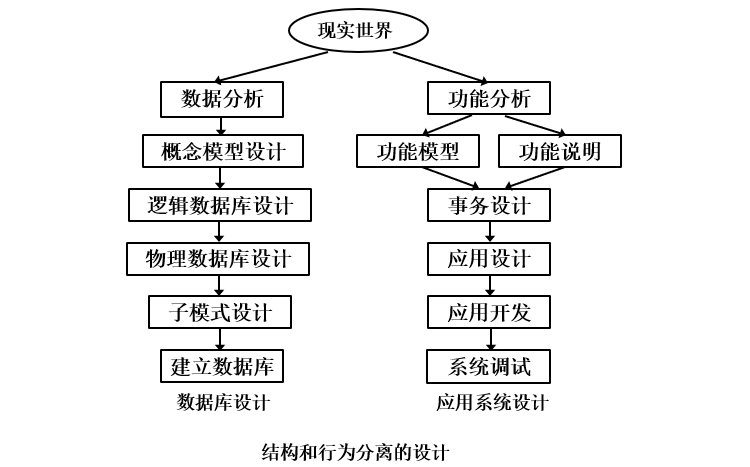

## 数据库设计方法

大型数据库设计是涉及多学科的综合性技术，又是一项庞大的工程项目。

它要求多方面的知识和技术。主要包括：

- 计算机的基础知识
- 软件工程的原理和方法
- 程序设计的方法和技巧
- 数据库的基本知识
- 数据库设计技术
- 应用领域的知识

早期主要采用**手工试凑法**，缺点是：

- 设计质量与设计人员的经验和水平有直接关系
- 缺乏科学理论和工程方法的支持，工程的质量难以保证
- 数据库运行一段时间后常常又不同程度地发现各种问题，增加了维护代价

现在采用的是规范设计法，基本思想是过程迭代和逐步求精。典型方法：

- 新奥尔良（New Orleans）方法
- 基于E-R模型的数据库设计方法
- 3NF（第三范式）的设计方法
- 面向对象的数据库设计方法
- 统一建模语言（UML）方法

## 数据库设计的基本步骤

数据库设计分**6个阶段**：

- 需求分析
- 概念结构设计
- 逻辑结构设计
- 物理结构设计
- 数据库实施
- 数据库运行和维护 

需求分析和概念设计独立于任何数据库管理系统 ，逻辑设计和物理设计与选用的数据库管理系统密切相关。

参加数据库设计的人员有：

- 系统分析人员和数据库设计人员

  自始至终参与数据库设计，其水平决定了数据库系统的质量。

- 数据库管理员和用户代表

  主要参加需求分析与数据库的运行和维护。

- 应用开发人员

  包括程序员和操作员，在实施阶段参与进来，分别负责编制程序和准备软硬件环境。

## 数据库设计过程中的各级模式

数据库设计不同阶段形成的数据库各级模式

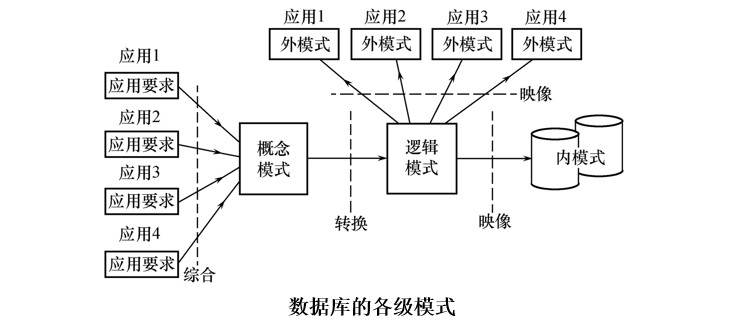

# 需求分析

## 需求分析的任务

需求分析就是**分析用户的要求**，是设计数据库的起点。

分析结果是否准确地反映了用户的实际要求，将直接影响到后面各个阶段的设计，并影响到设计结果是否合理和实用。

调查的重点是“数据”和“处理”，获得用户对数据库的要求，如：

1. 信息要求
2. 处理要求
3. 安全性与完整性要求

## 需求分析的方法

进行需求分析首先是调查清楚用户的实际需求并进行初步分析，与用户达成共识，分析与表达这些需求。

调查用户需求步骤：

1. 调查组织机构情况
2. 调查各部门的业务活动情况
3. 协助用户明确对新系统的各种要求，包括信息要求、处理要求、完全性与完整性要求
4. 确定新系统的边界

常用调查方法：

1. 跟班作业
2. 开调查会
3. 请专人介绍
4. 询问
5. 设计调查表请用户填写
6. 查阅记录

## 数据字典

数据字典是关于数据库中数据的描述，即元数据，不是数据本身。

数据字典在需求分析阶段建立，在数据库设计过程中不断修改、充实、完善。

数据字典是进行详细的数据收集和数据分析所获得的主要结果。

数据字典的内容：

- 数据项

  数据项是数据的最小组成单位，是不可再分的数据单位。若干个数据项可以组成一个数据结构。数据字典通过对数据项和数据结构的定义来描述数据流、数据存储的逻辑内容。

  数据项描述 ={数据项名,数据项含义说明,别名, 数据类型,长度,取值范围,取值含义, 与其他数据项的逻辑关系, 数据项之间的联系 }

- 数据结构

  数据结构反映了数据之间的组合关系。

  一个数据结构可以由若干个数据项组成，也可以由若干个数据结构组成，或由若干个数据项和数据结构混合组成。
  数据结构描述 = {数据结构名，含义说明，组成:{数据项或数据结构}}

- 数据流

  数据流是数据结构在系统内传输的路径。
  数据流描述 ={数据流名,说明,数据流来源,数据流去向,组成:{数据结构},平均流量,高峰期流量}

- 数据存储

  数据存储是数据结构停留或保存的地方，也是数据流的来源和去向之一。
  数据存储描述 ={数据存储名,说明,编号,输入的数据流,输出的数据流,组成 :{数据结构},数据量,
  存取频度,存取方式}

- 处理过程

  处理过程的具体处理逻辑一般用判定表或判定树来描述。数据字典中只需要描述处理过程的说明性信息。
  处理过程描述 ={处理过程名,说明,输入:{数据流},输出 :{数据流},处理:{简要说明}}

# 概念结构设计

## 概念模型

将需求分析得到的用户需求抽象为信息结构（即概念模型）的过程就是概念结构设计。

概念模型的特点：

1. 能真实、充分地反映现实世界，是现实世界的一个真实模型。
2. 易于理解，从而可以用它和不熟悉计算机的用户交换意见。
3. 易于更改，当应用环境和应用要求改变时，容易对概念模型修改和扩充。
4. 易于向关系、网状、层次等各种数据模型转换

描述概念模型的工具：E-R模型

## E-R模型

**联系的度**：参与联系的实体型的数目

- 2个实体型之间的联系度为2，也称为**二元联系**；
- 3个实体型之间的联系度为3，称为**三元联系**；
- N个实体型之间的联系度为N，也称为**N元联系**；

### 实体之间的联系

两个实体型之间的联系：

1. 一对一联系（1∶1）

   如果对于实体集A中的每一个实体，实体集B中至多有一个（也可以没有）实体与之联系，反之亦然，则称实体集A与实体集B具有一对一联系，记为1∶1。

   > 例如，学校里一个班级只有一个正班长，而一个班长只在一个班中任职，则班级与班长之间具有一对一联系。

2. 一对多联系（1∶n）

   如果对于实体集A中的每一个实体，实体集B中有n个实体（n≥0）与之联系，反之，对于实体集B中的每一个实体，实体集A中至多只有一个实体与之联系，则称实体集A与实体集B有一对多联系，记为1∶n。

   > 例如，一个班级中有若干名学生，而每个学生只在一个班级中学习，则班级与学生之间具有一对多联系。

3. 多对多联系（m∶n）

   如果对于实体集A中的每一个实体，实体集B中有n个实体（n≥0）与之联系，反之，对于实体集B中的每一个实体，实体集A中也有m个实体（m≥0）与之联系，则称实体集A与实体集B具有多对多联系，记为m∶n。

   > 例如，一门课程同时有若干个学生选修，而一个学生可以同时选修多门课程，则课程与学生之间具有多对多联系。

两个以上的实体型之间的联系：一般地，两个以上的实体型之间也存在着一对一、一对多、多对多联系。

> 例如：对于课程、教师与参考书3个实体型，如果一门课程可以有若干个教师讲授，使用若干本参考书，而每一个教师只讲授一门课程，每一本参考书只供一门课程使用，则课程与教师、参考书之间的联系是一对多的。
>
> 

单个实体型内的联系：同一个实体集内的各实体之间也可以存在一对一、一对多、多对多的联系。

> 例如，职工实体型内部具有领导与被领导的联系，即某一职工（干部）“领导”若干名职工，而一个职工仅被另外一个职工直接领导，因此这是一对多的联系。
>
> 

### E-R图

E-R图提供了表示实体型、属性和联系的方法：

- **实体型**：用**矩形**表示，矩形框内写明实体名。
- **属性**：用**椭圆形**表示，并用无向边将其与相应的实体型连接起来。
- **联系**：用**菱形**表示，菱形框内写明联系名，并用无向边分别与有关实体型连接起来，同时在无向边旁标上联系的类型（1∶1，1∶n或m∶n）。联系可以具有属性。

> 例如，学生实体具有学号、姓名、性别、出生年份、系、入学时间等属性，用E-R图表示如图所示。
>
> 

> 例如：用供应量来描述联系供应的属性，表示某供应商供应了多少数量的零件给某个数目。
>
> 

### 一个实例

某个工厂物资管理的概念模型。物资管理涉及的实体有：

- 仓库：属性有仓库号、面积、电话号码
- 零件：属性有零件号、名称、规格、单价、描述
- 供应商：属性有供应商号、姓名、地址、电话号码、账号
- 项目：属性有项目号、预算、开工日期
- 职工：属性有职工号、姓名、年龄、职称

这些实体之间的联系如下： 

1. 一个仓库可以存放多种零件，一种零件可以存放在多个仓库中，因此仓库和零件具有多对多的联系。用库存量来表示某种零件在某个仓库中的数量。
2. 一个仓库有多个职工当仓库保管员，一个职工只能在一个仓库工作，因此仓库和职工之间是一对多的联系。
3. 职工之间具有领导与被领导关系。即仓库主任领导若干保管员，因此职工实体型中具有一对多的联系。
4. 供应商、项目和零件三者之间具有多对多的联系。即一个供应商可以供给若干项目多种零件，每个项目可以使用不同供应商供应的零件，每种零件可由不同供应商供给。

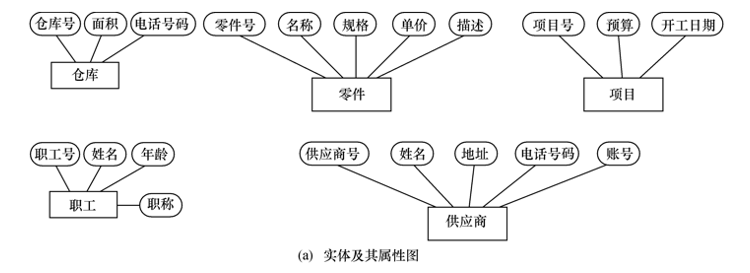

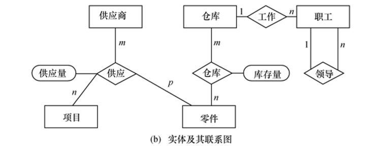

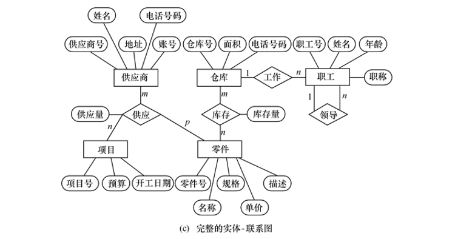

## 概念结构设计

### 实体与属性的划分原则

为了简化E-R图的处置，现实世界的事物能作为属性对待的，尽量作为属性对待。

事物作为属性的两条准则：

1. 作为属性，不能再具有需要描述的性质。属性必须是不可分的数据项，不能包含其他属性。
2. 属性不能与其他实体具有联系，即E-R图中所表示的联系是实体之间的联系。

> 例1：
>
> 职工是一个实体，职工号、姓名、年龄是职工的属性。
>
> 如果职称没有与工资、福利挂钩，根据准则1可以作为职工实体的属性。如果不同的职称有不同的工资、住房标准和不同的附加福利，则职称作为一个实体更恰当。
>
> 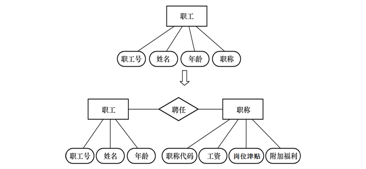
>
> ---
>
> 例2：
>
> 在医院中，一个病人只能住在一个病房，病房号可以作为病人实体的一个属性；如果病房还要与医生实体发生联系，即一个医生负责几个病房的病人的医疗工作，则根据准则2病房应作为一个实体。
>
> 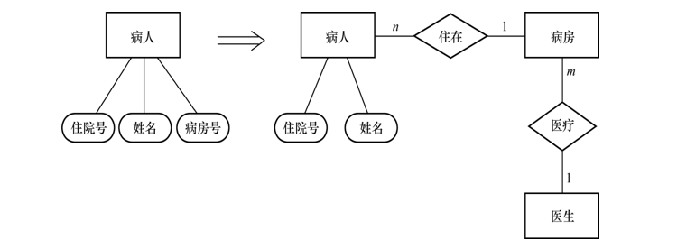
>
> ---
>
> 例3：
>
> 如果一种货物只存放在一个仓库，那么就可以把存放货物的仓库的仓库号作为描述货物存放地点的属性。
> 如果一种货物可以存放在多个仓库中，或者仓库本身又用面积作为属性，或者仓库与职工发生管理上的联系，那么就应把仓库作为一个实体。
>
> 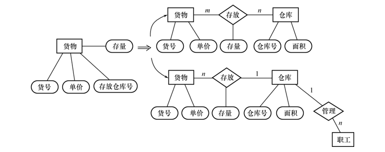
>
> ---
>
> 例4：
>
> 销售管理子系统E-R图的设计。该子系统的主要功能是：处理顾客和销售员送来的订单；工厂是根据订货安排生产的；交出货物同时开出发票；收到顾客付款后，根据发票存根和信贷情况进行应收款处理。
>
> 参照需求分析和数据字典中的详尽描述，遵循前面给出的两个准则，进行了如下调整：
>
> 1. 每张订单由订单号、若干头信息和订单细节组成。订单细节又有订货的零件号、数量等来描述。按照准则2，订单细节就不能作订单的属性处理而应该上升为实体。一张订单可以订若干产品，所以订单与订单细节两个实体之间是1∶ n的联系。
>
>    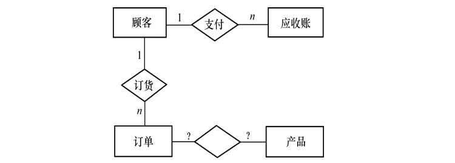
>
> 2. 原订单和产品的联系实际上是订单细节和产品的联系。每条订货细节对应一个产品描述，订单处理时从中获得当前单价、产品重量等信息。
>
> 3. 工厂对大宗订货给予优惠。每种产品都规定了不同订货数量的折扣，应增加一个“折扣规则”实体存放这些信息，而不应把它们放在产品实体中。
>
> 最后得到销售管理子系统E-R图如图所示。
>
> 
>
> 对每个实体定义的属性如下：
>
> 顾客：{顾客号，顾客名，地址，电话，信贷状况，账目余额}
>
> 订单：{订单号，顾客号，订货项数，订货日期，交货日期，工种号，生产地点}
>
> 订单细则：{订单号，细则号，零件号，订货数，金额}
>
> 应收账款：{顾客号，订单号，发票号，应收金额，支付日期，支付金额，当前余额，货款限额}
>
> 产品：{产品号，产品名，单价，重量}
>
> 折扣规则：{产品号，订货量，折扣}

### E-R图的集成

由上图可知，E-R图的集成一般需要分两步：

#### 合并

解决各分E-R图之间的冲突，将分E-R图合并起来生成初步E-R图。

各个局部应用所面向的问题不同，各个子系统的E-R图之间必定会存在许多不一致的地方，称之为冲突。

子系统E-R图之间的冲突主要有三类：

1. **属性冲突**

   - 属性域冲突，即属性值的类型、取值范围或取值集合不同。

     > 例如零件号，有的部门把它定义为整数，有的部门把它定义为字符型。年龄，某些部门以出生日期形式表示职工的年龄，而另一些部门用整数表示职工的年龄。

   - 属性取值单位冲突。

     > 例如，零件的重量有的以公斤为单位，有的以斤为单位，有的以克为单位。

2. **命名冲突**

   - 同名异义，即不同意义的对象在不同的局部应用中具有相同的名字。

   - 异名同义（一义多名），即同一意义的对象在不同的局部应用中具有不同的名字。

     > 如对科研项目，财务科称为项目，科研处称为课题，生产管理处称为工程。

   - 命名冲突
     可能发生在实体、联系一级上，也可能发生在属性一级上。需要通过讨论、协商等行政手段加以解决。

3. **结构冲突**

   - 同一对象在不同应用中具有不同的抽象。

     > 例如，职工在某一局部应用中被当作实体，而在另一局部应用中则被当作属性。

     解决方法：把属性变换为实体或把实体变换为属性，使同一对象具有相同的抽象。

   - 同一实体在不同子系统的E-R图中所包含的属性个数和属性排列次序不完全相同。

     解决方法：使该实体的属性取各子系统的E-R图中属性的并集，再适当调整属性的次序。

   - 实体间的联系在不同的E-R图中为不同的类型。

     > 例如，实体E1与E2在一个E-R图中是多对多联系，在另一个E-R图中是一对多联系

     解决方法是根据应用的语义对实体联系的类型进行综合或调整。

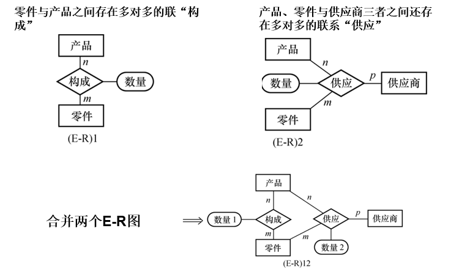

#### 修改和重构

由于合并生成的初步E-R图可能存在**冗余的数据**和**冗余的联系**，因此需要消除不必要的冗余，生成基本E-R图。

- 冗余的数据：可由基本数据导出的数据
- 冗余的联系：可由其他联系导出的联系。

消除冗余主要采用**分析方法**，即以数据字典和数据流图为依据，根据数据字典中关于数据项之间逻辑关系的说明来消除冗余。

> 

::: tip

并不是所有的冗余数据与冗余联系都必须加以消除，有时为了提高效率，不得不以冗余信息作为代价。

:::

除了分析方法外，还可以用**规范化理论**来消除冗余。

1. 确定分E-R图实体之间的数据依赖。

   实体之间一对一、一对多、多对多的联系可以用实体码之间的函数依赖来表示。于是有函数依赖集$F_L$。

   > 如下图中：部门和职工之间一对多的联系可表示为职工号→部门号 职工和产品之间多对多的联系可表示为（职工号，产品号）→工作天数等。
   >
   > 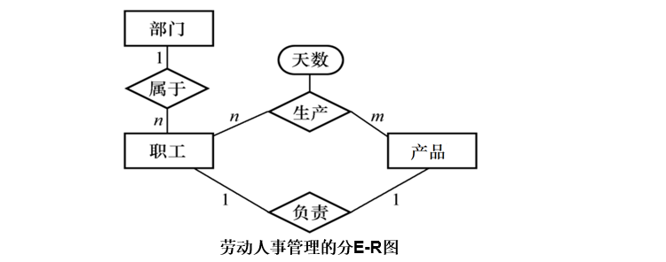

2. 求$F_L$的最小覆盖$G_L$，差集为 $D=F_L-G_L$。

   逐一考察D中的函数依赖，确定是否是冗余的联系，若是，就把它去掉。

   由于规范化理论受到泛关系假设的限制，应注意下面两个问题：

   - 冗余的联系一定在D中，而D中的联系不一定是冗余的。
   - 当实体之间存在多种联系时，要将实体之间的联系在形式上加以区分。

# 逻辑结构设计

逻辑结构设计的任务是把概念结构设计阶段设计好的基本E-R图转换为与选用数据库管理系统产品所支持的数据模型相符合的逻辑结构。

## E-R图向关系模型的转换

E-R图由实体型、实体的属性和实体型之间的联系三个要素组成。

关系模型的逻辑结构是一组关系模式的集合。

将E-R图转换为关系模型实际上就是将实体型、实体的属性和实体型之间的联系转化为关系模式。

转换原则：
  1. 一个实体型转换为一个关系模式

关系的属性：实体的属性；关系的码：实体的码。

  2. 实体型间的联系有以下不同情况

  - 一个1 : 1联系可以转换为一个独立的关系模式，也可以与任意一端对应的关系模式合并。

    - 转换为一个独立的关系模式：

      关系的属性：与该联系相连的各实体的码以及联系本身的属性；

      关系的候选码：每个实体的码均是该关系的候选码；

    - 与某一端实体对应的关系模式合并

      合并后关系的属性：加入对应关系的码和联系本身的属性；

      合并后关系的码：不变；

  - 一个1 : n联系可以转换为一个独立的关系模式，也可以与n端对应的关系模式合并。

    - 转换为一个独立的关系模式

      关系的属性：与该联系相连的各实体的码以及联系本身的属性；

      关系的码：n端实体的码；

    - 与n端对应的关系模式合并

      合并后关系的属性：在n端关系中加入1端关系的码和联系本身的属性；

      合并后关系的码：不变；

      可以减少系统中的关系个数，一般情况下更倾向于采用这种方法；

  - 一个m : n联系转换为一个关系模式

    关系的属性：与该联系相连的各实体的码以及联系本身的属性；

    关系的码：各实体码的组合；

  - 三个或三个以上实体间的一个多元联系转换为一个关系模式。

    关系的属性：与该多元联系相连的各实体的码以及联系本身的属性；

    关系的码：各实体码的组合；

  - 具有相同码的关系模式可合并

    目的：减少系统中的关系个数

    合并方法：

    - 将其中一个关系模式的全部属性加入到另一个关系模式中
    -  然后去掉其中的同义属性（可能同名也可能不同名）
    - 适当调整属性的次序

## 数据模型的优化

一般的数据模型还需要向特定数据库管理系统规定的模型进行转换。转换的主要依据是所选用的数据库管理系统的功能及限制。没有通用规则。

对于关系模型来说，这种转换通常都比较简单。

**数据库逻辑设计的结果不是唯一的**。

得到初步数据模型后，还应该适当地修改、调整数据模型的结构，以进一步提高数据库应用系统的性能，这就是数据模型的优化。

关系数据模型的优化通常以规范化理论为指导。

优化数据模型的方法:

1. 确定数据依赖

2. 对于各个关系模式之间的数据依赖进行极小化处理，消除冗余的联系。

3. 按照数据依赖的理论对关系模式进行分析，考察是否存在部分函数依赖、传递函数依赖、多值依赖等，确定各关系模式分别属于第几范式。

4. 按照需求分析阶段得到的各种应用对数据处理的要求，分析对于这样的应用环境这些模式是否合适，确定是否要对它们进行合并或分解。

   **并不是规范化程度越高的关系就越优**。当查询经常涉及两个或多个关系模式的属性时，系统必须经常地进行连接运算，连接运算的代价是相当高的。因此在这种情况下，第二范式甚至第一范式也许是适合的。

   非BCNF的关系模式虽然会存在不同程度的更新异常，但如果在实际应用中对此关系模式只是查询，并不执行更新操作，就不会产生实际影响。

   对于一个具体应用来说，到底规范化进行到什么程度，需要权衡响应时间和潜在问题两者的利弊才能决定

5. 对关系模式进行必要分解，提高数据操作效率和存储空间的利用率。

   常用分解方法：

   - 水平分解
     把(基本)关系的元组分为若干子集合，定义每个子集合为一个子关系，以提高系统的效率。

   - 垂直分解
     把关系模式R的属性分解为若干子集合，形成若干子关系模式。

     可以提高某些事务的效率，但可能使另一些事务不得不执行连接操作，降低了效率。

## 设计用户子模式

定义数据库模式主要是从系统的时间效率、空间效率、易维护等角度出发。

定义用户外模式时应该更注重考虑用户的习惯与方便。包括三个方面：

1. 使用更符合用户习惯的别名

   合并各分E-R图曾做了消除命名冲突的工作，以使数据库系统中同一关系和属性具有唯一的名字。这在设计数据库整体结构时是非常必要的。

   用视图机制可以在设计用户视图时可以重新定义某些属性名，使其与用户习惯一致，以方便使用。

2. 针对不同级别的用户定义不同的视图，以保证系统的安全性。

   > 假设有关系模式产品（产品号，产品名，规格，单价，生产车间，生产负责人，产品成本，产品合格率，质量等级），可以在产品关系上建立两个视图：
   > 为一般顾客建立视图：产品1（产品号，产品名，规格，单价）
   > 为产品销售部门建立视图： 产品2（产品号，产品名，规格，单价，车间，生产负责人）

3. 简化用户对系统的使用

   如果某些局部应用中经常要使用某些很复杂的查询，为了方便用户，可以将这些复杂查询定义为视图。

# 物理结构设计

数据库在物理设备上的存储结构与存取方法称为数据库的物理结构，它依赖于选定的数据库管理系统。

为一个给定的逻辑数据模型选取一个最适合应用要求的物理结构的过程，就是数据库的**物理设计**。

数据库物理设计的步骤：

- 确定数据库的物理结构，在关系数据库中主要指存取方法和存储结构。
- 对物理结构进行评价，评价的重点是时间和空间效率。
- 若评价结果满足原设计要求，则可进入到物理实施阶段。否则，就需要重新设计或修改物理结构，有时甚至要返回逻辑设计阶段修改数据模型。

## 数据库物理设计的内容和方法

设计物理数据库结构的准备工作

- 充分了解应用环境，详细分析要运行的事务，以获得选择物理数据库设计所需参数。
- 充分了解所用关系型数据库管理系统的内部特征，特别是系统提供的存取方法和存储结构。

选择物理数据库设计所需参数

- 数据库查询事务

  查询的关系，查询条件所涉及的属性，连接条件所涉及的属性，查询的投影属性。

- 数据更新事务
  被更新的关系，每个关系上的更新操作条件所涉及的属性，修改操作要改变的属性值。

-  每个事务在各关系上运行的频率和性能要求

关系数据库物理设计的内容

- 为关系模式选择存取方法（建立存取路径）
- 设计关系、索引等数据库文件的物理存储结构

## 关系模式存取方法选择

数据库系统是多用户共享的系统，对同一个关系要建立多条存取路径才能满足多用户的多种应用要求。

物理结构设计的任务之一是根据关系数据库管理系统支持的存取方法确定选择哪些存取方法。

数据库管理系统常用存取方法：
1. B+树索引存取方法

   根据应用要求确定，对哪些属性列建立索引，对哪些属性列建立组合索引，对哪些索引要设计为唯一索引。

   选择索引存取方法的一般规则：

   - 如果一个（或一组）属性经常在查询条件中出现，则考虑在这个（或这组）属性上建立索引（或组合索引）。
   - 如果一个属性经常作为最大值和最小值等聚集函数的参数，则考虑在这个属性上建立索引。
   - 如果一个（或一组）属性经常在连接操作的连接条
     件中 出现，则考虑在这个（或这组）属性上建立索
     引。

   关系上定义的索引数过多会带来较多的额外开销，如维护索引的开销和查找索引的开销。

2. Hash索引存取方法

   如果一个关系的属性主要出现在**等值连接**条件中或主要出现在**等值比较**选择条件中，而且满足下列两个条件之一，则此关系可以选择hash存取方法。

   1. 关系的大小可预知，而且不变； 
   2. 该关系的大小动态改变，但所选用的数据库管理系统提供了动态Hash存取方法。

3. 聚簇存取方法

   为了提高某个属性（或属性组）的查询速度，把这个或这些属性（称为聚簇码）上具有相同值的元组集中存放在连续的物理块中称为**聚簇**。

   该属性（或属性组）称为**聚簇码**（cluster key）许多关系型数据库管理系统都提供了聚簇功能。
   建立聚簇索引后，基表中数据也需要按指定的聚簇属性值的升序或降序存放。也即聚簇索引的索引项顺序与表中元组的物理顺序一致。

   在一个基本表上最多只能建立一个聚簇索引。

   聚簇索引的适用条件：很少对基表进行增删操作，很少对其中的变长列进行修改操作。

聚簇的**用途**：

1. 大大提高按聚簇属性进行查询的效率

  > 例：
  >
  > 假设学生关系按所在系建有索引，现在要查询信息系的所有学生名单。
  >
  > 计算机系的500名学生分布在500个不同的物理块上时，至少要执行500次I/O操作。
  >
  > 如果将同一系的学生元组集中存放，则每读一个物理块可得到多个满足查询条件的元组，从而显著地减少了访问磁盘的次数。

2. 节省存储空间

  聚簇以后，聚簇码相同的元组集中在一起了，因而聚簇码值不必在每个元组中重复存储，只要在一组中存一次就行了。

聚簇的**局限性**：

- 聚簇只能提高某些特定应用的性能。

- 建立与维护聚簇的开销相当大。

  对已有关系建立聚簇，将导致关系中元组的物理存储位置移动，并使此关系上原有的索引无效，必须重建。当一个元组的聚簇码改变时，该元组的存储位置也要做相应改变。

聚簇的**适用范围**：

- 既适用于单个关系独立聚簇，也适用于多个关系组合聚簇。
- 当通过聚簇码进行访问或连接是该关系的主要应用，与聚簇码无关的其他访问很少或者是次要的时，可以使用聚簇。

选择聚簇存取方法：

1. 设计候选聚簇
   - 常在一起进行连接操作的关系可以建立组合聚簇。
   - 如果一个关系的一组属性经常出现在相等比较条件中，则该单个关系可建立聚簇。
   - 如果一个关系的一个（或一组）属性上的值重复率很高，则此单个关系可建立聚簇。
2. 检查候选聚簇中的关系，取消其中不必要的关系
   - 从聚簇中删除经常进行全表扫描的关系
   - 从聚簇中删除更新操作远多于连接操作的关系
   - 从聚簇中删除重复出现的关系

当一个关系同时加入多个聚簇时，必须从这多个聚簇方案（包括不建立聚簇）中选择一个较优的，即在这个聚簇上运行各种事务的总代价最小。	

## 确定数据库的存储结构

确定数据库物理结构主要指确定数据的存放位置和存储结构，包括：确定关系、索引、聚簇、日志、备份等的存储安排和存储结构，确定系统配置等。

确定数据的存放位置和存储结构要综合考虑存取时间、存储空间利用率和维护代价3个方面的因素。

确定数据的存放位置基本原则：根据应用情况将易变部分与稳定部分分开存放，经常存取部分与存取频率较低部分分开存放。

> 例：
>
> 可以将比较大的表分别放在两个磁盘上，以加快存取速度，这在多用户环境下特别有效。
>
> 可以将日志文件与数据库对象（表、索引等）放在不同的磁盘以改进系统的性能。

## 评价物理结构

对数据库物理设计过程中产生的多种方案进行评价，从中选择一个较优的方案作为数据库的物理结构。

评价方法：

- 定量估算各种方案的存储空间、存取时间。维护代价。
- 对估算结果进行权衡、比较，选择出一个较优的合理的物理结构。

# 数据库的实施和维护

## 数据的载入和应用程序的调试

数据库结构建立好后，就可以向数据库中装载数据了。组织数据入库是数据库实施阶段最主要的工作。

数据装载方法：

- 人工方法
- 计算机辅助数据入库

**数据库应用程序的设计应该与数据设计并行进行**。 

## 数据库的试运行

应用程序调试完成，并且已有一小部分数据入库后，就可以开始对数据库系统进行联合调试，也称数据库的试运行。主要工作包括：

- 功能测试：实际运行应用程序，执行对数据库的各种操作，测试应用程序的各种功能。
- 性能测试：测量系统的性能指标，分析是否符合设计目标。

数据库性能指标的测量

- 数据库物理设计阶段在评价数据库结构估算时间、空间指标时，作了许多简化和假设，忽略了许多次要因素，因此结果必然很粗糙。
- 数据库试运行则是要实际测量系统的各种性能指标（不仅是时间、空间指标），如果结果不符合设计目标，则需要返回物理设计阶段，调整物理结构，修改参数；有时甚至需要返回逻辑设计阶段，调整逻辑结构。

重新设计物理结构甚至逻辑结构，会导致数据重新入库。由于数据入库工作量实在太大，所以可以采用分期输入数据的方法：先输入小批量数据供先期联合调试使用，待试运行基本合格后再输入大批量数据，逐步增加数据量，逐步完成运行评价。

在数据库试运行阶段，必须做好数据库的转储和恢复工作，尽量减少对数据库的破坏。

## 数据库的运行和维护

在数据库运行阶段，对数据库经常性的维护工作主要是由数据库管理员完成的，包括： 

1. 数据库的转储和恢复

2. 数据库的安全性、完整性控制 

3. 数据库性能的监督、分析和改进

4. 数据库的重组织与重构造

   - 数据库的重组织

     为什么要重组织数据库：

     数据库运行一段时间后，由于记录的不断增、删、改，会使数据库的物理存储变坏，从而降低数据库存储空间的利用率和数据的存取效率，使数据库的性能下降。

     重组织的形式：全部重组织，部分重组织。

     重组织的目标：提高系统性能。

     重组织的工作：按原设计要求重新安排存储位置，回收垃圾，减少指针链。数据库的重组织不会改变原设计的数据逻辑结构和物理结构。

     数据库管理系统一般都提供了供重组织数据库使用的实用程序，帮助数据库管理员重新组织数据库。

   - 数据库的重构造

     为什么要进行数据库的重构造：

     数据库应用环境发生变化，会导致实体及实体间的联系也发生相应的变化，使原有的数据库设计不能很好地满足新的需求，如增加新的应用或新的实体，取消某些已有应用，改变某些已有应用。

     数据库重构造的主要工作：根据新环境调整数据库的模式和内模式，增加或删除某些数据项，改变数据项的类型，增加或删除某个表，改变数据库的容量，增加或删除某些索引。

     重构造数据库的程度是有限的，若应用变化太大，已无法通过重构数据库来满足新的需求，或重构数据库的代价太大，则表明现有数据库应用系统的生命周期已经结束，应该重新设计新的数据库应用系统了。
