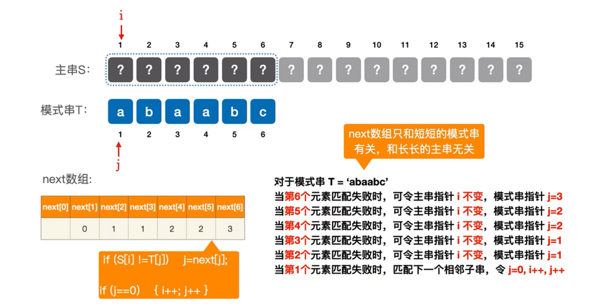
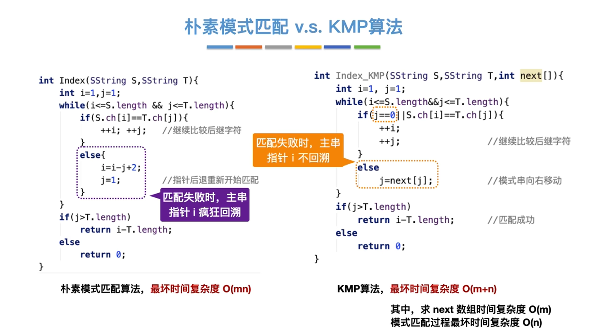
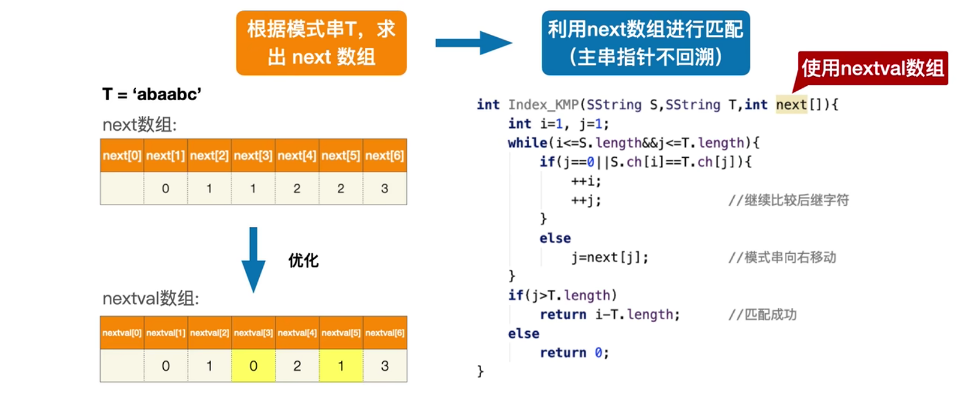

# 定义

字符串简称串，串（string）是由零个或多个字符组成的有限序列。一般记为

```math
S=a_1,a_2,a_3,\cdots a_n(n>=0)
```

其中，S是串名，单引号括起来的字符序列是串的值；$a_i$可以是字母、数字或其他字符；串中字符的个数n称为串的长度。n=0时的串称为空串（用$\emptyset$表示）。 

当两个串的**长度相等**且**每个对应位置的字符都相等**时，称这两个串是相等的。 

- **子串**：串中任意多个**连续的**字符组成的子序列称为该串的子串
- **主串**：包含子串的串。
- 字符在串中的位置：字符在串中的序号（下标从1开始）
- 子串在主串中的位置：子串的第一个字符在主串中的位置
- 空格串：由一个或多个空格组成的串，空格串不是空串，其长度为串中空格字符的个数。


串是一种特殊的线性表，数据元素之间呈线性关系。

在基本操作上， 串和线性表有很大差别。

- 线性表的基本操作主要以单个元素作为操作对象，如查找、插入或删除 某个元素等；
- 串的基本操作通常以子串作为操作对象，如查找、插入或删除一个子串等。 

# 基本操作

- `strAssign(&T,chars)`：赋值操作。把串T赋值为chars。
- `StrCopy(&T,S)`：复制操作。由串S复制得到串T。
- `StrEmpty(S)`：判空操作。若S为空串，则返回TRUE，否则返回FALSE。 
- `StrCompare(S,T)`：比较操作。若S>T，则返回值>0；若S=T，则返回值=0;
- `StrLength (S)`：求串长。返回串S的元素个数。
- `SubString (&Sub,S,pos,len)`：求子串。用Sub返回串S的第pos个字符起长度为len的子串。
- `Concat(&T,S1,S2)`：串联接。用T返回由S1和S2联接而成的新串。 
- `Index(S,T)`：定位操作。若主串S中存在与串T值相同的子串，则返回它在主串S中第一次出现的位置；否则函数值为0。
- `ClearString(&S)`：清空操作。将S清为空串。
- `DestroyString(&S)`：销毁串。将串 S 销毁。

# 存储结构

## 定长顺序存储

类似于线性表的顺序存储结构，用一组地址连续的存储单元存储串值的字符序列。在串的定长顺序存储结构中，为每个串变量分配一个固定长度的存储区，即定长数组。

```cpp
#define MAXLEN 255
typedef struct {
    char ch[MAXLEN];
    int length;
} SString;
```

## 堆分配存储

堆分配存储表示仍然以一组地址连续的存储单元存放串值的字符序列，但它们的存储空间是在程序执行过程中动态分配得到的。

```cpp
#define MAXLEN 255
typedef struct {
    char *ch;
    int length;
} HString;

int main() {
  HString S;
  S.ch = new char[MAXLEN];
}
```

## 块链存储表示

类似于线性表的链式存储结构，也可采用链表方式存储串值。由于串的特殊性（每个元素只有一个字符），在具体实现时，每个结点既可以存放一个字符，也可以存放多个字符。

每个结点称为块，整个链表称为块链结构。

```cpp
#define MAXLEN 255
typedef struct StringNode {
    char ch[4];// 为了提高存储密度
    struct StringNode *next;
} StringNode, *String;
```

# 模式匹配

字符串模式匹配：在主串中找到与模式串相同的子串，并返回其所在位置。

## 朴素模式匹配算法

这是一种暴力匹配算法

主串长度为n，模式串长度为m

朴素模式匹配算法：将主串中所有长为m的子串依次与模式串对比，直到找到一个完全匹配的子串，或所有子串都不匹配为止。

最坏情况下，每个子串都要对比m个字符，共n-m+1个子串，最坏时间复杂度为$O(nm)$

```cpp
#define MAXLEN 255
typedef struct {
    char ch[MAXLEN];
    int length;
} SString;

int Index(SString S, SString T) {
  int i = 1, j = 1;
  while (i <= S.length && j <= T.length) {
    if (S.ch[i] == T.ch[j]) {
      // 继续比较后续字符串
      i++;
      j++;
    } else {
      // 指针后退重新匹配下一个子串
      i = i - j + 2;
      j = 1;
    }
  }
  if (j > T.length) {
    return i - T.length;
  } else {
    return 0;
  }
}
```

## KMP算法

在暴力匹配中，每趟匹配失败都是模式后移一位再从头开始比较。而某趟己匹配相等的字符序列是模式的某个前缀，这种频繁的重复比较相当于模式串在不断地进行自我比较，这就是其低效率的根源。

KMP算法：根据模式串T，求出next数组，利用next数组进行匹配（主串指针不回溯）

next数组的作用：当模式串的第j个字符失配时，从模式串的第netx[j]的继续往后匹配

该算法最坏时间复杂度为$O(m+n)$，其中求next数组时间复杂度$O(m)$，模式匹配过程最坏时间复杂度$O(n)$



```cpp
int Index_KMP(SString S, SString T, int next[]) {
  int i = 1, j = 1;
  while (i <= S.length && j <= T.length) {
    if (S.ch[i] == T.ch[j] || j == 0) {
      // 继续比较后续字符串
      i++;
      j++;
    } else {
      // 匹配失败时，主串i不用回溯
      // 模式串向右移动
      j = next[j];
    }
  }
  if (j > T.length) {
    return i - T.length;
  } else {
    return 0;
  }
}
```



### 求next数组

`next[0]`不用处理

`next[1] = 0`和`next[2] = 1`是固定的。

其它next：在不匹配的位置前，划一根分界线，模式串一步一步往后退，直到分界线之前“能对上”，或模式串完全跨过分界线。此时j指向哪，next数组值就是多少。


### KMP进一步优化

本质上只是优化next数组。

将next数组优化成nextval数组

```cpp
int Index_KMP(SString S, SString T, int nextval[]) {
  // 逻辑不变，只是用nextval数组替代next数组
}
```

求nextval数组

```cpp
nextval[1] = 0;
for (int j = 2; j <= T.length; j++){
  if(T.ch[next[j]] == T.ch[j]){
    nextval[j] = nextval[next[j]];
  }else{
    nextval[j] = next[j];
  }
}
```




