# 操作系统的概念

**操作系统**（Operating System，**OS**）是指**控制**和**管理**整个计算机系统的**硬件与软件**资源，合理地组织、调度计算机的工作与资源的分配，进而**为用户和其他软件提供方便接口与环境**的程序集合。操作系统是计算机系统中**最基本的系统软件**。

# 操作系统的特征

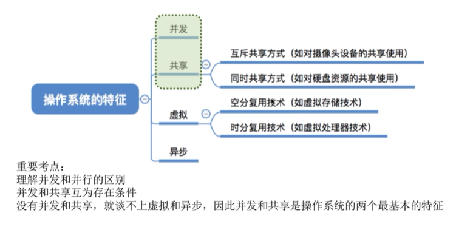

## 并发

==并发==：指两个或多个事件在**同一时间间隔**内发生。这些事件宏观上是同时发生的，微观上是交替发生的。

**操作系统的并发性**：指计算机系统中同时存在多个运行的程序，这些程序宏观上看是同时发生的，微观上看是交替发生的。

::: info 同一时间间隔（并发）和同一时刻（并行）的区别

==并行==: 在==同一时刻==能完成两种或两种以上的工作。

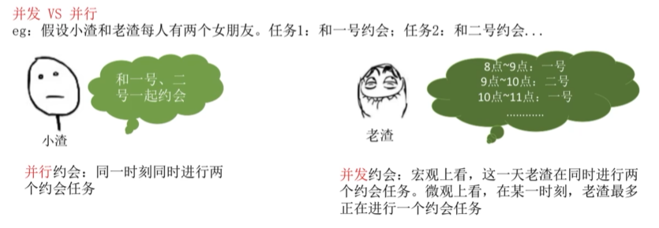

:::

::: tip

单核 CPU 同一时刻只能执行一个程序，各个程序只能并发执行；

多核 CPU 同一时刻可以执行多个程序，多个程序可以并行执行（运行程序数量要小于核的数量）；

:::

## 共享

共享即资源共享，是指系统中的资源可供内存中多个并发执行的进程共同使用。

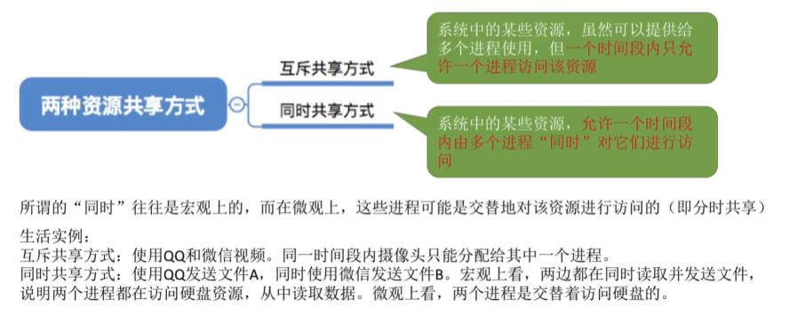

::: tip 共享和并发的关系

1. 资源共享是以程序的并发为条件的，若系统不允许程序并发执行，则不存在资源共享问题；
2. 若系统不能对资源共享实施有效的管理，则必将影响到程序的并发执行，甚至根本无法并发执行。

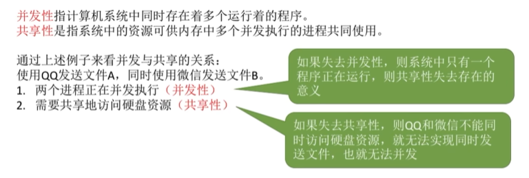

:::

## 虚拟

虚拟：指把一个物理上的实体变为若干逻辑上的对应物。前者是实际存在的；而后者是用户感觉上的事物。

用于实现虚拟的技术，称为虚拟技术。

- 虚拟处理器

  利用多道程序设计技术把一个物理上的 CPU 虚拟为多个逻辑上的 CP。

- 虚拟存储器

  采用虚拟存储器技术将一台机器的物理存储器变为虚拟存储器，从逻辑上扩充存储器的容量，此时用户感觉到的存储器（实际不存在）称为虚拟存储器。

## 异步

多道程序环境允许多个程序并发执行，但由于资源有限，进程的执行并不是一贯到底的，而是走走停停的，它以不可预知的速度向前推进，这就是进程的**异步性**。

异步性使得操作系统运行在一种随机的环境下，可能导致进程产生与时间有关的错误（就像对全局变量的访问顺序不当会导致程序出错一样）。但只要运行环境相同，操作系统就须保证多次运行进程后都能获得相同的结果。

::: tip

只有系统拥有并发性，才有可能导致异步性。

:::

# 操作系统的目标和功能

## 计算机系统资源的管理者

1. 处理机管理

   在多道程序环境下，处理机的分配和运行都以进程（或线程）为基本单位，因而对处理机的管理可归结为对进程的管理。

2. 存储器管理

   存储器管理是为了给多道程序的运行提供良好的环境，方便用户使用及提高内存的利用率。

3. 文件管理

   计算机中的信息都是以文件的形式存在的，操作系统中负责文件管理的部分称为**文件系统**。

4. 设备管理

   设备管理的主要任务是完成用户的 I/O 请求，方便用户使用各种设备，并提高设备的利用率。

---

## 用户与计算机硬件系统之间的接口

操作系统提供的接口主要分为两类：

1. ==命令接口==

   用户利用这些操作命令来组织和控制作业的执行。

   - **联机命令接口**（交互式命令接口）

     

   - 脱机命令接口（批处理命令接口）

     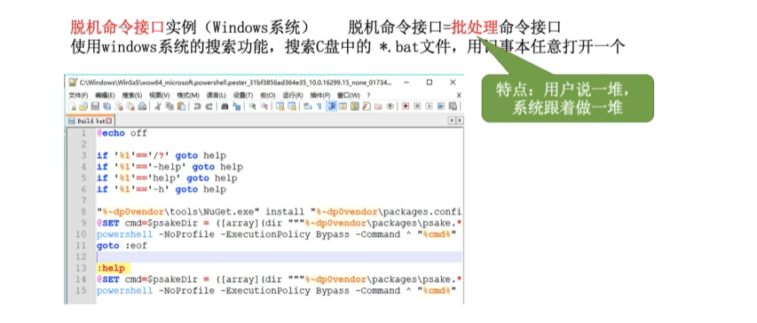

2. ==程序接口（也称系统调用）==

   系统调用是操作相同的一部分，是内核为用户提供的程序接口，运行在内核空间中。

   用户通过在程序中使用这些**系统调用**来请求操作系统为其提供服务。

   普通用户不能直接使用程序接口，只能通过代码**间接**使用。

   

   > 未使用系统调用的库函数执行效率通常要比系统调用更高，因为使用系统调用时需要上下文的却换和状态的转换。

---

## 对计算机资源的扩充

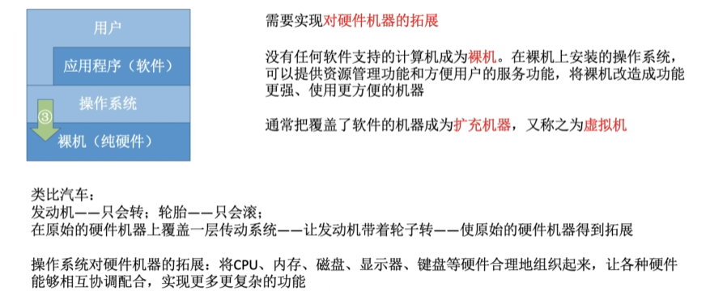

# 操作系统发展历程

## 手工操作阶段

此阶段无操作系统。

缺点：

1. **用户独占全机**，虽然不会出现因资源已被其他用户占用而等待的现象，但资源利用率低。
2. CPU 等待手工操作，**CPU 的利用不充分**。

## 批处理阶段

操作系统开始出现。

> 为了解决人机矛盾及 CPU 和 I/O 设备之间速度不匹配的矛盾。

### 单道批处理系统

系统对作业的处理是成批进行的，但内存中始终保持一道作业。

主要特征：

1. 自动性

   在顺利的情况下，磁带上的一批作业能自动地逐个运行，而无须人工干预。

2. 顺序性

   磁带上的各道作业顺序地进入内存，各道作业的完成顺序与它们进入内存的顺序在正常情况下应完全相同，亦即先调入内存的作业先完成。

3. 单道性

   内存中仅有一道程序运行，即监督程序每次从磁带上只调入一道程序进入内存运行，当该程序完成或发生异常情况时，才换入其后继程序进入内存运行。

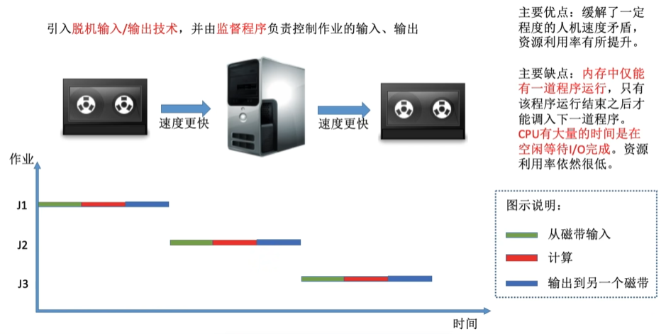

### 多道批处理系统

多道程序设计技术允许多个程序同时进入内存并允许它们在 CPU 中交替地运行，这些程序共享系统中的各种硬/软件资源。

当一道程序因 I/O 请求而暂停运行时，CPU 便立即转去运行另一道程序，即多道批处理系统的 I/O 设备可与 CPU 并行工作（借助中断技术）。

主要特征：

1. 多道

   计算机内存中同时存放多道相互独立的程序。

2. 宏观上并行

   同时进入系统的多道程序都处于运行过程中，即它们先后开始各自的运行, 但都未运行完毕。

3. 微观上串行

   内存中的多道程序轮流占有 CPU，交替执行。

## 分时操作系统

分时技术：把处理器的运行时间分成很短的时间片，按时间片轮流把处理器分配给各联机作业使用。若某个作业在分配给它的时间片内不能完成其计算，则该作业暂时停止运行，把处理器让给其他作业使用，等待下一轮再继续运行。

分时操作系统：多个用户通过终端同时共享一台主机，这些终端连接在主机上，用户可以同时与主机进行交互操作而互不干扰。

主要特征：

1. 同时性: 同时性也称多路性，指允许多个终端用户同时使用一台计算机。

2. 交互性: 用户能够方便地与系统进行人机交互。

3. 独立性: 系统中多个用户可以彼此独立地进行操作，互不干扰。

4. 及时性: 用户请求能在很短时间内获得响应。

优点：用户请求可以被即使响应，**解决了人机交互问题**。允许多个用户同时使用一台计算机，并且用户对计算机的操作相互独立。

缺点：**不能优先处理一些紧急任务**。操作系统对各个用户/作业都是完全公平的，循环地为每个用户/作业时间片，不区分任务的紧急性。

## 实时操作系统

> 为了能在某个时间限制内完成某些紧急任务而不需要时间片排队

实时操作系统可以分为：

1. 硬实时系统: 某个动作必须绝对地在规定的时刻（或规定的时间范围）发生，如导弹控制系统。

2. 软实时系统: 能够接受偶尔违反时间规定且不会引起任何永久性的损害，如订票系统。

在实时操作系统的控制下，计算机系统接收到外部信号后及时进行处理，并**在严格的时限内处理完接收的事件**。

实时操作系统的主要特点是**及时性**和**可靠性**。

## 网络操作系统、分布式计算机系统、个人计算机操作系统

# 操作系统运行环境

## 操作系统运行机制

在计算机系统中，通常 CPU 执行两种不同性质的程序：

- **内核程序**：操作系统中的一个核心组件，它是操作系统的主要部分之一，负责管理计算机的硬件资源和提供对这些资源的访问。
- **应用程序**：一种计算机程序，旨在执行特定的任务、功能或目的，以满足用户的需求。应用程序通常运行在操作系统之上，利用操作系统提供的服务和资源来完成各种任务。

::: info 内核

**操作系统内核**（内核）是由很多内核程序组成的。内核是操作系统最重要最核心的部分，也是最接近硬件的部分。

操作系统的功能未必都在内核中，如图形化用户界面 GUI。

:::

::: info 特权指令和非特权指令

1. ==特权指令==：**不允许用户直接使用**的指令，如 I/O 指令、关中断指令，存取用于内存保护的寄存器、送程序状态字到程序状态字寄存器等的指令。
2. ==非特权指令==：**允许用户直接使用**的指令，为了防止用户程序对系统造成破坏，它不能直接访问系统中的软硬件资源，仅限于访问用户的地址空间。

:::

将 CPU 的运行模式划分为**用户态**（目态）和**核心态**（又称管态、内核态）。应用程序运行在用户态，操作系统内核程序运行在核心态。

- 处于核心态时，说明此时运行的是内核程序，此时**可以执行特权指令**；
- 处于用户态时，说明此时运行的是应用程序，此时**只能执行非特权指令**；

::: tip CPU 如何分辨出当前是应用程序还是内核程序？

CPU 内部有一个程序状态字寄存器（PSW），其中有个二进制位，用 1/0 表示当前是核心态还是用户态。

:::

---

内核是计算机上配置的底层软件，它管理着系统的各种资源，可以看作是连接应用程序和硬件的一座桥梁，大多数操作系统的内核包含一下 4 方面的内容：

1. **时钟管理**

   在计算机的各种部件中，时钟是最关键的设备。

   - 通过时钟管理，向用户提供标准的系统时间。
   - 通过时钟中断的管理，可以实现进程的切换。

   > 时钟中断的主要工作是处理和时间有关的信息及决定是否执行调度程序。和时间有关的所有信息包括系统时间、进程的时间片、延时、使用 CPU 的时间、各种定时器。

2. **中断机制**

   引入中断机制的初衷是提高多道程序运行时的 CPU 利用率，使 CPU 可以在 I/O 操作期间执行其他指令。

   操作系统各项操作的基础，如进程的管理和调度、系统功能的调用、设备驱动、文件访问等都依赖于中断机制。

3. **原语**

   按层次结构设计的操作系统，底层必然是一些可被调用的公用小程序，它们各自完成一个规定的操作。

   特点：

   - 处于操作系统的最底层，是最接近硬件的部分。
   - 运行具有原子性，出于系统安全性和便于管理考虑其操作只能一气呵成。
   - 运行时间都较短，而且调用频繁。

   具有这些特点的程序称为原语。

4. **系统技制的数据结构及处理**

   系统中用来登记状态信息的数据结构很多，如消息队列、缓冲区、内存分配表等。

   为了实现有效的管理，系统需要一些基本的操作，常见的操作有以下 3 种：

   - 进程管理：进程状态管理、进程调度和分派、创建与撤销进程控制块等。
   - 存储器管理：存储器的空间分配和回收、内存信息保护程序、代码对换程序等。
   - 设备管理：缓冲区管理、设备分配和回收等。

::: tip

核心态指令实际上包括系统调用类指令和一些针对时钟、中断和原语的操作指令。

:::

## 中断和异常的概念

操作系统是中断驱动的，OS 总在等待某个事件的发生，事件总是由中断或异常引起的。

### 定义

- ==中断==：由**硬件**引起。

  也称==外中断==，是指来自 CPU 执行**指令外部**的事件。如设备发出的 I/O 结束中断，表示设备输入/输出处理已经完成，希望处理机能够向设备发出下一个输入/输出请求，同时让完成输入/输出后的程序继续运
  行。

- ==异常==：由**软件**引起。

  也称==内中断==，是指来自 CPU 执行**指令内部**的事件。如程序的非法操作码、地址越界、运算溢出等引起的事件。

### 分类

::: tip 外中断分类

1. 可屏蔽中断：通过 INTR 线发出的中断请求。
2. 不可屏蔽中断：通过 NMI 线发出的中断请求，通常是紧急的硬件故障，如电源掉电等。

:::

::: tip

==外部中断发生在用户态，在核心态完成中断处理过程==。

:::

### 处理过程

当 CPU 执行到第 i 条指令时**检测到异常事件**，或执行完该条指令后**发现中断请求信号**，CPU 当断当前用户程序，**调用相应的中断或异常处理程序**。

- 若中断或异常处理程序能够解决相应的问题，则在中断或异常处理程序的最后，CPU 通过执行中断或异常返回指令，**回到被打断的用户程序的第 i 条指令或第 i+1 条指令继续执行**；
- 若中断或异常处理程序发现是不可恢复的致命错误，则**终止用户程序**。

> 当 CPU 检测到中断信号后，中断程序的**断点**[程序计数器(PC)和程序状态字寄存器(PSW)]是**由硬件**自动保存，而不是操作系统。

> 中断向量表采用==数组==作为存储结构

::: info

外部中断处理过程，PC 值由中断隐指令自动保存，而通用寄存器内容由操作系统保存。块表(TLB)和 Cache 中的内容则由硬件机构保存。

:::

::: tip 调用中断处理程序 和 调用子程序 的区别

1. 中断处理程序与被中断的当前程序是**相互独立**的，它们之间没有确定的关系；子程序与主程序是同一程序的两部分，它们属于**主从关系**。

2. 通常中断的**产生都是随机**的；而子程序调用是通过调用指令引起的，是由程序设计者**事先安排**的。

3. 中断处理的过程还**需要有专门的硬件电路**才能实现；而调用子程序的过程完全属于**软件处理过程**。

4. 中断处理程序的入口地址可由硬件向量法产生向量地址，再由向量地址找到入口地址；子程序的入口地址是由 CALL 指令中的地址码给出的。

5. 调用中断处理程序和子程序==都需要保护程序计数器(PC)的内容==。

6. ==只有中断处理程序才会保存状态字寄存器(PSW)的内容==，子程序不会保存。

   > 子程序调用不改变程序的状态，因为子程序调用是编译器可控流程，而中断不是。以程序`if(a==b)`为例，它通常包含一条测试指令，以及一条根据标志位决定是否需要跳转来调用子程序的指令。执行`if(a==b)`时，会进行 a-b 操作，并生成相应的标志位，进而根据标志位来判断是否发生跳转。
   >
   > 假设刚好在生成相应的标志位后发生了中断，若不保存 PSW 的内容，则后续根据标志位来进行跳转的流程就可能发生错误。
   >
   > 但是，若进行了子程序调用，则说明已经根据 a-b 的标志位进行了跳转，此时 PSW 的内容已无意义而无须保存。
   >
   > 综上所述，中断处理和子程序调用都有可能使 PSW 的内容发生变化，但中断处理程序执行完返回后，可能需要用到 PSW 原来的内容，子程序执行完返回后，一定不需要用到 PSW 原来的内容。

7. 响应中断时，需对同时检测到的多个中断请求进行裁决，而调用子程序时没有这种操作。

:::

## 系统调用

### 定义

系统调用是指**用户在程序中调用操作系统所提供的一些子功能**，可视为特殊的公共子程序。换句话说，系统调用是由**用户进程发起的，请求操作系统的服务**。

::: tip 注意操作系统完成与系统调用完成的区别

**页置换**，内存中的空闲页框不够时，操作系统会将某些页面调出，并将要访问的页面调入，这个过程完全由操作系统完成，不涉及系统调用。

**进程调度**完全由操作系统完成，无法通过系统调用完成。

:::

在用户程序中，凡是==与资源有关的操作==（如存储分配、进行 I/O 传输及管理文件等），都必须通过系统调用方式向操作系统提出服务请求，并由操作系统代为完成。

::: tip 系统调用和库函数的区别

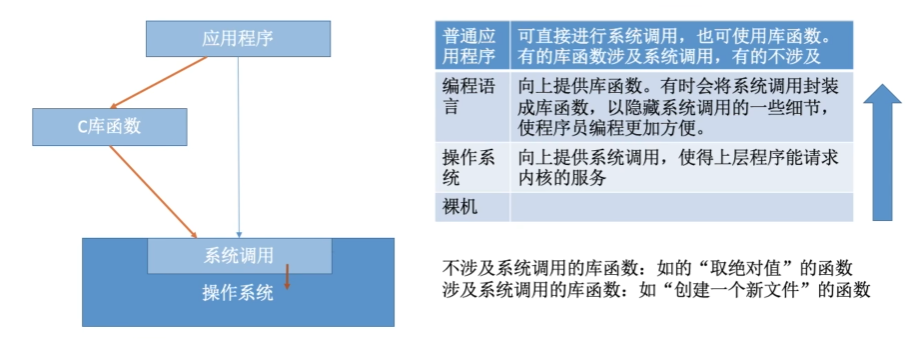

:::

系统调用按功能大致可分为如下几类：

- 设备管理：完成设备的请求或释放，以及设备启动等功能；
- 文件管理：完成文件的读、写、创建及删除等功能；
- 进程控制：完成进程的创建、撤销、阻塞及唤醒等功能；
- 进程通信：完成进程之间的消息传递或信号传递等功能；
- 内存管理：完成内存的分配、回收以及获取作业占用内存区大小及始址等功能；

### 执行过程

> 发生系统调用时，CPU 通过执行软中断指令将 CPU 的运行状态从用户态切换到内核态，这个过程与中断和异常的响应过程相同，由硬件负责**保存断点和程序状态字**，并将 CPU 模式**从用户态改为内核态**（都由==硬件==完成）。
>
> 然后，执行操作系统内核的系统调用入口程序，该内核程序负责**保存通用寄存器的内容**，再调用**执行特定的系统调用服务例程**（都由==操作系统==完成）。

> ==系统调用发生在用户态==，被调用程序在核心态下执行。

1. 用户程序首先将系统调用号和所需的参数压入堆栈；
2. 调用实际的调用指令，然后执行一个陷入指令，将 CPU 状态从用户态转为核心态，再后由硬件和操作系统内核程序保护被中断进程的现场，将程序计数器（PC）、程序状态字（PSW）及通用寄存器内容等压入堆栈。
3. 分析系统调用类型，转入相应的系统调用处理子程序。在系统中配置了一张系统调用入口表，表中的每个表项都对应一个系统调用，根据系统调用号可以找到该系统调用处理子程序的入口地址。
4. 在系统调用处理子程序执行结束后，恢复被中断的或设置新进程的 CPU 现场，然后返回被中断进程或新进程，继续往下执行。

::: info 陷入指令作用

用户程序可以执行**陷入指令**来发起系统调用，请求操作系统提供服务。

用户程序执行“陷入指令”，相当于把 CPU 的使用权主动交给操作系统内核程序（CPU 状态会从用户态进入核心态），之后操作系统内核程序再对系统调用请求做出相应处理。

处理完成后，操作系统内核程序又会把 CPU 的使用权还给用户程序（即 CPU 状态会从核心态回到用户态）。

这样设计的目的是保证系统的稳定性和安全性，防止用户程序随意更改或访问重要的系统资源，影响其他进程的运行。

:::

这样，操作系统的运行环境就可以理解为：

用户通过操作系统运行上层程序，而这个上层程序的运行依赖于操作系统的底层管理程序提供服务支持

- 当需要管理程序服务时，系统则通过硬件中断机制进入核心态，运行管理程序。
- 当程序运行出现异常情况，被动地需要管理程序的服务，这时就通过异常处理来进入核心态。

管理程序运行结束时，用户程序需要继续运行，此时通过相应的保存的程序现场退出中断处理程序或异常处理程序，返回断点处继续执行。

::: info 一些用户态转向核心态的例子

1. 用户程序要求操作系统的服务，即**系统调用**，例如 read 系统调用；
2. 发生一次**中断**，例如进行了整数除以 0 的操作（需要中断进行处理）；
3. 用户**程序中产生了一个错误**状态；
4. 用户程序中**企图执行一条特权指令**；
5. 从核心态转向用户态由一条指令实现，这条指令也是特权命令，一般是**中断返回指令**；

:::

::: tip

由用户态进入核心态，不仅状态需要切换，而且所用的堆栈也可能需要由用户堆栈切换为系统堆栈、但这个系统堆栈也是属于该进程的。

:::

# 操作系统结构

## 分层法

分层法是将操作系统分为若干层，在低层上构建高层。最底层（层 0）为硬件，最高层（层 N）为用户接口。高层仅依赖于紧邻它的底层。

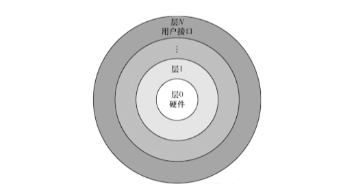

优点：

1. 易保证系统的准确性。
2. 易扩充和易维护。

缺点：

1. 合理定义各层比较困难。
2. 效率较差。

## 模块化

模块化是将操作系统按功能划分为若干具有一定独立性的模块。每个模块具有某方面的管理功能，并规定好各模块间的接口，使各模块之间能够通过接口进行通信。还可以进一步将各模块细分为若干具有一定功能的子模块，同样也规定好各子模块之间的接口。

划分模块时，

1. 模块不能划分得太小，也不能划分得过大。

2. 要充分考虑模块的独立性问题。

   衡量模块的独立性主要有两个标准：

   - 内聚性：模块内部各部分间联系的紧密程度。内聚性越高，模块独立性越好；
   - 耦合度：模块间相互联系和相互影响的程度。耦合度越低，模块独立性越好；

优点：

1. 提高了操作系统设计的正确性、可理解性和可维护性；
2. 增强了操作系统的可适应性；
3. 加速了操作系统的开发过程；

缺点：

1. 模块间的接口规定很难满足对接口的实际需求；
2. 各模块设计者齐头并进, 每个决定无法建立在上一个己验证的正确决定的基础上，因此无法找到一个可靠的决定顺序。

## 内核

内核是操作系统最基本、最核心的部分。实现操作系统内核功能的程序就是内核程序。

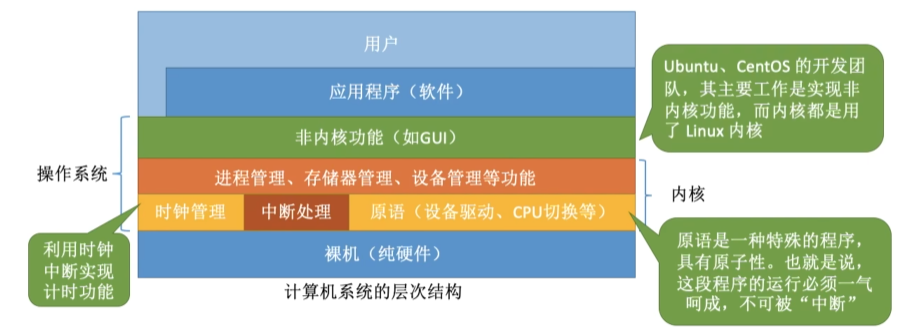

由上图可以引出内核的两种设计方法

1. 把所有功能都包含在操作系统内核中的就叫宏内核；
2. 只保留与硬件关系最紧密的部分就叫微内核；

换句话说，从操作系统的内核架构来划分，可分为**宏内核**和**微内核**。

### 宏内核

宏内核，也称**单内核**或**大内核**，是指将系统的主要功能模块都作为一个紧密联系的整体运行在核心态，从而为用户程序提供高性能的系统服务。

### 微内核

微内核构架，是指将内核中最基本的功能保留在内核，而将那些不需要在核心态执行的功能移到用户态执行，从而降低内核的设计复杂性。

在进行操作系统结构设计时，大多采用**基于客户/服务器模式**的微内核结构，将操作系统划分为两大部分：**微内核**和**多个服务器**。

微内核基本概念：

1. 足够小的内核

   内核是指精心设计的、能实现操作系统最基本核心功能的小型内核。

   微内核不是一个完整的 OS，而只是将操作系统中最基本的部分放入微内核，通常包含：与硬件处理紧密相关的部分、一些较基本的功能、客户和服务器之间的通信。

2. 基于客户/服务器模式

   客户与服务器之间是借助微内核提供的消息传递机制来实现信息交互的。

   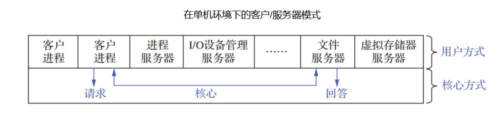

3. 应用“机制与策略分离”原理

   机制：实现某一功能的具体执行结构；

   策略：在进制的基础上借助于某些参数和算法来实现功能的优化，或达到不同的功能目标；

4. 采用面向对象技术

---

在微内核结构中，为了实现高可靠性，只有微内核运行在内核态，其余模块都运行在用户态， 一个模块中的错误只会使这个模块崩溃，而不会使整个系统崩溃。

> 例如，文件服务代码运行时出了问题，
>
> - 宏内核的文件服务是运行在内核态的，系统会直接崩溃。
> - 微内核的文件服务是运行在用户态的，只要把文件服务功能强行停止，然后重启，就可以继续使用，系统不会崩溃。

---

微内核的基本功能：

1. 进程（线程）管理；
2. 低级存储器管理；
3. 中断和陷入处理；

微内核系统优点：

1. 较强的**可扩展性**
2. 较高的**可靠性**
3. 较高的**安全性**
4. 可移植性强

微内核结构的**主要问题是性能问题**，因为要频繁地在核心态和用户态之间进行切换。

### 宏内核和微内核比较

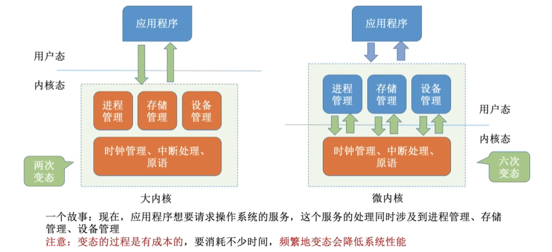

## 外核

在底层中，一种称为外核（exokemel）的程序在内核态中运行。它的任务是为虚拟机分配资源，并检查使用这些资源的企图，以确保没有机器会使用他人的资源。每个用户层的虚拟机可以运行自己的操作系统，但限制只能使用已经申请并且获得分配的那部分资源。

优点：

- 减少了映射层。在其他的设计中，每个虚拟机都认为它有自己的磁盘，虚拟机监控程序就必须维护一张表格以重映像磁盘地址，有了外核，这个重映射处理就不需要了。
- 将多道程序（在外核内）与用户操作系统代码（在用户空间内）加以分离，而且相应的负载并不重。

# 操作系统引导

操作系统引导是指计算机利用 CPU 运行特定程序，通过程序识别硬盘，识别硬盘分区，识别硬盘分区上的操作系统，最后通过程序启动操作系统。

常见操作系统的引导过程如下：

1. 激活 CPU

   激活的 CPU **读取 ROM 中的 boot 程序**，将指令寄存器置为 BIOS 的第一条指令，即开始执行 BIOS 的指令。

2. 硬件自检

   BIOS程序在内存最开始的空间==构建中断向量表==，接下来的POST过程要用到中断功能。

   然后进行通电自检，检查硬件是否出现故障。如有故障，主板会发出不同含义的蜂鸣，启动中止；如无故障，屏幕会显示CPU、内存、硬盘等信息。

3. 加载带有操作系统的硬盘

   通电自检后，BIOS开始读取BootSequence（通过CMOS里保存的启动顺序，或者通过与用户交互的方式)，将控制权交给启动顺序排在第一位的存储设备，然后CPU将该存储设备引导扇区的内容加载到内存中。

4. 加载主引导记录(MBR)

   主引导记录MBR的作用是告诉CPU去硬盘的哪个主分区去找操作系统。

   硬盘以特定的标识符区分引导硬盘和非引导硬盘。如果发现一个存储设备不是可引导盘，就检查下一个存储设备。如无其他启动设备，就会死机。

5. 扫描硬盘分区表，并加载硬盘活动分区

   MBR包含硬盘分区表，硬盘分区表以特定的标识符区分活动分区和非活动分区。

   主引导记录扫描硬盘分区表，进而识别含有操作系统的硬盘分区（活动分区）。找到硬盘活动分区后，开始加载硬盘活动分区，将控制权交给活动分区。

6. 加载分区引导记录(PBR)

   取活动分区的第一个扇区，这个扇区称为分区引导记录，其作用是寻找并激活分区根目录下用于引导操作系统的程序（启动管理器）。

7. 加载启动管理器

   分区引导记录搜索活动分区中的启动管理器，加载启动管理器。

8. 加载操作系统

   将操作系统的初始化程序加载到内存中执行。

# 虚拟机

::: info 传统计算机

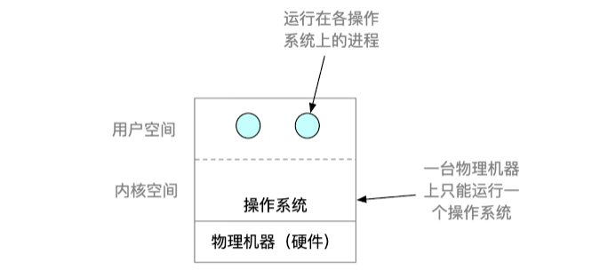

:::

虚拟机：使用虚拟化技术，将一台物理机虚拟化为多台虚拟机器（Virtual Machine，VM），每个虚拟机器都可以独立运行一个操作系统。

## 第一类虚拟机管理程序

从技术上讲，第一类虚拟机管理程序就像一个操作系统，因为它是唯一一个运行在最高特权级的程序。

虚拟机作为用户态的一个进程运行，不允许执行特权指令。

虚拟机上的操作系统认为自己运行在内核态（实际上不是），称为虚拟内核态。

当虚拟机操作系统执行了一条特权指令时，

- 在支持虚拟化的 CPU 上

  虚拟机管理程序会检查这条指令是由虚拟机中的操作系统执行的还是由用户程序执行的。如果是前者，虚拟机管理程序将安排这条指令功能的正确执行。否则，虚拟机管理程序将模拟真实硬件面对用户态执行特权指令时的行为。

- 在不支持虚拟化的 CPU 上

  真实硬件不会直接执行虚拟机中的敏感指令，这些敏感指令被转为对虚拟机管理程序的调用，由虚拟机管理程序模拟这些指令的功能。

## 第二类虚拟机管理程序

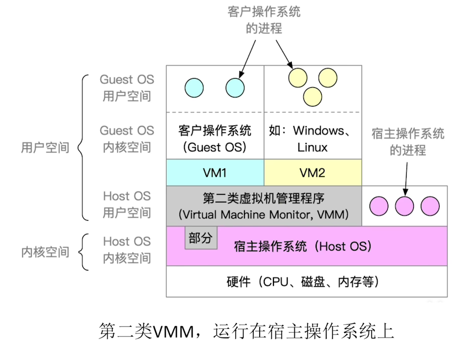

它是一个依赖于操作系统分配和调度资源的程序，很像一个普通的进程。

## 两类虚拟机管理程序的对比

