# 内存管理

内存管理(MemoryManagement)是操作系统设计中最重要和最复杂的内容之一。

操作系统对内存的划分和动态分配，就是内存管理的概念。

内存管理的**主要功能**有：

1. 内存空间的分配与回收

   由操作系统完成主存储器空间的分配和管理，使程序员摆脱存储分配的麻烦，提高编程效率。

2. 地址转换

   在多道程序环境下，程序中的逻辑地址与内存中的物理地址不可能一致，因此存储管理必须提供地址变换功能，把逻辑地址转换成相应的物理地址。

3. 内存空间的扩充

   利用虚拟存储技术或自动覆盖技术，从逻辑上扩充内存。

4. 内存共享

   指允许多个进程访问内存的同一部分。例如，多个合作进程可能需要访问同一块数据，因此必须支持对内存共享区域进行受控访问。

5. 存储保护

   保证各道作业在各自的存储空间内运行，互不干扰。

## 什么是内存

## 程序的链接与装入

创建进程首先要将程序和数据装入内存。将用户源程序变为可在内存中执行的程序，通常需要以下几个步骤：

1. **编译**：由编译程序**将用户源代码编译成若干目标模块**。
2. **链接**：由链接程序将编译后形成的一组**目标模块及它们所需的库函数链接在一起**，形成一个完整的装入模块。
3. **装入**：由装入程序将装入模块**装入内存**运行。

---

链接的三种方式：

1. **静态链接**

   在程序运行之前，先将各目标模块及它们所需的库函数链接成一个完整的装配模块，以后不再拆开。

   需要解决两个问题：

   - 修改相对地址，编译后的所有目标模块都是从 0 开始的相对地址，当链接成一个装入模块时要修改相对地址。
   - 变换外部调用符号，将每个模块中所用的外部调用符号也都变换为相对地址。

   

2. **装入时动态链接**

   将用户源程序编译后所得到的一组目标模块，在装入内存时，采用边装入边链接的方式。

   优点：便于修改和更新，便于实现对目标模块的共享。

   

3. **运行时动态链接**

   对某些目标模块的链接，是在程序执行中需要该目标模块时才进行的。凡在执行过程中未被用到的目标模块，都不会被调入内存和被链接到装入模块上。

   优点：加快程序的装入过程，还可节省大量的内存空间。

   

---

模块装入内存时的三种方式：

1. **绝对装入**

   绝对装入方式**只适用于单道程序环境**。

   在编译时，若知道程序将驻留在内存的某个位置，则编译程序将产生绝对地址的目标代码。绝对装入程序按照装入模块中的地址，将程序和数据装入内存。

   由于程序中的逻辑地址与实际内存地址完全相同，因此不需对程序和数据的地址进行修改。

   

   > 程序中使用的绝对地址，可在编译或汇编时给出，也可由程序员直接赋予。而通常情况下在
   > 程序中采用的是符号地址，编译或汇编时再转换为绝对地址。

2. **可重定位装入**

   根据内存的当前情况，将装入模块装入内存的适当位置。

   在装入时对目标程序中**指令和数据地址的修改过程称为重定位**，又因为**地址变换通常是在进程装入时一次完成的，故称为静态重定位**。

   当一个作业装入内存时，**必须给它分配要求的全部内存空间**，若没有足够的内存，则无法装入。作业一旦**进入内存，整个运行期间就不能在内存中移动，也不能再申请内存空间**。

   

3. **动态运行时装入**

   动态运行时装入也称**动态重定位**。

   程序**在内存中若发生移动**，则需要采用动态的装入方式。

   装入程序把装入模块装入内存后，并**不立即把装入模块中的相对地址转换为绝对地址**，而是把这种**地址转换推迟到程序真正要执行时才进行**。因此，**装入内存后的所有地址均为相对地址**。

   这种方式需要一个**重定位寄存器**的支持，

   优点：可以将程序分配到不连续的存储区；在程序运行之前可以只装入部分代码即可投入运行，然后在程序运行期间，根据需要动态申请分配内存；便于程序段的共享。

   

## 逻辑地址与物理地址

编译后，每个目标模块都**从 0 号单元开始编址**，这称为该目标模块的**相对地址（或逻辑地址）**。

当链接程序将各个模块链接成一个完整的可执行目标程序时，链接程序顺序依次按各个模块的相对地址构成统一的从 0 号单元开始编址的逻辑地址空间（或虚拟地址空间），对于 32 位系统，逻辑地址空间的范围为 0 ～ 2^32^-1。

**进程在运行时，看到和使用的地址都是逻辑地址**。用户程序和程序员只需知道逻辑地址，而**内存管理的具体机制则是完全透明的**。**不同进程可以有相同的逻辑地址**，因为这些相同的逻辑地址可以映射到主存的不同位置。

**物理地址空间**是指**内存中物理单元的集合**，它是**地址转换的最终地址**，进程在运行时执行指令和访问数据，最后都要通过物理地址从主存中存取。当装入程序将可执行代码装入内存时，必须通过地址转换将逻辑地址转换成物理地址，这个过程称为地址重定位。

操作系统通过**内存管理部件(MMU)将进程使用的逻辑地址转换为物理地址**。进程使用虚拟内存空间中的地址，操作系统在相关硬件的协助下，将它“转换”成真正的物理地址。逻辑地址通过页表映射到物理内存，页表由操作系统维护并被处理器引用。

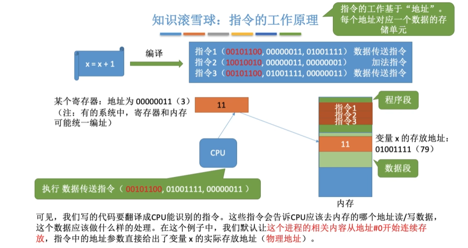

## 进程的内存映像

不同于存放在硬盘上的可执行程序文件，当一个程序调入内存运行时，就构成了进程的内存映像。

一个进程的内存映像一般有几个要素：

- 代码段：即程序的二进制代码，代码段是只读的，可以被多个进程共享。
- 数据段：即程序运行时加工处理的对象，包括全局变量和静态变量。
- 进程控制块（PCB）：存放在系统区。操作系统通过 PCB 来控制和管理进程。
- 堆：用来存放动态分配的变量。
- 栈：用来实现函数调用。从用户空间的最大地址往低地址方向增长。

代码段和数据段在程序调入内存时就指定了大小，而堆和栈不一样。当调用像 malloc 和 free 这样的 C 标准库函数时，堆可以在运行时动态地扩展和收缩。用户栈在程序运行期间也可以动态地扩展和收缩，每次调用一个函数，栈就会增长；从一个函数返回时，栈就会收缩。

## 内存保护

确保每个进程都有一个单独的内存空间。内存分配前，需要保护操作系统不受用户进程的影响，同时保护用户进程不受其他用户进程的影响。

内存保护可采取两种方法：

1. 在 CPU 中**设置一对上、下限寄存器**，存放用户作业在主存中的下限和上限地址。每当 CPU 要访问一个地址时，分别和两个寄存器的值相比，判断有无越界。

2. 采用**重定位寄存器**（基地址寄存器）和**界地址寄存器**（限长寄存器）来进行越界检查。

   **重定位寄存器存放进程的起始物理地址**，**界地址寄存器存放进程的最大逻辑地址**。

   内存管理机构动态地**将逻辑地址与界地址寄存器进行比较，若未发生地址越界，则加上重定位寄存器的值后映射成物理地址，再送交内存单元**。

   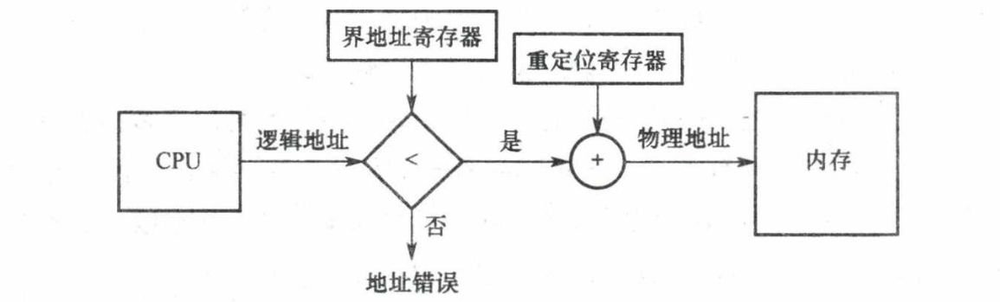

   > 这种方案允许操作系统内核修改这两个寄存器的值，而不允许用户程序修改。因此加载重定位寄存器和界地址寄存器时必须使用特权指令，只有操作系统内核才可以加载这两个存储器。

## 内存共享

并不是所有的进程内存空间都适合共享，**只有那些只读的区域才可以共享**。

**可重入代码**又称纯代码，是一种**允许多个进程同时访问但不允许被任何进程修改的代码**。

在实际执行时，可以为每个进程配以局部数据区，把在执行中可能改变的部分复制到该数据区。这样，程序在执行时只需对该私有数据区中的内存进行修改，并不去改变共享的代码。

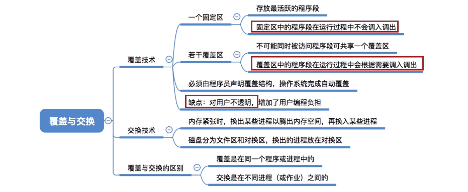

覆盖与交换技术是在多道程序环境下**用来扩充内存**的两种方法。

交换技术主要在不同进程（或作业）之间进行，而覆盖则用于同一个程序或进程中。

对于主存无法存放用户程序的矛盾，现代操作系统是通过虚拟内存技术来解决的，覆盖技术则已成为历史，而交换技术在现代操作系统中仍具有较强的生命力。

## 内存分配与回收

存储管理方式随着操作系统的发展而发展。

在操作系统由单道向多道发展时，存储管理方式由单一连续分配发展为固定分区分配。为了能更好地适应不同大小的程序要求，又从固定分区分配发展到动态分区分配。为了更好地提高内存的利用率，进而从连续分配方式发展到离散分配方式—页式存储管理。

# 内存分配与回收

## 连续分配管理方式

**连续分配**方式是指**为一个用户程序分配一个连续的内存空间**。例如某用户需要 100MB 的内存空间，连续分配方式就在内存空间中为用户分配一块连续的 100MB 空间。

连续分配方式主要包括单一连续分配、固定分区分配和动态分区分配。

### 单一连续分配

内存在此方式下分为**系统区**和**用户区**。

- 系统区仅供操作系统使用，通常在低地址部分；
- 在用户区内存中，**仅有一道用户程序**，即整个内存的用户空间由该程序独占。

优点：实现简单；**无外部碎片**；无须进行内存保护，因为内存中永远只有一道程序。

缺点：只能用于单用户、单任务的操作系统中；**有内部碎片**；存储器的利用率极低。

::: info 内部碎片

内部碎片是指**分配给某进程的内存区域中**，如果**有些部分没有使用**，那么这部分就是“内部碎片”。

:::

::: info 外部碎片碎片

在内存中存在的多个不连续的空闲区域。这些**空闲区域太小，无法满足新的内存分配请求**，即使总的空闲内存量可能足够大。

:::

### 固定分区分配

固定分区分配是最简单的一种多道程序存储管理方式，它**将用户内存空间划分为若干固定大小的区域，每个分区只装入一道作业**。当有空闲分区时，便可再从外存的后备作业队列中选择适当大小的作业装入该分区，如此循环。

在划分分区时有两种不同的方法：

1. **分区大小相等**：程序太小会造成浪费，程序太大又无法装入，缺乏灵活性，但适用于用一台计算机控制多个相同对象的场合。

2. **分区大小不等**：划分为多个较小的分区、适量的中等分区和少量大分区。

为了便于分配，建立一张**分区使用表**，通常按分区大小排队，各表项包括每个分区的起始地址、大小及状态(是否己分配)。

分配内存时，便检索该表，以找到一个能满足要求且尚未分配的分区分配给装入程序，并将对应表项的状态置为"已分配”；若找不到这样的分区，则拒绝分配。回收内存时，只需将对应表项的状态置为“未分配”即可。

问题：

1. 程序可能**太大而放不进任何一个分区**；
2. 当程序小于固定分区大小时，也要占用一个完整的内存分区，这样分区内部就存在空间浪费，会**产生内部碎片**。**固定分区方式无外部碎片**，但不能实现多进程共享一个主存区，所以存储空间利用率低。

### 动态分区分配

#### 分配原理

又称**可变分区分配**。这种分配方式**不会预先划分内存分区**，它是在**进程装入内存时，根据进程的实际需要，动态地为之分配内存**，并使分区的大小正好适合进程的需要。因此，系统中分区的大小和数目是可变的。

**动态分区分配没有内部碎片，但是有外部碎片**。

::: info 举例

如图所示，系统有 64MB 内存空间，其中低 8MB 固定分配给操作系统，其余为用户可用内存。

开始时装入前三个进程，它们分别分配到所需的空间后，内存仅剩 4MB，进程 4 无法装入。在某个时刻，CPU 出现空闲，操作系统就换出进程 2，换入进程 4。由于进程 4 比进程 2 小，这样在主存中就产生了一个 6MB 的内存块。之后 CPU 又出现空闲，需要换入进程 2，而主存无法容纳进程 2，操作系统就换出进程 1，换入进程 2。

动态分区在开始时是很好的，但是随着时间的推移，内存中会产生越来越多的小内存块，内存的利用率也随之下降。这些小内存块被称为外部碎片，它存在于所有分区的外部，与固定分区中的内部碎片正好相对。

> 外部碎片可通过紧凌技术来克服，即操作系统不时地对进程进行移动和整理。但是，这需要动态重定位寄存器的支持，且相对费时。紧凑过程实际上类似于 Windows 系统中的磁盘碎片整理程序，只不过后者是对外存空间的紧凑。

:::

::: info 相应的数据结构

1. **空闲分区表**

   

2. **空闲分区链**

   

:::

在动态分区分配中，与固定分区分配类似，设置一张空闲分区链（表），可以按始址排序。

**分配内存时**，检索空闲分区链，找到所需的分区，若其大小大于请求大小，便从该分区中按请求大小分割一块空间分配给装入进程（若剩余部分小到不足以划分，则无须分割），余下部分仍留在空闲分区链中。

**回收内存时**，系统根据回收分区的始址，从空闲分区链中找到相应的插入点，此时可能出现四种情况：

1. 回收区与插入点的前一空闲分区相邻，将这两个分区合并，并修改前一分区表项的大小为两者之和；

   例：回收进程 4

   

2. 回收区与插入点的后一空闲分区相邻，将这两个分区合并，并修改后一分区表项的始址和大小；

   例：回收进程 3

   

3. 回收区同时与插入点的前、后两个分区相邻，此时将这三个分区合并，修改前一分区表项的大小为三者之和，取消后二分区表项；

   例：回收进程 4

   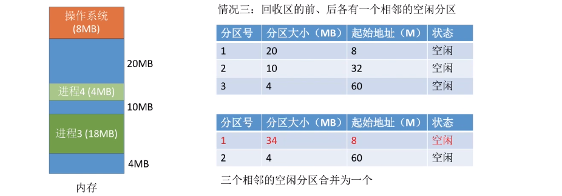

4. 回收区没有相邻的空闲分区，此时应为回收区新建一个表项，填写始址和大小，并插入空闲分区链。

   例：回收进程 2

   

#### 基于顺序搜索的分配算法

把一个新作业装入内存时，必须按照一定的**动态分区分配算法**，从空闲分区表或空闲分区链中选出一个分区分配给该作业。

顺序分配算法是指**依次搜索空闲分区链上的空闲分区，以寻找一个大小满足要求的分区**。

顺序分配算法有以下四种：

1. ==首次适应==(First Fit, FF)算法

   空闲分区**以地址递增的次序**链接。分配内存时，**从链首开始顺序查找，找到大小能满足要求的第一个空闲分区分配给作业**。

   首次适应算法会**使得内存的低地址部分出现很多小的空闲分区**，而每次分配查找时都要经过这些分区，因此**增加了查找开销**。

2. ==邻近适应==(Next Fit, NF)算法

   又称**循环首次适应算法**，由首次适应算法演变而成。不同之处是，分配内存时**从上次查找结束的位置开始继续查找**。

   但它常常导致在内存空间的尾部（因为在一遍扫描中，内存前面部分使用后再释放时，不会参与分配）分裂成小碎片。**通常比首次适应算法要差**。

3. ==最佳适应==(Best Fit, BF)算法

   空闲分区**按容量递增的次序**排列。分配内存时，顺序查找到第一个能满足大小的空闲分区分配给作业。

   虽然称为"最佳”，但是**性能通常很差**，因为每次最佳的分配会留下很小的难以利用的内存块，会==产生最多的外部碎片==。

4. ==最坏适应==(Worst Fit, WF)算法

   空闲分区**以容量递减的次序**链接，找到第一个能满足要求的，即**最大的分区**，从中分割一部分存储空间给作业。

   与最佳适应算法相反，最坏适应算法**每次都选择最大的分区进行分配**，虽然可以让分配后留下的空闲区更大，更可用。但会**很快导致没有可用的大内存块**，因此**性能也非常差**。

#### 基于索引搜索的分配算法

当系统很大时，空闲分区链可能很长，此时采用顺序分配算法可能很慢。因此，在大中型系统中往往采用索引分配算法。

算法思想：**根据其大小对空闲分区分类，对于每类（大小相同）空闲分区，单独设立一个空闲分区链，并设置一张索引表来管理这些空闲分区链**。当为进程分配空间时，在索引表中查找所需空间大小对应的表项，并从中得到对应的空闲分区链的头指针，从而获得一个空闲分区。

索引分配算法有以下三种。

1. **快速适应算法**

   空闲分区的分类根据进程常用的空间大小进行划分。

   分配过程分为两步：

   - 首先根据进程的长度，在索引表中找到能容纳它的最小空闲分区链表；
   - 然后从链表中取出第一块进行分配。

   优点是**查找效率高、不产生内部碎片**；缺点是**回收分区时，需要有效地合并分区**，算法比较复杂，**系统开销较大**。

2. **伙伴系统**

   规定所有分区的大小均为 2 的 $k$ 次幂（ $k$ 为正整数）。

   当需要为进程分配大小为 $n$ 的分区时($2^{i-1}< n\le 2^i $)，在大小为 $2^i$ 的空闲分区链中查找。若找到，则将该空闲分区分配给进程。否则，表示大小为 $2^i$ 的空闲分区已耗尽，需要在大小为 $2^{i+1}$ 的空闲分区链中继续查找。

   若存在大小为 $2^{i+1}$ 的空闲分区，则将其等分为两个分区，这两个分区称为一对**伙伴**，其中一个用于分配，而将另一个加入大小为 $2^{i}$ 的空闲分区链。若不存在，则继续查找，直至找到为止。回收时，也可能需要对伙伴分区进行合并。

3. **哈希算法**

   根据空闲分区链表的分布规律，建立哈希函数，构建一张以空闲分区大小为关键字的哈希表，每个表项记录一个对应空闲分区链的头指针。

   分配时，根据所需分区大小，通过哈希函数计算得到哈希表中的位置，从中得到相应的空闲分区链表。

## 非连续分配管理方式

在连续分配方式中，我们发现，即使内存有超过 1GB 的空闲空间，但若没有连续的 1GB 空间，则需要 1GB 空间的作业仍然是无法运行的；但若采用非连续分配方式，则作业所要求的 1GB 内存空间可以分散地分配在内存的各个区域，当然，这也需要额外的空间去存储它们（分散区域）的索引，使得非连续分配方式的存储密度低于连续分配方式。

非连续分配方式根据分区的大小是否固定，分为分页存储管理和分段存储管理。在分页存储管理中，又根据运行作业时是否要将作业的所有页面都装入内存才能运行，分为基本分页存储管理和请求分页存储管理。

### 基本分页存储管理

固定分区会产生内部碎片，动态分区会产生外部碎片，这两种技术对内存的利用率都比较低。

我们希望内存的使用能尽量避免碎片的产生，这就引入了分页的思想：将内存空间分为若干固定大小（如 4KB）的分区，称为页框、页帧或物理块。**进程的逻辑地址空间也分为与块大小相等的若干区域**，称为页或页面。**操作系统以页框为单位为各个进程分配内存空间**。

::: tip 分页和固定分区技术的不同点

块的大小相对分区要小很多，而且进程也按照块进行划分，进程运行时按块申请主存可用空间并执行。

这样，进程只会在为最后一个不完整的块申请一个主存块空间时，才产生主存碎片。尽管会产生内部碎片，但这种碎片相对于进程来说也是很小的，每个进程平均只产生半个块大小的内部碎片（也称页内碎片）。

:::

#### 分页存储的基本概念

##### 页面和页面大小

进程中的块称为**页或页面**，进程的逻辑地址空间中的**每个页面有一个编号，称为页号，从 0 开始**；

内存中的块称为**页框或页帧**，内存空间中的**每个页框也有一个编号，称为页框号（或物理块号），也从 0 开始**。

进程在执行时需要申请内存空间，即要**为每个页面分配内存中的可用页框**，这就产生了**页号和页框号的一一对应**。

> 外存也以同样的单位进行划分，直接称为块或盘块。

为方便地址转换，**页面大小应是 2 的整数次幂**。

> 页面大小应该适中，页面太小会使进程的页面数过多，这样页表就会过长，占用大量内存，而且也会增加硬件地址转换的开销，降低页面换入/换出的效率；页面过大又会使页内碎片增多，降低内存的利用率。

> 页面大小刚好是 2 的整数幂的好处：
>
> 计算机硬件可以很快速的把一个逻辑地址拆分成对应的**页号**和**页内偏移量**，而无需进行除法运算，从而提升了运行速度。
>
> 然后根据页号查询页表从而找到页面存放的内存块号，将二进制表示的内存块号和页内偏移量拼接起来，就可以得到最终的物理地址。

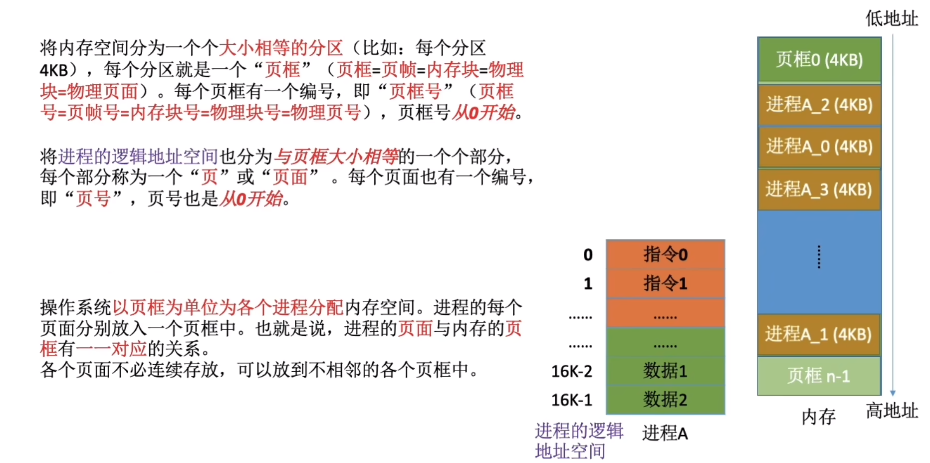

##### 地址结构

分页存储管理的逻辑地址结构包含两部分：前一部分为**页号**，后一部分为**页内偏移量**，即**页内地址**。

在下图所示的例子中，地址长度为 32 位， 其中

- 0〜11 位为页内地址，即每页大小为 4KB；
- 12〜31 位为页号，即最多允许$2^{20}$页。

##### 页表

为了便于在内存中找到进程的每个页面所对应的物理块，系统为**每个进程**建立一张**页表**，它记录页面在内存中对应的物理块号，**页表一般存放在内存中**。

进程的**每个页面对应一个页表项**，每个**页表项由页号和块号组成**，它记录了页面在内存中对应的物理块号。

页表是由**页表项**组成的。**每个页表项的长度是相同的，页号是“隐含”的**（因为页表项连续存放，不占存储空问题间，类似于数组）。

在配置页表后，进程执行时，通过查找该表，即可找到每页在内存中的物理块号。可见，**页表的作用是实现从页号到物理块号的地址映射**。

::: tip 页表项与地址结构比较

页表项与地址都由两部分构成，而且第一部分都是页号，但页表项的第二部分是物理内存中的块号，而地址的第二部分是页内偏移；

页表项的第二部分与地址的第二部分共同组成物理地址。

:::

#### 基本地址变换机构

**基本地址变换机构**的任务是**借助进程的页表将逻辑地址转换为物理地址**。

为了提高地址变换的速度，通常会在系统中设置一个**页表寄存器**(PTR)，**存放页表在内存中的起始地址 F 和页表长度 M**。进程未执行时，页表的始址和页表长度放在进程控制块(PCB)中，当进程被调度时，操作系统内核会把它们放到页表寄存器中。

设页面大小为 L，逻辑地址 A 到物理地址 E 的变换过程如下：

1. **计算页号 P 和页内偏移量 W**

   如果用十进制数手算，则 P=A/L, W=A%L；

   > 但是在计算机实际运行时，逻辑地址结构是固定不变的，因此计算机硬件可以更快地得到二进制表示的页号、页内偏移量。

2. **判断页号是否越界**。比较页号 P 和页表长度 M，若 P$\geqslant$M，则产生越界中断，否则继续执行。

   > 页号是从 0 开始的，而页表长度至少是 1，因此 P=M 时也会越界

3. **在页表中查询页号对应的页表项，确定页面存放的物理块号**（**第 1 次访存**）。页表中页号 P 对应的页表项地址 = 页表起始地址 F + 页号 P $\times$ 页表项长度，取出该**页表项内容 b，即为内存块号**。

4. **计算物理地址** $E=b\times L+W$，用得到的物理地址 E 去访存（**第 2 次访存**）。

   如果内存块号、页面偏移量是用二进制表示的，那么把二者拼接起来就是最终的物理地址了

::: tip 页表项长度、页表长度、页面大小的区别

- 页表长度：这个页表中总共有几个页表项，即总共有几个页；
- 页表项长度：每个页表项占多大的存储空间；
- 页面大小：一个页面占多大的存储空间；

:::

在分页存储管理（页式管理）的系统中，只要确定了每个页面的大小，逻辑地址结构就确定了。

因此，**页式管理中地址是一维的**。即，只要给出一个逻辑地址，系统就可以自动地算出页号、页内偏移量两个部分，并不需要显式地告诉系统这个逻辑地址中，页内偏移量占多少位。

::: info 分页管理方式存在的两个主要问题

1. 每次访存操作都需要进行逻辑地址到物理地址的转换，地址转换过程必须足够快，否则访存速度会降低。
2. 每个进程引入页表，用于存储映射机制，页表不能太大，否则内存利用率会降低。

:::

#### 具有快表的地址变换机构

由上面介绍的地址变换过程可知，若页表全部放在内存中，则存取一个数据或一条指令至少要访问两次内存：第一次是访问页表，确定所存取的数据或指令的物理地址；第二次是根据该地址存取数据或指令。

显然，这种方法比通常执行指令的速度慢了一半。 为此，在地址变换机构中增设一个具有并行查找能力的高速缓冲存储器一一**快表**。

**快表**，又称**联想寄存器**(**TLB**, translation lookaside buffer)，是一种访问速度比内存快很多的**高速缓存**（不是内存），用来**存放最近访问的页表项的副本**，可以**加速地址变换的速度**。

与此对应，**内存中的页表常称为慢表**。

> 快表是专门的硬件，**当进程切换的时候，快表的内容需要被清除**。

::: tip TLB 和普通 Cache 的区别

**TLB 中只有页表项的副本**，而普通 Cache 中可能会有其他各种数据的副本。

:::

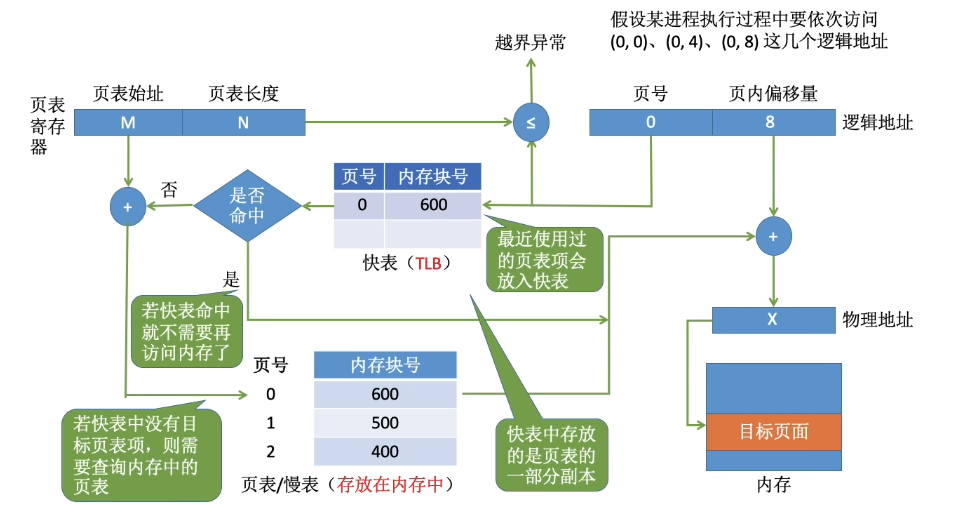

在具有快表的分页机制中，地址的变换过程如下：

1. CPU 给出逻辑地址，由硬件进行地址转换，得到页号、页内偏移量，将页号与快表中的所有页号进行比较。

2. 如果找到匹配的页号，说明要访问的页表项在快表中有副本，则直接从中取出该页对应的内存块号，再将内存块号与页内偏移量拼接形成物理地址，最后，访问该物理地址对应的内存单元。

   因此，**若快表命中，则访问某个逻辑地址仅需一次访存即可**。

3. 如果没有找到匹配的页号，则需要访问内存中的页表，找到对应页表项，得到页面存放的内存块号，再将内存块号与页内偏移量拼接形成物理地址，最后，访问该物理地址对应的内存单元。

   因此，**若快表未命中，则访问某个逻辑地址需要两次访存**。

   > 在找到页表项后，应同时将其存入快表，以便后面可能的再次访问。但若快表已满，则必须按照一定的算法对旧的页表项进行替换。

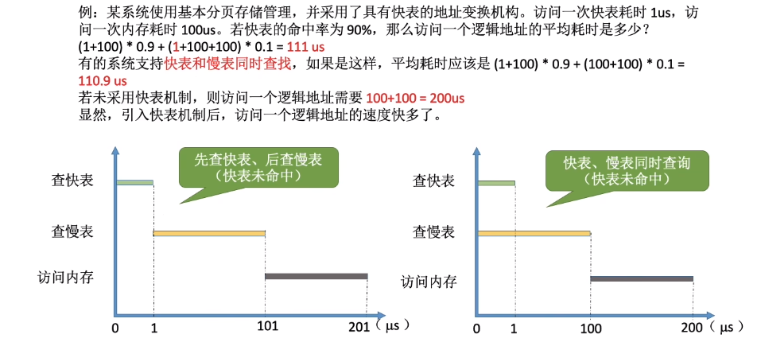

> 有些处理机设计为快表和慢表同时查找，若在快表中查找成功则终止慢表的查找。

::: info 局部性原理

从广义上讲，快表、页高速缓存及虚拟内存技术都属于高速缓存技术，这个技术所依赖的原理就是局部性原理。

局部性原理既适用于程序结构，又适用于数据结构。局部性原理表现在以下两个方面：

- **时间局部性**：如果执行了程序中的某条指令，那么不久后这条指令很有可能再次执行；如果某个数据被访问过，不久之后该数据很可能再次被访问。因为程序中存在大量的循环。

- **空间局部性**：一旦程序访问了某个存储单元，在不久之后，其附近的存储单元也很有可能被访问。因为很多数据在内存中都是连续存放的。

时间局部性通过将近来使用的指令和数据保存到高速缓存中，并使用高速缓存的层次结构实现。

空间局部性通常使用较大的高速缓存，并将预取机制集成到高速缓存控制逻辑中实现。

虚拟内存技术实际上建立了“内存-外存”的两级存储器结构，利用局部性原理实现高速缓存。

:::

在基本地址变换机构中，每次要访问一个逻辑地址，都需要查询内存中的页表。由于局部性原理，可能连续很多次查到的都是同一个页表项。这就是为什么具有快表的地址变换机构能大幅提高系统效能的原因。

#### 两级页表

引入分页管理后，进程在执行时不需要将所有页调入内存页框，而只需将保存有映射关系的页表调入内存，但仍需考虑页表的大小。因为页表必须连续存放，当页表很大时，需要占用很多个连续的页框。但没有必要让整个页表常驻内存，因为进程在一段时间内可能只需要访问某几个特定的页面。

以 32 位逻辑地址空间、页面大小$4KB$、页表项大小$4B$为例：页内偏移为$log_2{4K}=12$位，页号部分为 20 位，则每个进程页表中的页表项数可达$2^{20}$之多，仅页表就要占用$2^{20}×4B/4KB=1K$个页，而且还要求是连续的，显然这是不切实际的。

解决上述问题的方法有两种：

1. 对于页表所需的内存空间，采用离散分配方式，用一张索引表来记录各个页表的存放位置，这就解决了页表占用连续内存空间的问题。

2. 只将当前需要的部分页表项调入内存，其余的页表项仍驻留磁盘，需要时再调入（虚拟内存的思想），这就解决了页表占用内存过多的问题。

   > 该方法和引进页表机制的思路一模一样，实际上就是为离散分配的页表再建立一张页表，称为**外层页表（或页目录）**。

为了方便实现地址变换，需要在系统中增设一个**外层页表寄存器（也称页目录基址寄存器）**，用于**存放页目录始址**。

二级页表如何实现地址变换：

1. 按照地址结构将逻辑地址拆分成三部分；
2. 将逻辑地址中的页目录号（一级页号）作为页目录的索引，从中找到对应页表的始址（第 1 次访存）；
3. 再用二级页号作为页表分页的索引，从中找到对应的页表项（第 2 次访存）；
4. 结合页内偏移量得到物理地址，再用该地址访问内存单元（第 3 次访存）。

> 对于更大的逻辑地址空间，以 $64$ 位为例。
>
> 若采用两级分页，则页面大小为 $4KB$，页表项大小为 $4B$；若按物理块大小划分页表，则有 $42$ 位用于外层页号，此时外层页表有 $4096G$ 个页表项，需占用 $16384GB$ 的连续内存空间，显然这是无法接受的，因此必须采用多级页表，再对外层页表分页。
>
> 建立多级页表的目的在于建立索引，以免浪费内存空间去存储无用的页表项。若采用多级页表机制，则**各级页表的大小不能超过一个页面**。
>
> 

### 基本分段存储管理

分页管理方式是从计算机的角度考虑设计的，目的是提高内存的利用率，提升计算机的性能。分页通过硬件机制实现，对用户完全透明。

分段管理方式的提出则考虑了用户和程序员，以满足方便编程、信息保护和共享、动态增长及动态链接等多方面的需要。

#### 分段

分段系统将用户进程的逻辑地址空间划分为大小不等的段。

例如，用户进程由主程序段、两个子程序段、栈段和数据段组成，于是可以把这个用户进程划分为 5 段，**每段从 0 开始编址**，并分配一段连续的地址空间（**段内要求连续，段间不要求连续**，进程的地址空间是二维的）。

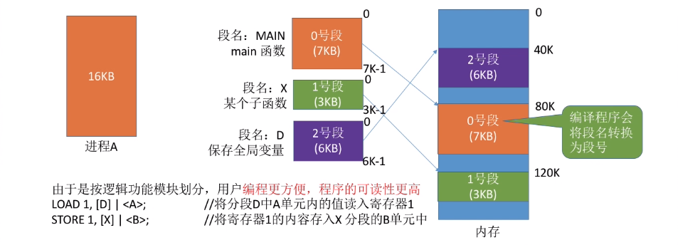

分段系统的**逻辑地址结构**由**段号**（**段名**）和**段内地址**（**段内偏移量**）所组成。

**段号的位数决定了每个进程最多可以分几个段。段内地址位数决定了每个段的最大长度是多少。**

> 在页式系统中，逻辑地址的页号和页内偏移量对用户是透明的，但在分段系统中，段号和段内偏移量必须由用户显式提供，在高级程序设计语言中，这个工作由编译程序完成。

#### 段表

每个进程都有一张逻辑空间与内存空间映射的段表，其中每个段表项对应进程的一段，段表项记录该段在内存中的始址和长度。

配置段表后，执行中的进程可通过查找段表，找到每段所对应的内存区。段表用于实现从逻辑段到物理内存区的映射。

#### 地址变换

1. 从逻辑地址 A 中取出前几位为段号 S，后几位为段内偏移量 W。
2. 判断段号是否越界，若段号 S $\ge$ 段表长度 M，则产生越界中断，否则继续执行。
3. 在段表中查询段号对应的段表项（**第 1 次访存**），段号 S 对应的段表项地址 = 段表始址 F + 段号 S $\times$ 段表项长度。取出段表项中该段的段长 C，若 W $\ge$ C，则产生越界中断，否则继续执行。
4. 取出段表项中该段的始址 b，计算物理地址 E = b + W，用物理地址 E 去访存（**第 2 次访存**）。

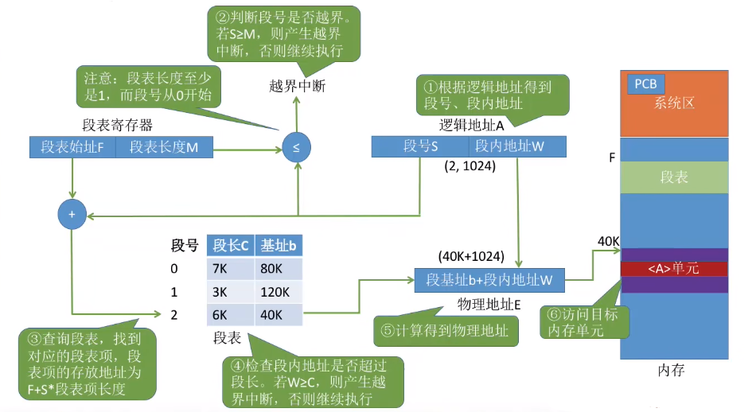

#### 分段、分页管理的对比

1. **页是信息的物理单位**。分页的主要目的是为了实现离散分配，**提高内存利用率**。分页仅仅是系统管理上的需要，完全是系统行为，对用户是不可见的。**段是信息的逻辑单位**。分段的主要目的是**更好地满足用户需求**。一个段通常包含着一组属于一个逻辑模块的信息。

2. **分段对用户是可见的**，用户编程时需要显式地给出段名。**页的大小固定且由系统决定**。段的长度却不固定，决定于用户编写的程序。

3. **分页的用户进程地址空间是一维的**，程序员只需给出一个记忆符即可表示一个地址。**分段的用户进程地址空间是二维的**，程序员在标识一个地址时，既要给出段名，也要给出段内地址。

   

4. **分段比分页更容易实现信息的共享和保护**。不能被修改的代码称为纯代码或可重入代码（不属于临界资源），这样的代码是可以共享的。可修改的代码是不能共享的（比如，有一个代码段中有很多变量，各进程并发地同时访问可能造成数据不一致)。

   

   

   与分页管理类似，分段管理的保护方法主要有两种：一种是存取控制保护，另一种是地址越界保。

   地址越界保护将段表寄存器中的段表长度与逻辑地址中的段号比较，若段号大于段表长度，则产生越界中断；再将段表项中的段长和逻辑地址中的段内偏移进行比较，若段内偏移大于段长，也会产生越界中断。

   分页管理只需要判断页号是否越界，页内偏移是不可能越界的。

### 段页式存储管理

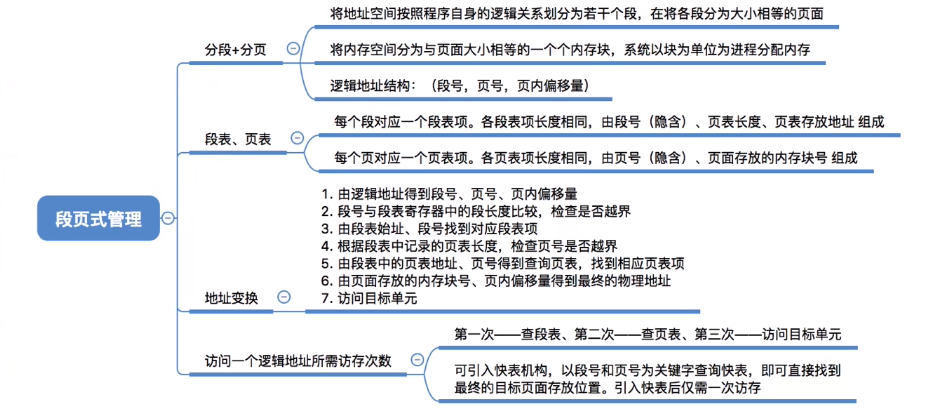

分页存储管理能有效地提高内存利用率，而分段存储管理能反映程序的逻辑结构并有利于段的共享和保护。将这两种存储管理方法结合起来，便形成了段页式存储管理方式。

在段页式系统中，进程的地址空间首先被分成若干逻辑段，每段都有自已的段号，然后将每段分成若干大小固定的页。对内存空间的管理仍然和分页存储管理一样，将其分成若干和页面大小相同的存储块，对内存的分配以存储块为单位。

在段页式系统中，作业的逻辑地址分为三部分：**段号、页号和页内偏移量**

- **段号的位数**决定了每个进程最多可以分几个段；
- **段页号位数**决定了每个段最多有多少页；
- **页页内偏移量**决定了页面大小、内存块大小是多少；

为了实现地址变换，系统为每个进程**建立一张段表**，每个段对应一个段表项，每个段表项至少包括段号、页表长度和页表始址；**每个段有一张页表**，每个页表项至少包括页号和块号。

> 在段页式存储管理中，**每个进程的段表只有一个，而页表可能有多个**。

此外，系统中还应有一个段表寄存器，指出进程的段表始址和段表长度（段表寄存器和页表寄存器的作用都有两个，一是在段表或页表中寻址，二是判断是否越界）。

在进行地址变换时，首先通过段表查到页表始址，然后通过页表找到物理块号，最后形成物理地址。

如图所示，进行一次访问实际需要**三次访问主存**，这里同样可以使用快表来加快查找速度，其关键字由段号、页号组成，值是对应的物理块号和保护码。

# 虚拟内存

## 基本概念

### 传统存储管理方式的特征

传统存储管理方式的特征、缺点：

- **一次性**：作业必须一次性全部装入内存后才能开始运行。

  这会造成两个问题：

  1. 作业很大时，不能全部装入内存，导致大作业无法运行；
  2. 当大量作业要求运行时，由于内存无法容纳所有作业，因此只有少量作业能运行，导致多道程序并发度下降。

- **驻留性**：一旦作业被装入内存，就会一直驻留在内存中，直至作业运行结束。

  事实上，在一个时间段内，只需要访问作业的一小部分数据即可正常运行，这就导致了内存中会驻留大量的、暂时用不到的数据，浪费了宝贵的内存资源。

### 虚拟存储器的定义

基于局部性原理，在程序装入时，仅须**将程序当前要运行的少数页面或段先装入内存，而将其余部分暂留在外存**，就可以让程序开始执行。

在程序执行过程中，当所访问的信息不在内存时，由**操作系统负责将所需信息从外存调入内存**，然后继续执行程序。

若内存空间不够，**操作系统将内存中暂时不使用的内容换出到外存上**，从而腾出空间存放将要调入内存的信息，这个过程就是页面置换（或段置换）功能。

这样，系统好像为用户提供了一个比实际内存容量大得多的存储器，称为**虚拟存储器**。

> 之所以将其称为虚拟存储器，是因为这种存储器实际上并不存在，只是由于系统提供了部分装入、请求调入和置换功能后（对用户透明），给用户的感觉是好像存在一个比实际物理内存大得多的存储器。但容量大只是一种错觉，是虚的。

### 虚拟存储器的特征

虚拟存储器有以下三个主要特征：

1. **多次性**

   是指**无须在作业运行时一次性地全部装入内存，而允许被分成多次调入内存运行**，即只需将当前要运行的那部分程序和数据装入内存即可开始运行。以后每当要运行到尚未调入的那部分程序时，再将它调入。多次性是**虚拟存储器最重要的特征**。

2. **对换性**

   是指**无须在作业运行时一直常驻内存**，在进程运行期间，允许将那些暂不使用的程序和数据从内存调至外存的对换区（换出），待以后需要时再将它们从外存调至内存（换进）。正是由于对换性，才使得虚拟存储器得以正常运行。

3. **虚拟性**

   是指**从逻辑上扩充内存的容量，使用户所看到的内存容量远大于实际的内存容量**。这是虚拟存储器所表现出的最重要特征，也是实现虚拟存储器的最重要目标。

### 虚拟内存技术的实现

虚拟内存技术允许将一个作业分多次调入内存。采用连续分配方式时，会使相当一部分内存空间都处于暂时或“永久”的空闲状态，造成内存资源的严重浪费，而且也无法从逻辑上扩大内存容量。

因此，虚拟内存的实现需要**建立在离散分配的内存管理方式的基础上**。

> 不管哪种方式，都需要有一定的硬件支持。例如：
>
> - 一定容量的内存和外存；
> - 页表机制（或段表机制），作为主要的数据结构；
> - 中断机构，当用户程序要访问的部分尚未调入内存时，则产生中断；
> - 地址变换机构，用于逻辑地址到物理地址的变换。

## 请求分页管理方式

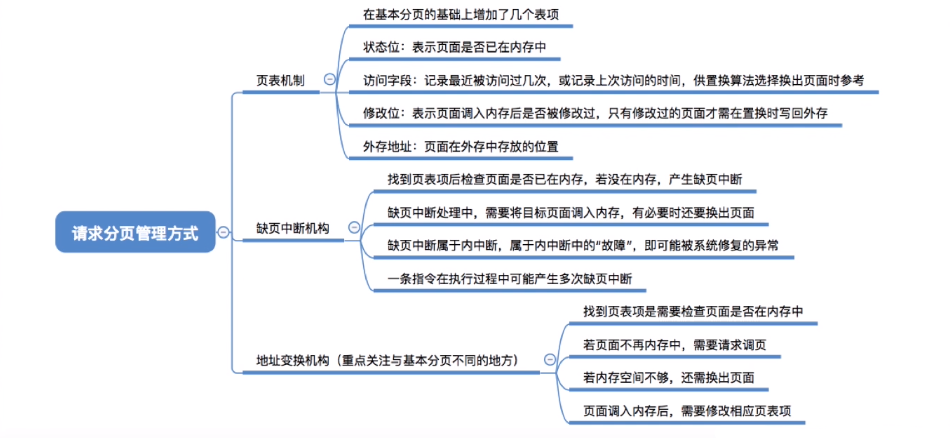

请求分页系统建立在基本分页系统的基础之上，为支持虚拟存储器功能而增加了请求调页和页面置换功能。

在请求分页系统中，只要求将当前需要的一部分页面装入内存，便可启动作业运行。在作业执行过程中，当所访问的页面不在内存时，再通过请求调页功能将其从外存调入内存；当内存空间不够时，通过页面置换功能将内存中暂时用不到的页面换出到外存。

### 页表机制

与基本分页管理相比，请求分页管理中，为了实现“请求调页”，操作系统需要**知道每个页面是否已经调入内存**；如果还没调入，那么也需要**知道该页面在外存中存放的位置**。

当内存空间不够时，要实现“页面置换”，操作系统需要**通过某些指标来决定到底换出哪个页面**；有的页面没有被修改过，就不用再浪费时间写回外存。有的页面修改过，就需要将外存中的旧数据覆盖，因此，操作系统也需要**记录各个页面是否被修改的信息**。

### 缺页中断机构

在请求分页系统中，每当所要访问的页面不在内存中时，便产生一个缺页中断，请求操作系统的缺页中断处理程序处理。此时应将缺页的进程阻塞塞，放入阻塞队列，调页完成后再将其唤醒，放回就绪队列。

若内存中有空闲页框，则为进程分配一个页框，将所缺页面从外存装入该页框，并修改页表中的相应表项，若内存中没有空闲页框，则由页面置换算法选择一个页面淘汰，若该页在内存期间被修改过，则还要将其写回外存。未被修改过的页面不用写回外存。

缺页中断作为中断，同样要经历诸如保护 CPU 环境、分析中断原因、转入缺页中断处理程序、恢复 CPU 环境等几个步骤。但与一般的中断相比，它有以下两个明显的区别：

1. 指令执行期间而非一条指令执行完后产生和处理中断，**属于内部异常**。

   > 缺页中断是因为当前执行的指令想要访问的目标页面未调入内存而产生的，因此属于内中断。

2. **一条指令在执行期间，可能产生多次缺页中断**。

   > 如将逻辑地址 A 中的数据复制到逻辑地址 B，而 A、B 属于不同的页面并且都没有调入内存，则有可能产生两次中断。

### 地址变换机构

在基本分页系统地址变换机构的基础上，为实现虚拟内存，增加了产生和处理缺页中断，及从内存中换出一页的功能。

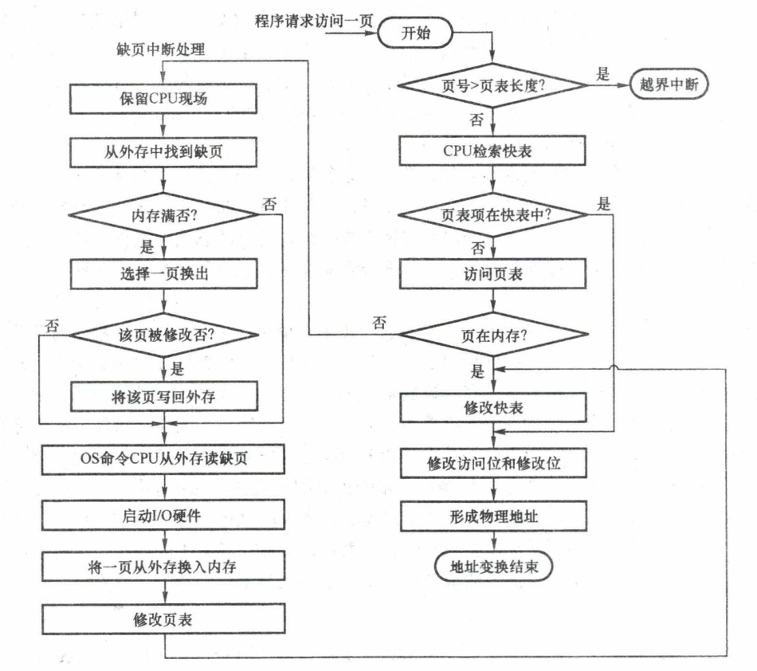

请求分页系统的地址变换过程如下：

1. 先检索快表，若命中，则从相应表项中取出该页的物理块号，并修改页表项中的访问位，以供置换算法换出页面时参考。对于写指令，还需要将修改位置为 1。
2. 若快表未命中，则要到页表中查找，若找到，则从相应表项中取出物理块号，并将该页表项写入快表，若快表已满，则需采用某种算法替换。
3. 若在页表中未找到，则需要进行缺页中断处理，请求系统将该页从外存换入内存，页面被调入内存后，由操作系统负责更新页表和快表，并获得物理块号。
4. 利用得到的物理块号和页内地址拼接形成物理地址，用该地址去访存。

> - 修改访问位和修改位
>
>   只有“写指令”才需要修改“修改位”。并且，一般来说只需修改快表中的数据，只有要将快表项删除时才需要写回内存中的慢表。这样可以减少访存次数。
>
> - 启动 I/O 硬件
>
>   换入/换出页面都需要启动慢速的 I/O 操作，如果换入/换出太频繁，会有很大的开销。
>
> - 修改页表
>
>   页面调入内存后，需要修改慢表，同时也需要将表项复制到快表中。

## 页框分配

### 驻留集

对于分页式的虚拟内存，在进程准备执行时，不需要也不可能将一个进程的所有页都读入主存。**因此，操作系统必须决定读取多少页，即决定给特定的进程分配几个页框**。

**给一个进程分配的页框的集合**就是这个进程的**驻留集**。需要考虑以下两点：

- 驻留集越小，驻留在内存中的进程就越多，可以提高多道程序的并发度，但分配给每个进程的页框太少，会导致缺页率较高，CPU 需耗费大量时间来处理缺页。
- 驻留集越大，当分配给进程的页框超过某个数目时，再为进程增加页框对缺页率的改善是不明显的，反而只能是浪费内存空间，还会导致多道程序并发度的下降，资源利用率降低。

> 在采用了虚拟存储技术的系统中，驻留集大小一般小于进程的总大小。

### 内存分配策略

在请求分页系统中，可采取**两种内存分配策略**，即固定和可变分配策略。

> - **固定分配**：操作系统为每个进程分配一组**固定数目的物理块**，在进程运行期间不再改变。即，**驻留集大小不变**。
> - **可变分配**：先为每个进程分配一定数目的物理块，在进程运行期间，可根据情况做**适当的增加或减少**。即，**驻留集大小可变**。

在进行置换时，也可采取**两种置换策略**，即全局置换和局部置换。

> - **局部置换**：发生缺页时只能选**进程自已的物理块**进行置换。
> - **全局置换**：可以将操作系统**保留的空闲物理块**分配给缺页进程，也可以将**别的进程持有的物理块**置换到外存，再分配给缺页进程。

于是可组合出下面三种适用的策略：

1. **固定分配局部置换**：

   系统为每个进程分配一定数量的物理块，在整个运行期间都不改变。若进程在运行中发生缺页，则只能从该进程在内存中的页面中选出一页换出，然后再调入需要的页面。

   缺点：**难以确定应为每个进程分配的物理块数目**。太少会频繁出现缺页中断，太多又会降低 CPU 和其他资源的利用率。

   > 采用这种策略的系统可以根据进程大小、优先级、或是根据程序员给出的参数来确定为一个进程分配的内存块数。

2. **可变分配全局置换**：

   刚开始会为每个进程分配一定数量的物理块。操作系统会保持一个空闲物理块队列。当某进程发生缺页时，从空闲物理块中取出一块分配给该进程；若已无空闲物理块，则可选择一个未锁定的页面换出外存，再将该物理块分配给缺页的进程。

   > 只要缺页就给分配新物理块。

   采用这种策略时，**只要某进程发生缺页，都将获得新的物理块**，仅当空闲物理块用完时，系统才**选择一个未锁定的页面调出**。被选择调出的页可能是系统中任何一个进程中的页，因此这个**被选中的进程拥有的物理块会减少，缺页率会增加**。

3. **可变分配局部置换**：

   刚开始会为每个进程分配一定数量的物理块。当某进程发生缺页时，只允许从该进程自已的物理块中选出一个进行换出外存。

   如果进程在运行中频繁地缺页，系统会为该进程多分配几个物理块，直至该进程缺页率趋势适当程度；反之，如果进程在运行中缺页率特别低，则可适当减少分配给该进程的物理块。

   > 根据发生缺页的频率来动态地增加或减少进程的物理块。

::: tip 为什么没有固定分配全局置换

全局置换意味着一个进程拥有的物理块数量必然会改变，因此不可能是固定分配，这也就是为什么没有固定分配全局置换。

:::

### 调入页面的时机

为确定系统将进程运行时所缺的页面调入内存的时机，可采取以下两种调页策略：

1. **预调页策略**

   根据局部性原理（主要指空间局部性），一次调入若干个相邻的页面可能比一次调入一个页面更高效。但如果提前调入的页面中大多数都没被访问过，则又是低效的。因此可以预测不久之后可能访问到的页面，将它们预先调入内存。

   这种策略**主要用于进程的首次调入**，由程序员指出应该先调入哪些部分。

2. 请求调页策略

   进程**在运行期间发现缺页时才将所缺页面调入内存**。

   由这种策略调入的页面一定会被访问到，由于每次只能调入一页，而每次调页都要磁盘 I/O 操作，因此**I/O 开销较大**。

### 从何处调入页面

请求分页系统中的外存分为两部分：用于存放文件的文件区和用于存放对换页面的对换区。

对换区采用连续分配方式，而文件区采用离散分配方式，因此对换区的磁盘 I/O 速度比文件区的更快。这样，当发生缺页请求时，系统从何处将缺页调入内存就分为三种情况：

1. 系统拥有足够的对换区空间

   可以全部从对换区调入所需页面，以提高调页速度。为此，在进程运行前，需将与该进程有关的文件从文件区复制到对换区。

   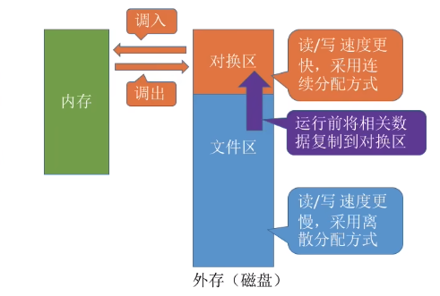

2. 系统缺少足够的对换区空间

   凡是不会被修改的文件都直接从文件区调入；而当换出这些页面时，由于它们未被修改而不必再将它们换出。但对于那些可能被修改的部分，在将它们换出时须调到对换区，以后需要时再从对换区调入（因为读比写的速度快）。

   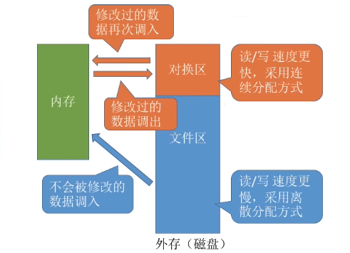

3. UNIX 方式

   与进程有关的文件都放在文件区，因此未运行过的页面都应从文件区调入。曾经运行过但又被换出的页面，由于是放在对换区，因此在下次调入时应从对换区调入。进程请求的共享页面若被其他进程调入内存，则无须再从对换区调入。

   

### 如何调入页面

当进程所访问的页面不在内存中时（存在位为 O)，便向 CPU 发出缺页中断，中断响应后便转入缺页中断处理程序。

该程序通过查找页表得到该页的物理块，此时

- 若内存未满，则启动磁盘 I/O，将所缺页调入内存，并修改页表。
- 若内存已满，则先按某种置换算法从内存中选出一页准备换出；
  - 若该页未被修改（修改位为 0），则不需要将该页写回磁盘；
  - 若该页已被修改（修改位为 1），则必须将该页写回磁盘，然后将所缺页调入内存，并修改页表中的相应表项，置其存在位为 1。

调入完成后，进程就可利用修改后的页表形成所要访问数据的内存地址。

## 页面置换算法

进程运行时，若其访问的页面不在内存而需将其调入，但内存已无空闲空间时，就需要从内存中调出一页，换出到外存。**选择调出哪个页面的算法**就称为页面置换算法。

页面的换入、换出需要磁盘 I/O，会有较大的开销，因此好的页面置换算法应该**追求更少的缺页率**。

### 最佳置换算法(OPT)

> OPTimal replacement

最佳置换算法选择的**被淘汰页面是以后永不使用的页面，或是在最长时间内不再被访问的页面**，以便保证获得最低的缺页率。

最佳置换算法可以保证最低的缺页率，但实际上，只有在进程执行的过程中才能知道接下来会访问到的是哪个页面。操作系统**无法提前预判页面访问序列**。因此，**最佳置换算法是无法实现的**。

> ==缺页时未必发生页面置换==，==若还有可用的空闲内存块就不用进行页面置换==。

### 先进先出置换算法(FIFO)

> First Input First Output

**优先淘汰最早进入内存的页面**，即**淘汰在内存中驻留时间最久的页面**。

该算法实现简单，只需把已调入内存的页面根据先后次序链接成**队列**，设置一个指针总是指向最老的页面。但该算法与进程实际运行时的规律不适应，因为在进程中，有的页面经常被访问。

FIFO 算法还会产生当**为进程分配的物理块增多，缺页次数不减反增的异常现象**，称为 **Belady 异常**。

> ==只有 FIFO 算法会产生 Belady 异常，LRU 和 OPT 算法永远不会出现 Belady 异常。==。

另外，FIFO 算法虽然实现简单，但是该算法与进程实际运行时的规律不适应，因为先进入的页面也有可能最经常被访问。因此，算法性能差。

### 最近最久未使用置换算法(LRU)

> Least recently used

LRU 算法选每次**淘汰的页面是最近最久未使用的页面**，它认为过去一段时间内未访问过的页面，在最近的将来可能也不会被访问。

该算法为每个页面设置一个访问字段，用**访问字段记录该页面自上次被访问以来所经历的时间 t**。当需要淘汰一个页面时，选择现有页面中 t 值最大的，即最近最久未使用的页面。

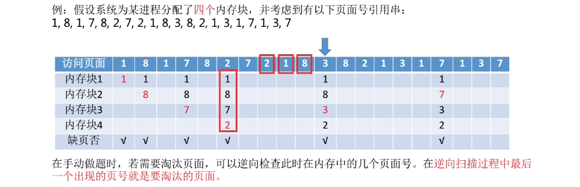

LRU 算法的性能较好，但需要寄存器和栈的硬件支持。LRU 是堆栈类的算法。理论上可以证明，堆栈类算法不可能出现 Belady 异常。FIFO 算法基于队列实现，不是堆栈类算法。

### 时钟置换算法(CLOCK)

最佳置换算法性能最好，但无法实现；先进先出置换算法实现简单，但算法性能差；最近最久未使用置换算法性能好，是最接近 OPT 算法性能的，但是实现起来需要专门的硬件支持，算法开销大。

因此，操作系统的设计者尝试了很多算法，试图用比较小的开销接近 LRU 算法的性能，这类算法都是 CLOCK 算法的变体。

#### 简单的 CLOCK 置换算法

为每个页面设置一位**访问位**，当某页**首次被装入或被访问时，其访问位被置为 1**。算法将内存中的页面链接成一个循环队列，并有一个**替换指针**与之相关联。当**某一页被替换时，该指针被**
**设置指向被替换页面的下一页**。

当需要淘汰一个页面时，**只需检查页的访问位**。如果**是 0，就选择该页换出**；如果**是 1，则将它置为 0，暂不换出，给予该页第二次驻留内存的机会**，继续检查下一个页面，若第一轮扫描中所有页面都是 1，则将这些页面的访问位依次置为 0 后，再进行第二轮扫描。

> 第二轮扫描中一定会有访问位为 O 的页面，因此简单的 CLOCK 算法选择一个淘汰页面**最多会经过两轮扫描**。

由于该算法是循环地检查各个页面的使用情况，所以称为 CLOCK 算法。但是，因为该算法只有一位访问位，而置换时将未使用过的页面换出，所以也称最近未用(NRU, NotRecently Used)算法。

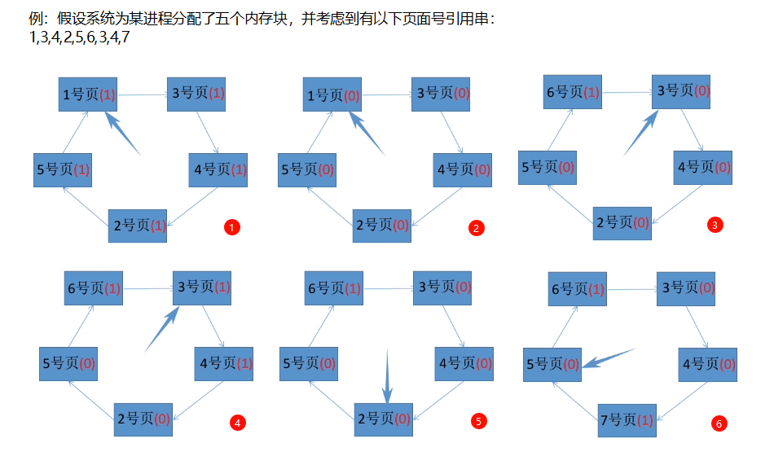

#### 改进型 CLOCK 置换算法

简单的时钟置换算法仅考虑到一个页面最近是否被访问过。事实上，如果被淘汰的页面没有被修改过，就不需要执行 I/O 操作写回外存。只有被淘汰的页面被修改过时，才需要写回外存。因此，除了考虑一个页面最近有没有被访问过之外，操作系统还应考虑页面有没有被修改过。

在改进型 CLOCK 算法中，除考虑页面使用情况外，还增加了置换代价一一**修改位**。在选择页面换出时，优先考虑既未使用过又未修改过的页面。

由访问位 A 和修改位 M 可以组合成下面四种类型的页面：

- A=0, M=0：最近未被访问，且未被修改，是最佳的淘汰页。
- A=0, M=1：最近未被访问，但已被修改，是次佳的淘汰页。
- A=1, M=0：最近已被访问，但未被修改，可能再被访问。
- A=1, M=1：最近已被访问，且已被修改，可能再被访问。

::: warning

为方便讨论，用（访问位，修改位）的形式表示各页面状态。如（1，1）表示一个页面近期被访问过，且被修改过。

:::

内存中的每页必定都是这四类页面之一。在进行页面置换时，可采用与简单 CLOCK 算法类似的算法，差别在于该算法要同时检查访问位和修改位。

算法执行过程如下：

- 第一轮：从当前位置开始扫描到第一个（0，0）的帧用于替换。本轮扫描不修改访问位。
- 第二轮：若第一轮扫描失败，则重新扫描，查找第一个（0，1）的帧用于替换。本轮将所有扫描过的帧访问位设为 0。
- 第三轮：若第二轮扫描失败，将指针返回到开始的位置重新扫描，查找第一个（0，0）的帧用于替换。本轮扫描不修改访问位。
- 第四轮：若第三轮扫描失败，则重新扫描，查找第一个（0，1）的帧用于替换。

> 由于第二轮已将所有帧的访问位设为 0，因此经过第三轮、第四轮扫描一定会有一个帧被选中，因此**改进型 CLOCK 置换算法**选择一个淘汰页面**最多会进行四轮扫描**。

改进型 CLOCK 算法优于简单 CLOCK 算法的地方在于，可减少磁盘的 I/O 操作次数。但为了找到一个可置换的页，可能要经过几轮扫描，即实现算法本身的开销将有所增加。

操作系统中的页面置换算法都有一个原则，即尽可能保留访问过的页面，而淘汰未访问过的页面。简单的 CLOCK 算法只考虑页面是否被访问过；改进型 CLOCK 算法对这两类页面做了细分，分为修改过和未修改过的页面。因此，若有未使用过的页面，则当然优先将其中未修改过的页面换出。若全部页面都使用过，还是优先将其中未修改过的页面换出。

## 抖动工作集

### 抖动

刚刚换出的页面马上又要换入内存，刚刚换入的页面马上又要换出外存，这种**频繁的页面调度行为**称为**抖动**，或颠簸。

系统发生抖动的根本原因是，**分配给每个进程的物理块太少**，不能满足进程正常运行的基本要求，致使每个进程在运行时频繁地出现缺页，必须请求系统将所缺页面调入内存。

显然，对磁盘的访问时间也随之急剧增加，造成每个进程的大部分时间都用于页面的换入/换出，而几乎不能再去做任何有效的工作，进而导致发生 CPU 利用率急剧下降并趋于零的情况。

### 工作集

抖动是进程运行时出现的严重问题，必须采取相应的措施解决它。由于抖动的发生与系统为进程分配物理块的多少（即驻留集）有关，于是又提出了关于进程工作集的概念。

工作集：指在某段时间间隔里，进程实际访问页面的集合。

实际应用中，工作集窗口会设置得很大，即对于**局部性好的程序，工作集大小一般会比工作集窗口小很多**。

工作集反映了进程在接下来的一段时间内很有可能会频繁访问的页面集合，因此驻留集大小不能小于工作集，否则进程在运行过程中会频繁缺页。

> **驻留集大小不能小于工作集大小，否则进程运行过程中将频繁缺页**。

## 内存映射文件

**内存映射文件**(Memory-Mapped Files)：作系统向应用程序提供的**一个系统调用**，它与虚拟内存有些相似，在磁盘文件与进程的虚拟地址空间之间建立映射关系。

**进程通过该系统调用，将一个文件映射到其虚拟地址空间的某个区域，之后就用访问内存的方式读写文件**。

这种功能将一个文件当作内存中的一个大字符数组来访问，而不通过文件 I/O 操作来访问，显然这更便利。磁盘文件的读出/写入由操作系统负责完成，对进程而言是透明的。当映射进程的页面时，不会实际读入文件的内容，而只在访问页面时才被每次一页地读入。当进程退出或关闭文件映射时，所有被改动的页面才被写回磁盘文件。

进程可通过共享内存来通信，实际上，很多时候，共享内存是通过映射相同文件到通信进程的虚拟地址空间来实现的。

当多个进程映射到同一个文件时，各进程的虚拟地址空间都是相互独立的，但操作系统将对应的这些虚拟地址空间映射到相同的物理内存（用页表实现）。一个进程在共享内存上完成了写操作，此刻当另一个进程在映射到这个文件的虚拟地址空间上执行读操作时，就能立刻看到上一个进程写操作的结果。

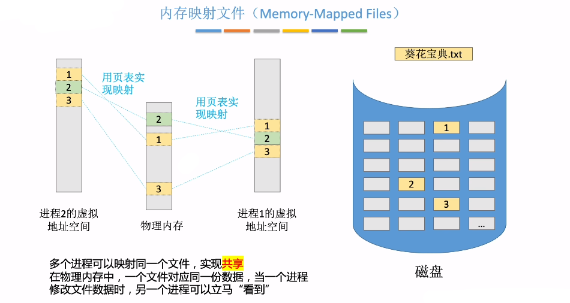

由此可见，内存映射文件带来的好处主要是：

1. 使程序员的编程更简单，已建立映射的文件，只需按访问内存的方式进行读写；
2. 方便多个进程共享同一个磁盘文件。

## 虚拟存储器性能影响因素

**缺页率是影响虚拟存储器性能的主要因素**，而缺页率又受到页面大小、分配给进程的物理块数、页面置换算法以及程序的编制方法的影响。

1. 根据局部性原理，**页面较大则缺页率较低，页面较小则缺页率较高**。

   页面较小时，一方面减少了内存碎片，有利于提高内存利用率；另一方面，也会使每个进程要求较多的页面，导致页表过长，占用大量内存。

   页面较大时，虽然可以减少页表长度，但会使页内碎片增大。

2. **分配给进程的物理块数越多，缺页率就越低**，但是**当物理块超过某个数目时，再为进程增加一个物理块对缺页率的改善是不明显的**。只要保证活跃页面在内存中，保持缺页率在一个很低的范围即可。

3. **好的页面置换算法可使进程在运行过程中具有较低的缺页率**。选择 LRU、CLOCK 等置换算法，将未来有可能访问的页面尽量保留在内存中，从而提高页面的访问速度。

4. **写回磁盘的频率**。换出已修改过的页面时，应当写回磁盘，如果每当一个页面被换出时就将它写回磁盘，那么每换出一个页面就需要启动一次磁盘，效率极低。

   为此在系统中建立一个已修改换出页面的链表，对每个要被换出的页面（已修改），可以暂不将它们写回磁盘，而将它们挂在该链表上，仅当被换出页面数达到给定值时，才将它们一起写回磁盘，这样就可显著减少磁盘 I/O 的次数，即减少巳修改页面换出的开销。

   此外，如果有进程在这批数据还未写回磁盘时需要再次访问这些页面，就不需从外存调入，而直接从已修改换出页面链表上获取，这样也可以减少页面从磁盘读入内存的频率，减少页面换进的开销。

## 地址翻译

设某系统满足以下条件：

- 有一个 TLB 与一个 dataCache
- 存储器以字节为编址单位
- 虚拟地址 14 位
- 物理地址 12 位
- 页面大小为 $64B$
- TLB 为四路组相联，共有 16 个条目
- dataCache 是物理寻址、直接映射的，行大小为 4B，共有 16 组

因为本系统以字节编址，页面大小为$64B$，则页内偏移地址为$log_2{(64B/1B)}=6$位，所以虚拟页号为$14-6=8$位，物理页号为$12-6=6$位。

因为 TLB 为四路组相联，共有 16 个条目，则 TLB 共有$16/4=4$组，因此虚拟页号中低$log_24=2$位就为组索引，高 6 位就为 TLB 标记。又因为 Cache 行大小为 4B，因此物理地址中低 log24=2 位为块偏移，Cache 共有 16 组，可知接下来$log_2{16}=4$位为组索引，剩下高 6 位作为标记。

写出访问地址为`0x03d4`，`0x00f1`和`0x0229`的过程。

先将十六进制的虚拟地址`0x03d4`，`0x00f1`和`0x0229`转化为二进制形式。

得到每个地址的组索引和 TLB 标记，接下来就要找出每个地址的页面在不在主存中，若在主存中，则还要找出物理地址。

- 对于 `0x03d4`，组索引为 3，TLB 标记为 `0x03`，查 TLB，第 3 组中正好有标记为 03 的项，有效位为 1，可知页面在主存中，对应的物理页号为 `0d (001101)`，再拼接页内地址 `010100`，可得物理地址为 `0x354 (001101010100)`。
- 对于 `0x00fl`，组索引为 3，TLB 标记为 `0x00`，查 TLB，第 3 组中没有标记为 00 的项，再去找页表，虚拟页号为`0x03`，页表第 3 行的有效位为 1，可知页面在主存中，物理页号为 `02 (000010)`，再拼接页内地址 `110001`，可得物理地址为 `0x0b1 (000010110001)`。
- 对于 `0x0229`，组索引为 0，TLB 标记为 `0x02`，查 TLB，第 0 组中没有标记为 02 的项，再去找页表，虚拟页号为 `0x08`，页表第 8 行的有效位为 0，页面不在主存中，产生缺页中断。

找出在主存中的页面的物理地址后，就要通过物理地址访问数据，接下来要找该物理地址的内容在不在 Cache 中，物理地址结构如下表所示。

- 对于 `0x354`，Cache 索引为 5，Cache 标记为 `0x0d`，对照 Cache 中索引为 5 的行，标记正好为 `0d`，有效位为 1，可知该块在 Cache 中，偏移 0，即块 0，可得虚拟地址 `0x03d4` 的内容为 `36H`。
- 对于 `0x0bl`，Cache 索引为 c，Cache 标记为 `0x02`，对照 Cache 中索引为 c 的行，有效位为 0，可知该块不在 Cache 中，要去主存中查找物理页号为 2、偏移为 `0x31` 的内容。

> 以上例子基本覆盖了从虚拟地址到 Cache 查找内容的所有可能出现的情况，查找顺序是从 TLB 到页表（TLB 不命中），再到 Cache 和主存，最后到外存。

# 覆盖与交换\*

## 覆盖

覆盖技术，用来**解决程序大小超过物理内存总和的问题**。

由于程序运行时并非任何时候都要访问程序及数据的各个部分（尤其是大程序），因此可把用户空间分成**一个固定区**和**若干覆盖区**。将经常活跃的部分放在固定区，不常用的部分按调用关系分段。

首先将那些即将要访问的段放入覆盖区，其他段放在外存中，在需要调用前，系统再将其调入覆盖区，替换覆盖区中原有的段。

覆盖技术打破了必须将一个进程的全部信息装入主存后才能运行的限制，但当同时运行程序的代码量大于主存时仍不能运行。

内存中能够更新的地方只有覆盖区的段，不在覆盖区中的段会常驻内存。

缺点的是必须由程序员声明覆盖结构，操作系统完成自动覆盖。对用户不透明，增加了编程的负担。

## 交换

交换（对换）的基本思想是，把处于等待状态（或在 CPU 调度原则下被剥夺运行权利）的程序暂时从内存移到外存，把内存空间腾出来，这一过程又称**换出**；把准备好竞争 CPU 运行的程序从外存移到内存，这一过程又称**换入**。

暂时换出外存等待的进程状态称为**挂起状态**。挂起状态又可以细分为**就绪挂起**、**阻塞挂起**两种状态。

有关交换，需要注意以下几个问题：

- 交换需要备份存储，通常是磁盘。它必须足够大，并提供对这些内存映像的直接访问。
- 为了有效使用 CPU，需要使每个进程的执行时间比交换时间长。
- 若换出进程，则必须确保该进程完全处于空闲状态。
- 交换空间通常作为磁盘的一整块，且独立于文件系统，因此使用起来可能很快。
- 交换通常在有许多进程运行且内存空间吃紧时开始启动，而在系统负荷降低时就暂停。
- 普通的交换使用不多，但交换策略的某些变体在许多系统（如 UNIX）中仍发挥作用。

