# 基本概念

## 传输层的功能

物理层、数据链路层和网络层，它们共同解决了将主机通过异构网络互联起来所面临的问题，实现了主机到主机的通信。然而在计算机网络中实际进行通信的真正实体，是位于通信两端主机中的进程。

传输层位于网络层之上、应用层之下，它为运行在**不同主机上的进程之间提供逻辑通信**。

传输层属于面向通信部分的最高层，同时也是用户功能中的最低层。显然，即使网络层协议不可靠（网络层协议使分组丢失、混乱或重复），传输层同样能为应用程序提供可靠的服务。

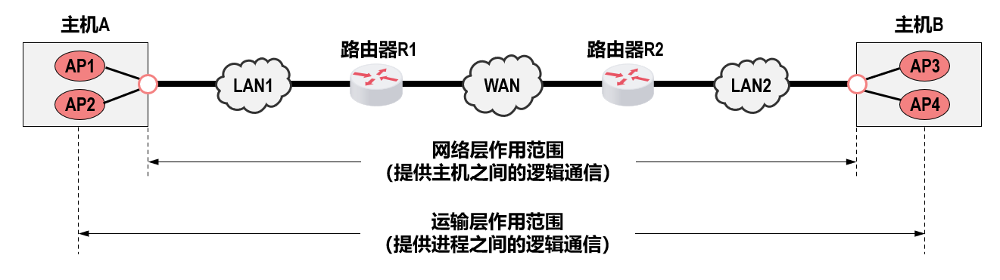

网络的边缘部分的两台主机使用网络的核心部分的功能进行端到端的通信时，只有主机的协议栈才有传输层，而路由器在转发分组时都只用到下三层的功能（即在==通信子网中没有传输层，传输层只存在于通信子网以外的主机中==）。

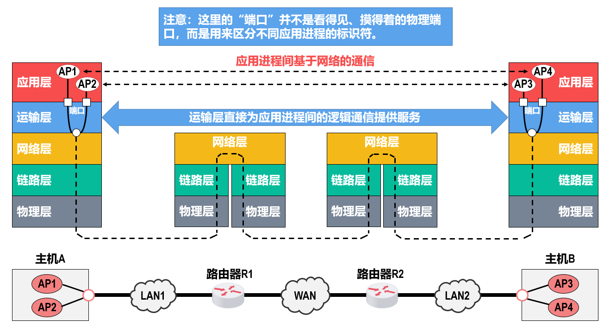

从网络层来说，通信的双方是两台主机，IP 数据报的首部给出了这两台主机的 IP 地址。但“**两台主机之间的通信**”实际上是**两台主机中的应用进程之间的通信**。应用进程之间的通信又称**端到端的逻辑通信**。

IP 协议虽然能把分组送到目的主机，但这个分组还停留在主机的网络层，而没有交付给主机中的进程。**从传输层来看，通信的真正端点不是主机而是主机中的进程**。

## 两个主要协议


TCP/IP 协议族在 IP 层之上使用了两个传输协议：

- ==面向连接的传输控制协议(TCP)==，采用 TCP 时，传输层向上提供的是一条==全双工的可靠逻辑信道==；

  TCP 提供面向连接的可靠服务，通信双方在传送数据之前必须**先建立连接**，然后基于此连接进行可靠数据传输，数据**传输结束后要释放连接**。

  TCP 不提供广播或多播服务。

  TCP 为了实现可靠数据传输，就必须增加许多措施，如确认、流量控制、计时器及连接管理等。这不仅使协议数据单元的首部增大很多，还要占用许多的处理机资源。因此 TCP 主要适用于可靠性更重要的场合，如文件传输协议、超文本传输协议、远程登录等。

- ==无连接的用户数据报协议(UDP)==，采用 UDP 时，传输层向上提供的是一条==不可靠的逻辑信道==。

  UDP 提供无连接的不可靠服务，通信双方在传送数据之前**不需要建立连接**，接收方的传输层在收到 UDP 用户数据报后，**无须给发送方发回任何确认**。

  UDP 在 IP 层之上仅提供两个附加服务：多路复用和对数据的错误检查。

  IP 层知道怎样把分组投递给一台主机，但不知道怎样把它们投递给主机上的具体应用。

  因为 UDP 比较简单，所以执行速度比较快、实时性好。使用 UDP 的应用主要包括小文件传送协议、DNS、SNMP 和实时传输协议。

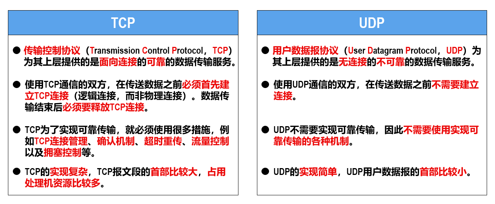

::: tip

网络层无法同时实现两种协议（即在网络层要么只提供面向连接的服务，如虚电路：要么只提供无连接服务，如数据报，而不可能在网络层同时存在这两种方式）。

:::

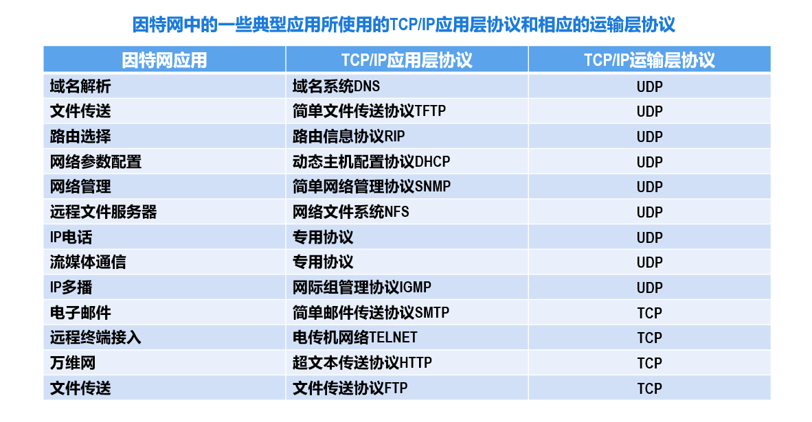

## 端口

端口能让应用层的各种进程将其数据通过端口向下交付给传输层，以及让传输层知道应当将其报文段中的数据向上通过端口交付给应用层相应的进程。

端口在传输层的作用类似于 IP 地址在网络层的作用，只不过 IP 地址标识的是主机，而端口标识的是主机中的应用进程。

在协议栈层间的抽象的协议端口是软件端口，它与路由器或交换机上的硬件端口是完全不同的概念。硬件端口是不同硬件设备进行交互的接口，而软件端口是应用层的各种协议进程与传输实体进行层间交互的一种地址。传输层使用的是软件端口。

---

应用进程通过端口号进行标识，端口号长度为 16 比特，取值范围是 0 ~ 65535。

==端口号只具有本地意义==，即**端口号只标识本计算机应用层中的各进程**，在因特网中**不同计算机的相同端口号是没有联系的**。

根据端口号范围可将端口分为两类：

1. ==服务器端使用的端口号==

   - **熟知端口号**，数值为 0 ～ 1023，这些端口号指派给了 TCP/IP 最重要的一些应用程序，让所有的用户都知道。
   - **登记端口号**，数值为 1024 ～ 49151，供没有熟知端口号的应用程序使用的，使用这类端口号必须在 IANA 登记，以防止重复。

2. ==客户端使用的端口号==

   数值为 49152 ～ 65535。因为这类端口号仅在客户进程运行时才动态地选择，所以又称**短暂端口号**。

   当服务器进程收到客户进程的报文时，就知道了客户进程所使用的端口号，因而可以把数据发送给客户进程。通信结束后，刚用过的客户端口号就不复存在，这个端口号就可以供其他客户进程使用。

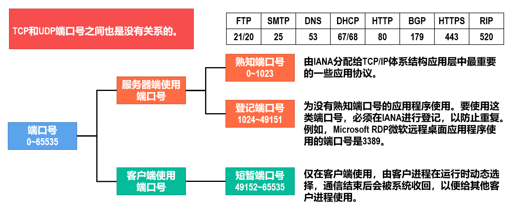

---

在网络中通过 IP 地址来标识和区别不同的主机，通过端口号来标识和区分一台主机中的不同应用进程，端口号拼接到 IP 地址即构成套接字(Socket)。

在网络中采用发送方和接收方的套接字来识别端点。套接字，实际上是一个通信端点，即

```math
 \text{套接字}(Socket)=( \text{IP地址:端口号})
```

它**唯一地标识网络中的一台主机上的一个应用进程**。

在网络通信中，主机 A 发给主机 B 的报文包含目的端口号和源端口号，源端口号是“返回地址”的一部分，即当主机 B 需要发回一个报文给主机 A 时，主机 B 到主机 A 的报文中的目的端口号便是主机 A 到主机 B 的报文中的源端口号（完全的返回地址是主机 A 的 IP 地址和源端口号）。

## 复用和分用

- ==复用==是指发送方**不同的应用进程都可以使用同一个传输层协议传送数据**。
- ==分用==是指接收方的**传输层在剥去报文的首部后能够把这些数据正确交付到目的应用进程**。

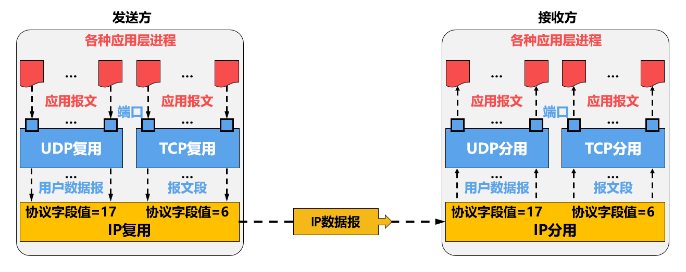


::: tip

网络层也有复用和分用的功能，但网络层的复用是指发送方不同协议的数据都可被封装成 IP 数据报发送出去，分用是指接收方的网络层在剥去首部后把数据交付给相应的协议。

:::

## 检错检测

传输层要对收到的报文（首部和数据部分）进行差错检测。

- 对于==TCP==协议，若接收方发现==报文段==出错，则要求发送方==重发==该报文段。
- 对于==UDP==协议，若接收方发现==数据报==出错，则直接==丢弃==。

在网络层，IP 数据报首部中的检验和字段只检验首部是否出错，而不检查数据部分。

# UDP

## UDP 概述

UDP 仅在 IP 层的数据报服务之上增加了两个最基本的功能：**复用和分用**，以及**差错检测**。

UDP 优点：

1. UDP 无须建立连接，因此 UDP 不会引入建立连接的时延。
2. 无连接状态。当某些专用服务器使用 UDP 时，一般都能支持更多的活动客户机。
3. UDP 的首部开销小。TCP 有 20B 的首部开销，而 UDP 仅有 8B 的开销。
4. UDP 没有拥塞控制，因此网络中的拥塞不会影响源主机的发送速率。
5. UDP 支持一对一、一对多、多对一和多对多的交互通信。

UDP 应用场景：

- UDP 常用于**一次性传输较少数据的网络应用**，如 DNS、SNMP 等，因为对于这些应用，若采用 TCP，则将为连接创建、维护和拆除带来不小的开销。
- UDP 也常用于**多媒体应用**（如 IP 电话、实时视频会议、流媒体等），显然，可靠数据传输对这些应用来说并不是最重要的，但 TCP 的拥塞控制会导致数据出现较大的延迟，这是它们不可容忍的。

UDP**不保证可靠交付**，但这并**不意味着应用对数据的要求是不可靠的**，所有**维护可靠性的工作可由用户在应用层来完成**。应用开发者可根据应用的需求来灵活设计自己的可靠性机制。

UDP 是面向报文的。

- 发送方 UDP 对应用层交下来的报文，在添加首部后就向下交付给 IP 层，一次发送一个报文，既不合并，也不拆分，而是保留这些报文的边界；
- 接收方 UDP 对 IP 层交上来 UDP 数据报，在去除首部后就原封不动地交付给上层应用进程，一次交付一个完整的报文。

因此**报文**不可分割，是==UDP 数据报处理的最小单位==。因此，**应用程序必须选择合适大小的报文**，若报文太长，UDP 把它交给 IP 层后，可能会导致分片；若报文太短，UDP 把它交给 IP 层后，会使 IP 数据报的首部的相对长度太大，两者都会降低 IP 层的效率。

## UDP 数据报

UDP 数据报包含两部分：**首部字段**和**用户数据字段**。UDP 首部有==8B==，由 4 个字段组成，每个字段的长度都是 2B。

各字段意义如下：

1. ==源端口==：源端口号。在需要对方回信时选用，不需要时可用全 0。
2. ==目的端口==：目的端口号。这在终点交付报文时必须使用到。
3. ==长度==：UDP 数据报的长度（==包括首部和数据==），其**最小值是 8**（仅有首部）。
4. ==检验和==：检测 UDP 数据报在传输中是否有错。该字段是可选的，**当源主机不想计算检验和时，则直接令该字段为全 0**（若检验和计算结果恰好是 0，则该字段为全 1）。

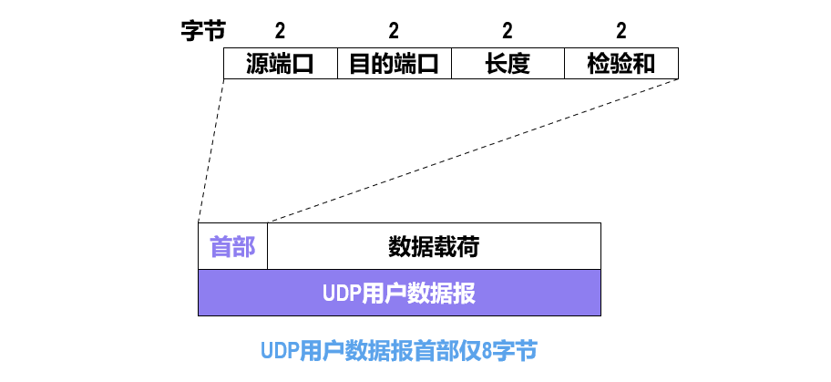

若接收方 UDP 发现收到的报文中的==目的端口号不正确==（即不存在对应于端口号的应用进程）则就丢弃该报文，并由==ICMP 发送“端口不可达”差错报文==给发送方。

## UDP 检验

在计算检验和时，要在 UDP 数据报之前增加**12B 的伪首部**，伪首部并不是 UDP 的真正首部。只是在计算检验和时，临时添加在 UDP 数据报的前面，得到一个临时的 UDP 数据报。

检验和就是按照这个临时的 UDP 数据报来计算的。

==伪首部既不向下传送又不向上递交，而只是为了计算检验和==。

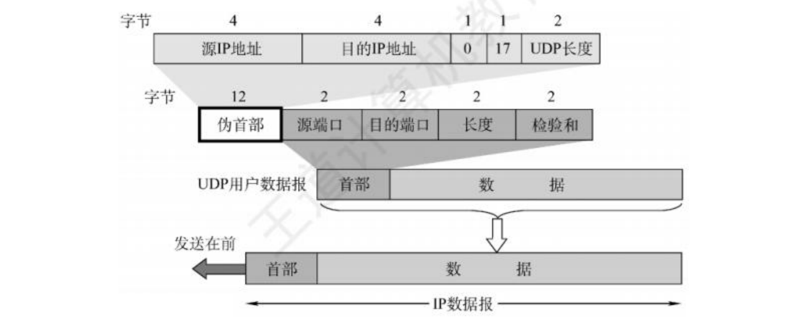

UDP 计算检验和的方法和计算 IP 数据报首部检验和的方法相似。不同的是**IP 数据报的检验和只检验 IP 数据报的首部**，但==UDP 的检验和要将首部和数据部分一起检验==。

UDP 计算检验和的方法：

1. 发送方首先把全 O 放入检验和字段并添加伪首部，然后把 UDP 数据报视为许多 16 位的字串接起来。

   若 UDP 数据报的**数据部分不是偶数个字节**，则要**在末尾填入一个全 0 字节，但此字节不发送**。

2. 然后按**二进制反码计算**出这些 16 位字的和，将**此和的二进制反码**写入检验和字段，并发送。

3. 接收方把收到的 UDP 数据报加上伪首部（若不为偶数个字节，则还需要补上全 0 字节）后，按二进制反码求这些 16 位字的和。

   当无差错时其结果应为全 1，否则就表明有差错出现，接收方就应该丢弃这个 UDP 数据报。

UDP 检验和**检验出 UDP 数据报是错误的**，则==可以丢弃，也可以交付给上层==，但是需要附上错误报告，即告诉上层这是错误的数据报。

通过伪首部，不仅可以检查==源端口号、目的端口号==和==UDP 用户数据报的数据部分==，还可以检查==IP 数据报的源 IP 地址和目的地址==。

这种简单的差错检验方法的==校错能力不强==，但它的好处是**简单、处理速度快**。

# TCP

## 特点

TCP 是在不可靠的 IP 层之上实现的可靠的数据传输协议，它**主要解决传输的可靠、有序、无丢失和不重复问题**。

TCP 是 TCP/IP 体系中非常复杂的一个协议，主要特点如下：

1. TCP 是面向连接的传输层协议，TCP 连接是一条逻辑连接。
2. 每一条 TCP 连接==只能有两个端点==，每一条**TCP 连接只能是一对一**的。
3. TCP 提供==可靠交付==的服务，保证传送的数据**无差错、不丢失、不重复且有序**。
4. TCP 提供==全双工通信==，允许通信双方的应用进程在任何时候都能发送数据，为此 TCP 连接的**两端都设有发送缓存和接收缓存**，用来临时存放双向通信的数据。
   - 发送缓存用来暂时存放：发送应用程序传送给发送方 TCP 准备发送的数据；TCP 已发送但尚未收到确认的数据。
   - 接收缓存用来暂时存放：按序到达但尚未被接收应用程序读取的数据；不按序到达的数据。
5. TCP 是==面向字节流==的，虽然应用程序和 TCP 的交互是一次一个数据块（大小不等），但 TCP 把应用程序交下来的数据仅视为一连串的无结构的字节流。

TCP 和 UDP 在发送报文时所采用的方式完全不同。UDP 报文的长度由发送应用进程决定，而 TCP 报文的长度则根据接收方给出的窗口值和当前网络拥塞程度来决定。若应用进程传送到 TCP 缓存的数据块太长，则 TCP 就把它划分得短一些再传送；若太短，则 TCP 也可等到积累足够多的字节后再构成报文段发送出去。关于 TCP 报文的长度问题，后面会详细讨论。

## 报文段

TCP==传送的数据单元==称为==报文段==。

TCP 报文段**既可以用来运载数据，又可以用来建立连接、释放连接和应答**。

一个 TCP 报文段分为首部和数据两部分，整个 TCP 报文段作为 IP 数据报的数据部分封装在 IP 数据报中。其首部的前 20B 是固定的。TCP 首部最短为 20B，后面有 4N 字节是根据需要而增加的选项，==长度为 4B 的整数倍==。

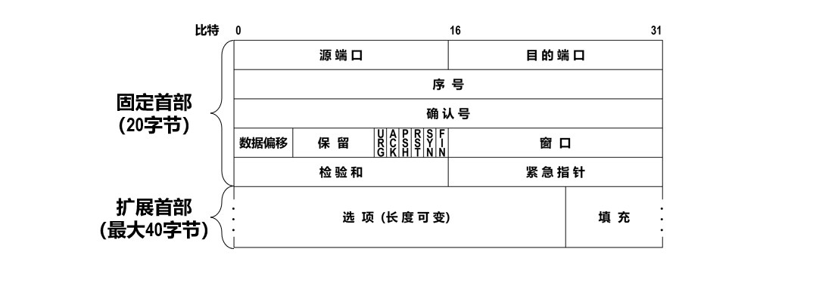

1. 源端口和目的端口

   各占 2B。分别表示发送方和接收方使用的端口号。

2. ==序号==

   占 4B，范围为 0 ～ 2^32^-1，共 2^32^个序号。

   TCP 连接中传送的字节流中的**每个字节都要按顺序编号**，序号字段值指的是**本报文段所发送的数据的第一个字节的序号**。

   例如，一报文段的序号字段值是 301，而携带的数据共有 100B，表明本报文段的数据的最后一个字节的序号是 400，因此下一个报文段的数据序号应从 401 开始。

3. ==确认号==

   占 4B，是**期望收到对方下一个报文段的第一个数据字节的序号**。

   若确认号为 N，则表明到序号 N-1 为止的所有数据都已正确收到。

   例如，B 正确收到了 A 发送过来的一个报文段，其序号字段是 501，而数据长度是 200B（序号 501 ～ 700），这表明 B 正确收到了 A 发送的到序号 700 为止的数据。因此 B 期望收到 A 的下一个数据序号是 701，于是 B 在发送给 A 的确认报文段中把确认号置为 701。

   

4. ==数据偏移==（即==首部长度==）

   占 4 位，这里不是 IP 数据报分片的那个数据偏移，而是表示首部长度（首部中还有长度不确定的选项字段），它指出 TCP 报文段的==数据起始处距离 TCP 报文段的起始处有多远==。

   “数据偏移”的单位是 32 位（以==4B 为计算单位==）。因为 4 位二进制数能表示的最大值为 15，所以 TCP 首部的最大长度为 60B。

   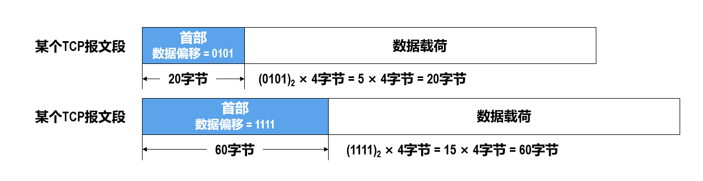

5. 保留

   占 6 位，保留为今后使用，但目前应置为 0。

6. 紧急位 URG

   当 URG=1 时，表明紧急指针字段有效。它告诉系统此报文段中有紧急数据，应尽快传送（相当于高优先级的数据）。紧急数据被插入到报文段数据的最前面，而在紧急数据后面的数据仍是普通数据，因此要与首部中的紧急指针字段配合使用。

7. ==确认位 ACK==

   仅**当 ACK=1 时确认号字段才有效**。当 ACK=0 时，确认号无效。

   TCP 规定，在**连接建立后所有传送的报文段都必须把 ACK 置 1**。

8. 推送位 PSH（Push）

   两个应用进程进行交互式通信时，都希望在键入一个命令后立即就能收到对方的响应，此时发送方 TCP 把 PSH 置 1，接收方 TCP 收到 PSH=1 的报文段后，就尽快交付给接收应用进程，而不再等到整个缓存都填满了后再向上交付。

9. 复位位 RST(Reset)

   当**RST=1 时**，表示 TCP 连接中出现严重差错（如主机崩溃等），**必须释放连接**，然后重新建立传输连接。此外，它还可用于拒绝一个非法的报文段。

10. **同步位 SYN**

当 SYN=1 时表示这是一个连接请求或连接接受报文。

当 SYN=1，ACK=0 时，表明这是一个连接请求报文，若对方同意建立连接，则应在响应报文中使用 SYN=1，ACK=1。

11. **终止位 FIN**(Finish)

    用来释放一个连接。当 FIN=1 时，表明**此报文段的发送方的数据已发送完毕**，并要求释放传输连接。

12. **窗口**

    占 2B，范围为 0 ～ 2^16^-1。

    窗口值告诉对方，从本报文段首部中的确认号算起，**接收方目前允许对方发送的数据量**（==以字节为单位==）。

    接收方的数据缓存空间是有限的，因此窗口值作为接收方让发送方设置其发送窗口的依据。

    例如，设确认号是 701，窗口字段是 1000。这表明，从 701 号算起，发送此报文段的一方还有接收 1000 字节数据（字节序号为 701 ～ 1700）的接收缓存空间。

13. 检验和

    占 2B。检验和字段**检验的范围包括首部和数据两部分**。

    在计算检验和时，和 UDP 一样，要在 TCP 报文段的前面加上 12B 的伪首部（只需将 UDP 伪首部的协议字段的 17 改成 6，UDP 长度字段改成 TCP 长度，其他的和 UDP 一样）。

    

14. 紧急指针

    占 2B。紧急指针仅在 URG=1 时才有意义，它指出本报文段中的紧急数据的字节数（紧急数据在报文段数据的最前面）。也就是说，使窗口为零也可以发送紧急数据。

15. 选项

    长度可变，最长可达 40B。

    当不使用选项时，TCP 首部长度是 20B。TCP 最初只规定了一种选项，即最大报文段长度（MaximumSegmentSize，MSS）。MSS 是 TCP 报文段中的数据字段的最大长度（注意仅仅是数据字段）。

16. 填充

    这是为了使整个首部长度是 4B 的整数倍。

## 连接管理

TCP 是面向连接的协议，因此每个 TCP 连接都有三个阶段：**连接建立、数据传送和连接释放**。

TCP 连接的管理就是使运输连接的建立和释放都能正常进行。

TCP 把连接作为最基本的抽象，每条 TCP 连接有两个端点，TCP 连接的端点不是主机，不是主机的 IP 地址，不是应用进程，也不是传输层的协议端口。TCP 连接的端口即为套接字，每一条 TCP 连接唯一地被通信的两个端点（即两个套接字）所确定。

==同一个 IP 地址可以有多个不同的 TCP 连接==，而==同一个端口号也可以出现在多个不同的 TCP 连接中==。

TCP 连接的建立采用客户/服务器模式。主动发起连接建立的应用进程称为客户(Client)，而被动等待连接建立的应用进程称为服务器(Server)。

### 连接的建立(三次握手)

连接的建立经历以下 3 个步骤，通常称为“==三次握手==”。

“三报文握手”建立 TCP 连接的目的在于解决以下三个主要问题：

- 使 TCP 双方能够确知对方的存在。
- 使 TCP 双方能够协商一些参数。
- 使 TCP 双方能够对运输实体资源进行分配和初始化。

连接建立前，服务器处于 LISTEN（收听）状态，等待客户的连接请求。


1. 客户机的 TCP 首先向服务器的 TCP 发送连接请求报文段。这个报文段的首部中的同步位 SYN=1，同时选择一个初始序号 seq=x。

   TCP 规定，==SYN 报文段不能携带数据，但要消耗掉一个序号==。这时，客户机进入 SYN-SENT（同步已发送）状态。

2. 服务器的 TCP 收到连接请求报文段后，如同意建立连接，则向客户机发回确认，并为该 TCP 连接分配缓存和变量。

   在确认报文段中，把 SYN 位和 ACK 位都置 1，确认号是 ack=x+1，同时也为自已选择一个初始序号 seq=y。

   ==确认报文段不能携带数据，但也要消耗掉一个序号==。这时，服务器进入 SYN-RCVD（同步收到）状态。

3. 当客户机收到确认报文段后，还要向服务器给出确认，并为该 TCP 连接分配缓存和变量。

   确认报文段的 ACK 位置 1，确认号 ack=y+1，序号 seq=x+1。==该报文段可以携带数据，若不携带数据则不消耗序号==。

   这时，客户机进入 ESTABLISHED（已建立连接）状态。当服务器收到来自客户机的确认后，也进入 ESTABLISHED 状态。

成功进行以上三步后，就建立了 TCP 连接，接下来就可以传送应用层数据。**TCP 提供的是全双工通信**，因此通信双方的应用进程在任何时候都能发送数据。

---

**不采用“两次握手”建立连接**主要是为了**防止两次握手情况下已失效的连接请求报文段突然又传送到服务器而产生错误**。

客户 A 向服务器 B 发出 TCP 连接请求，第一个连接请求报文在网络的某个结点长时间滞留，A 超时后认为报文丢失，于是再重传一次连接请求，B 收到后建立连接。数据传输完毕后双方断开连接。而此时，前一个滞留在网络中的连接请求到达服务器 B，而 B 认为 A 又发来连接请求。此时，

- 若使用“三次握手”，则 B 向 A 返回确认报文段，因为是一个失效的请求，所以 A 不予理睬，建立连接失败。
- 若采用的是“两次握手”，则这种情况下 B 认为传输连接已经建立，并一直等待 A 传输数据，而 A 此时并无连接请求，因此不予理睬，这样就造成了 B 的资源白白浪费。

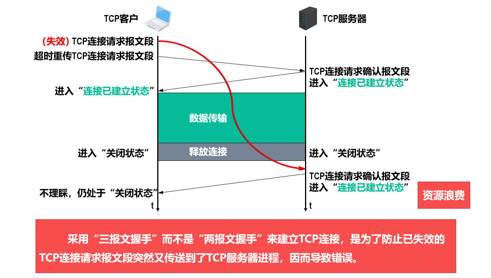

### 连接的释放(四次挥手)

与 TCP 连接的==两个进程中的任何一个都能终止该连接==。TCP 连接释放的过程通常称为“==四次挥手==”。


1. 客户机打算关闭连接时，向其 TCP 发送连接释放报文段，并停止发送数据，主动关闭 TCP 连接，该报文段的终止位 FIN=1，序号 seq=u，它等于前面已传送过的数据的最后一个字节的序号加 1，FIN 报文段即使不携带数据，也要消耗掉一个序号。

   这时，客户机进入 FIN-WAIT-1（终止等待 1）状态。

   TCP 是全双工的，即可以想象为一条 TCP 连接上有两条数据通路，发送 FIN 的一端不能再发送数据，即关闭了其中一条数据通路，但对方还可以发送数据。

2. 服务器收到连接释放报文段后即发出确认，确认号 ack=u+1，序号 seq=v，等于它前面已传送过的数据的最后一个字节的序号加 1。然后服务器进入 CLOSE-WAIT（关闭等待）状态。

   ==此时，从客户机到服务器这个方向的连接就释放了==，TCP 连接处于半关闭状态。但**服务器若发送数据，客户机仍要接收**，即从服务器到客户机这个方向的连接并未关闭。

   客户机收到来自服务器的确认后，进入 FIN-WAIT-2（终止等待 2）状态，等待服务器发出的连接释放报文段。

3. 若服务器已经没有要向客户机发送的数据，就通知 TCP 释放连接，此时，其发出 FIN=1 的连接释放报文段。

   设该报文段的序号为 w（处于半关闭状态的服务器可能又发送了一些数据），还必须重复发送上次已发送的确认号 ack=u+1。这时服务器进入 LAST-ACK（最后确认）状态。

4. 客户机收到连接释放报文段后，必须发出确认，之后进入 TIME-WAIT（时间等待）状态。该报文段的确认位 ACK 置 1，确认号 ack=w+1，序号 seq=u+1。

   服务器收到该确认报文段后就进入 CLOSED（连接关闭）状态。客户机进入 TIME-WAIT 状态后，还要经过时间等待计时器设置的时间 2MSL（Maximum Segment Lifetime，最长报文段寿命）后，才进入 CLOSED 状态。

若服务器收到连接释放请求后不再发送数据，则从**客户机发出 FIN 报文段时刻算起**，==客户机释放连接的最短时间为 1 RTT + 2 MSL==，==服务器释放连接的最短时间为 1.5 RTT==。


---

除时间等待计时器外，TCP 还设有一个保活计时器。设想 TCP 双方已建立连接，但后来客户主机突然出现故障。显然，服务器以后就不能再收到客户发来的数据。因此，应当有措施使服务器不要再白白等待下去，这个问题就可以使用保活计时器来解决。


## 流量控制

流量控制的功能就是==让发送方的发送速率不要太快==，以便让接收方来得及接收，因此可以说流量控制是一个速度匹配服务（匹配发送方的发送速率与接收方的读取速率）。

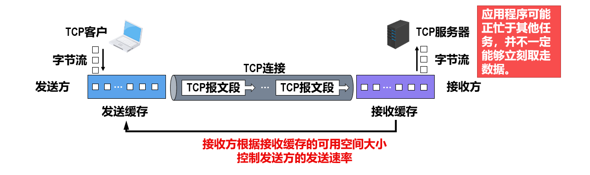

TCP 利用==滑动窗口机制==**来实现流量控制**。TCP 要求发送方维持一个**接收窗口(rwnd)**，接收方根据当前接收缓存的大小，动态地调整接收窗口的大小，其大小反映了接收方的容量。接收方将其放在 TCP 报文段首部中的“窗口”字段，以通知发送方。

发送方的发送窗口不能超过接收方给出的接收窗口值，以限制发送方向网络注入报文的速率。

假设数据只从 A 发往 B，而 B 仅向 A 发送确认报文段，则 B 可通过设置确认报文段首部中的窗口字段来将 rwnd 通知给 A。接收方允许连续接收的能力，**单位是字节**。


发送方 A==总是根据最新收到的 rwnd 值来限制自已发送窗口的大小==，从而将未确认的数据量控制在 rwnd 大小之内，保证 A 不会使 B 的接收缓存溢出。

设 A 向 B 发送数据，在连接建立时，B 告诉 A：“我的接收窗口 rwnd=400”。接收方 B 进行了三次流量控制，这三个报文段都设置了 ACK=1，只有在 ACK=1 时确认号字段才有意义。第一次把窗口减到 rwnd=300，第二次又减到 rwnd=100，最后减到 rwnd=0，即不充许发送方再发送数据。这使得发送方暂停发送的状态将持续到 B 重新发出一个新的窗口值为止。

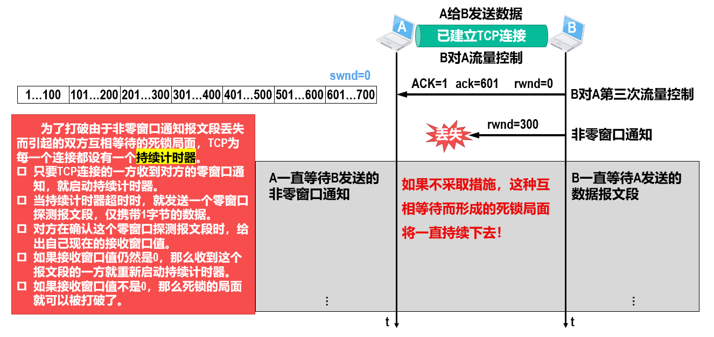

TCP 为每个连接设有一个**持续计时器**，只要发送方收到对方的零窗口通知，就启动持续计时器。若计时器超时，就发送一个零窗口探测报文段，而对方就在确认这个探测报文段时给出现在的窗口值。若窗口仍然为零，则发送方收到确认报文段后就重新设置持续计时器。


传输层和数据链路层的流量控制的区别是：

- 传输层实现的是端到端，即两个进程之间的流量控制。传输层的滑动窗口协议的窗口大小则可以动态变化。
- 数据链路层实现的是两个中间的相邻结点之间的流量控制。此外，数据链路层的滑动窗口协议的窗口大小不能动态变化。

## 拥塞控制

### 拥塞

在某段时间，若**对网络中某一资源的需求超过了该资源所能提供的可用部分，网络性能就要变坏**，这种情况就叫作==拥塞==。

::: info

拥塞现象是指到达通信子网中某一部分的**分组数量过多**，使得该部分**网络来不及处理**，以致这部分乃至整个网络性能下降的现象，严重时甚至导致网络通信业务陷入停顿，即出现死锁现象。

:::

判断网络是否进入拥塞状态的方法是，**观察网络的吞吐量与网络负载的关系**：

- 若随着网络负载的增加，网络的**吞吐量明显小于正常的吞吐量**，则网络就可能已**进入轻度拥塞状态**；
- 若网络的**吞吐量随着网络负载的增大而下降**，则网络就可能已**进入拥塞状态**。

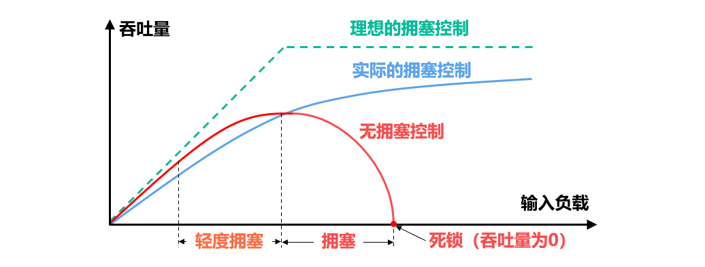

### 拥塞控制

==拥塞控制==是指**防止过多的数据注入网络，保证网络中的路由器或链路不致过载**。出现拥塞时，端点并不了解拥塞发生的细节，**对通信的端点来说，拥塞往往表现为通信时延的增加**。

拥塞控制主要解决的问题是如何获取网络中发生拥塞的信息，从而利用这些信息进行控制，以避免因拥塞而出现分组的丢失。

::: tip 拥塞控制与流量控制的区别

- **拥塞控制**是让网络能够承受现有的网络负荷，是一个==全局性的过程==，**涉及所有的主机、所有的路由器**，以及与**降低网络传输性能有关的所有因素**。

  

- **流量控制**往往是指点对点的通信量的控制，是个==端到端的问题==（**接收端控制发送端**），它所要做的是**抑制发送端发送数据的速率**，以便使接收端来得及接收。

  


拥塞控制和流量控制也有相似的地方，即它们==都通过控制发送方发送数据的速率来达到控制效果==。

:::

拥塞控制的方法有两种：

1. **开环控制**

   在设计网络时事先将有关发生拥塞的因素考虑周到，力求网络在工作时不产生拥塞。

   这是一种静态的预防方法。一旦整个系统启动并运行，中途就不再需要修改。

   **当网络的流量特征可以准确规定且性能要求可以事先获得时，适合使用开环控制**。

2. **闭环控制**

   事先不考虑有关发生拥塞的各种因素，采用监测网络系统去监视，及时检测哪里发生了拥塞，然后将拥塞信息传到合适的地方，以便调整网络系统的运行，并解决出现的问题。

   闭环控制是基于反馈环路的概念，是一种动态的方法。

   **当网络的流量特征不能准确描述或者当网络不提供资源预留时，适合使用闭环控制**。**因特网采用的就是闭环控制方法**。

::: info 介绍

> 王道书上没有


:::

### TCP 拥塞控制方法

可靠传输 TCP 进行拥塞控制的算法有四种：==慢开始==、==拥塞避免==、==快重传==和==快恢复==。

发送方在确定发送报文段的速率时，既要考虑接收方的接收能力，又要从全局考虑不要使网络发生拥塞。因此，除了接收窗口，TCP 还要求**发送方**维持一个==拥塞窗口(cwnd)==，其**大小取决于网络的拥塞程度**，并且**动态地变化**。

**发送方控制拥塞窗口的原则**：只要网络未出现拥塞，拥塞窗口就再增大一些，以便把更多的分组发送出去，以提高网络的利用率。但只要网络出现拥塞，拥塞窗口就减小一些，以减少注入到网络的分组数，以缓解网络出现的拥塞。

::: tip 判断网络出现拥塞的依据

没有按时收到应当到达的 TCP 确认报文段而产生了超时重传。

:::

**发送窗口的上限值**应取**接收窗口**rwnd 和**拥塞窗口**cwnd 中**较小的一个**，即

```math
 \text{发送窗口的上限值}=min[rwnd,cwnd]
```


> 假设：
>
> - 数据为单方向传送，对方只传送确认报文；
> - 接收方总是有足够大的缓存空间，因而发送窗口的大小由网络的拥塞程度决定，也就是不考虑接收方对发送方的流量控制。。
> - 以 TCP==最大报文段长度 MSS==（即**TCP 报文段的数据载荷部分**）的个数作为讨论问题的单位，而不是以字节为单位（尽管 TCP 是面向字节流的）。

#### 慢开始-拥塞避免

::: info ssthresh 闽值

为了**防止 cwnd 增长过大而引起网络拥塞**，还需要设置一个慢开始门限==ssthresh==（闽值）。这样，当慢开始一直把 cwnd 增大到一个规定的 ssthresh 时，然后改用拥塞避免算法。


:::

==慢开始算法==的思路是当发送方刚开始发送数据时，因为并不清楚网络的负荷情况，若立即把大量数据注入网络，则有可能引发网络拥塞。因此**先发送少量数据探测一下，若没有发生拥塞，则适当增大拥塞窗口，即由小到大逐渐增大拥塞窗口**（即发送窗口）。

使用慢开始算法后，每经过一个传输轮次（即往返时延 RTT），==cwnd 就会加倍==，即 cwnd 的值随传输轮次指数增长。


慢开始的“慢”并不是指拥塞窗口 cwnd 的增长速率慢，而是指在 TCP 开始发送报文段时先设置 cwnd=1，使得发送方一开始向网络注入的报文段少（目的是试探一下网络的拥塞情况），然后逐渐增大 cwnd，这对防止网络出现拥塞是一个非常有力的措施。

---

==拥塞避免算法==的思路是==让拥塞窗口 cwnd 缓慢增大==，县体做法是：**每经过一个往返时延 RTT 就把发送方的拥塞窗口 cwnd**==加 1==，而不是加倍，使拥塞窗口 cwnd**按线性规律缓慢增长**，这比慢开始算法的拥塞窗口增长速率要缓慢得多。

“拥塞避免”也==并非指完全能够避免拥塞==，而是指在拥塞避免阶段将 cwnd 值控制为按线性规律增长，**使网络比较不容易出现拥塞**。


无论**在慢开始阶段还是在拥塞避免阶段**，只要发送方判断**网络出现拥塞**==（未按时收到确认）==

1. 首先把慢开始门限==ssthresh 设置为出现拥塞时的发送方的 cwnd 值的一半==（但**不能小于 2**）
2. 然后把拥塞窗口==cwnd 重新设置为 1==，==执行慢开始算法==。这样做的目的是迅速减少主机发送到网络中的分组数，使得发生拥塞的路由器有足够时间把队列中积压的分组处理完。


#### 快重传-快恢复

有时个别报文段会在网络中丢失，但实际上网络并未发生拥塞。若发送方迟迟收不到确认，就会产生超时，并误认为网络发生了拥塞，这就导致发送方错误地启动慢开始算法，从而降低传输效率。

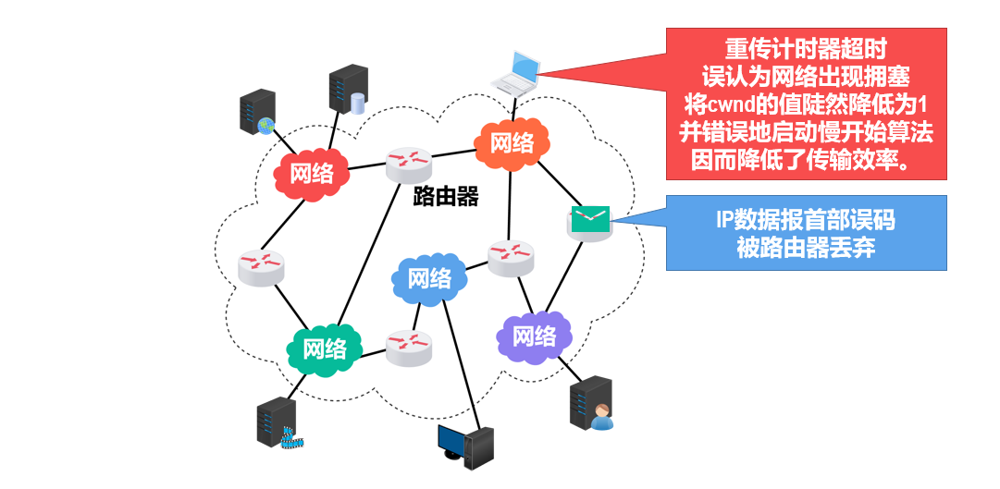

采用==快重传算法可以让发送方尽早知道发生了个别报文段的丢失==。

==快重传算法==是**使发送方尽快（尽早）进行重传，而不等超时计时器超时再重传**。这就要求：

- 接收方不要等待自已发送数据时才进行销带确认，而要立即发送确认，即使==收到了失序的报文段也要立即发出对已收到报文段的重复确认==。
- 发送方一旦连==续收到 3 个余 ACK==（即重复确认），就立即重传相应的报文段，而不等该报文段的超时计时器超时再重传。


::: tip

TCP 规定每当比期望序号大的失序报文段到达时，就发送一个冗余 ACK，指明下一个期待字节的序号。

:::

---

==快恢复算法==的原理如下：当**发送方连续收到 3 个冗余 ACK（重复确认）时**，把慢开始门限==ssthresh 调整为当前 cwnd 的一半==（为了预防网络发生拥塞）。但此时发送方知道现在只是丢失了个别的报文段，于是不启动慢开始算法，而是==执行快恢复算法==。

::: tip

因为跳过了拥塞窗口 cwnd 从 1 起始的慢开始过程，所以被称为快恢复。

:::


#### 总流程

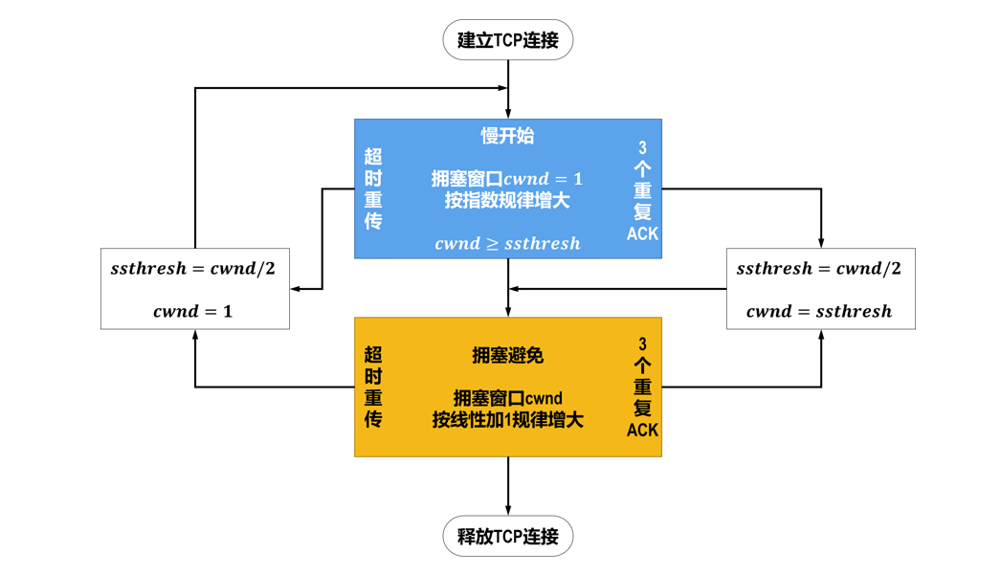

接收方的缓存空间总是有限的。因此，发送方发送窗口的大小由流量控制和拥塞控制共同决定。

::: tip 注意

当题目中同时出现接收窗口(rwnd)和拥塞窗口(cwnd)时，发送方发送窗口的实际大小是由 rwnd 和 cwnd 中较小的那一个确定的。

:::


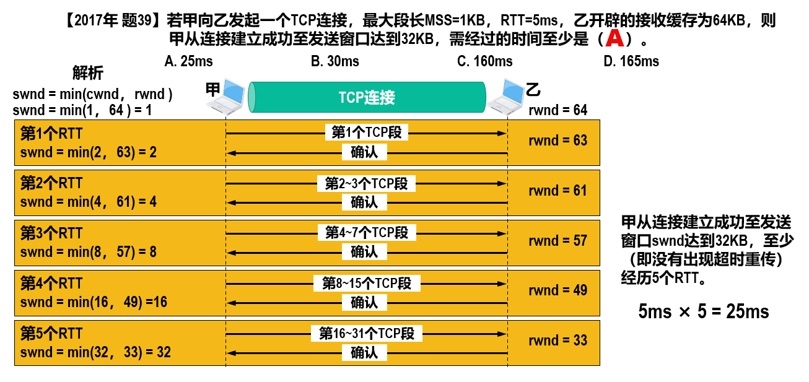

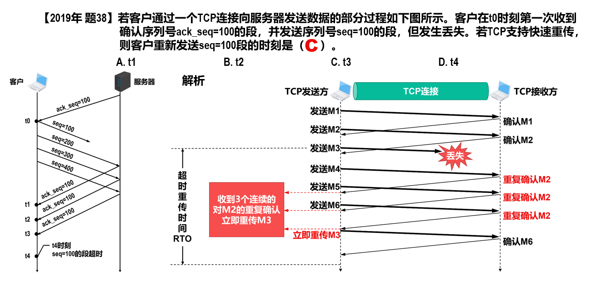


### TCP 拥塞控制与网际层拥塞控制的关系\*


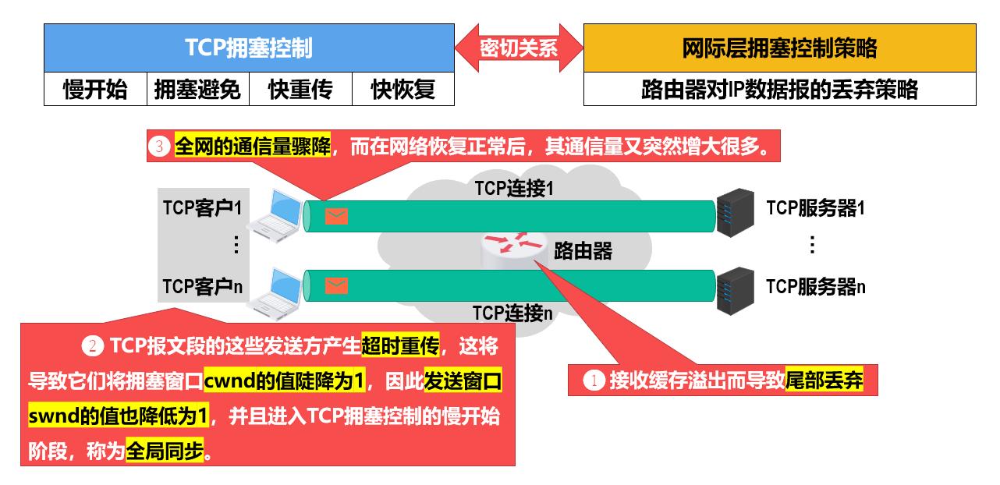

## 可靠传输

TCP 在不可靠的 IP 层之上建立一种可靠数据传输服务。

TCP 提供的可靠数据传输服务保证接收方从缓存区读出的字节流与发送方发出的字节流完全一样。TCP 使用了检验、序号、确认和重传等机制来达到这一目的。其中，TCP 的检验机制与 UDP 一样。

### 序号和确认

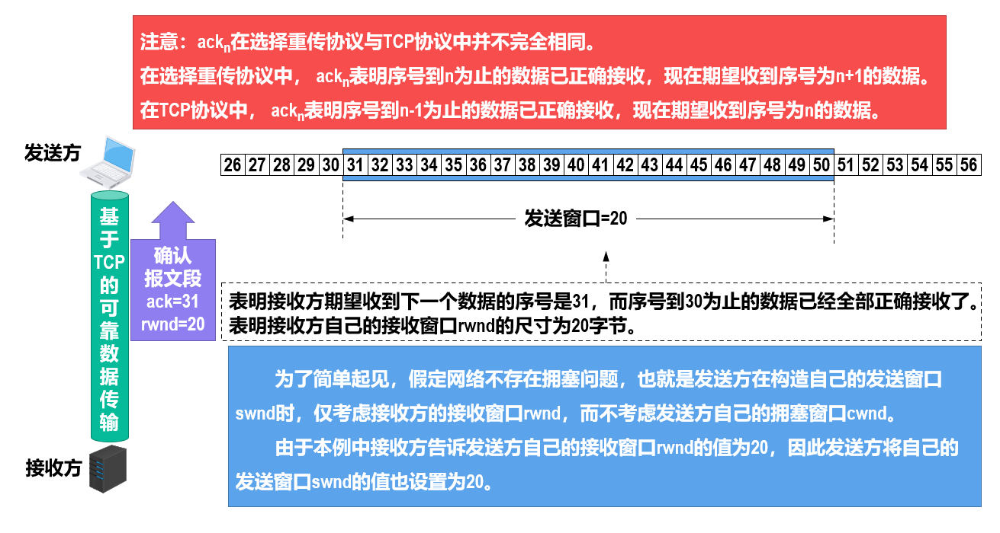


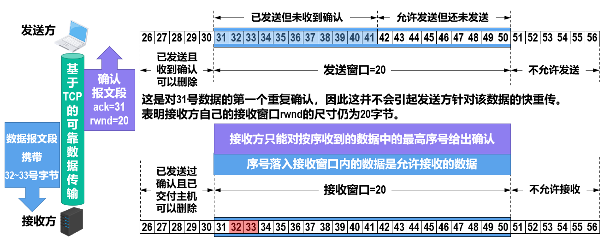


### 重传

有两种事件会导致 TCP 对报文段进行重传：==超时==和==冗余 ACK==。

---

TCP==每发送一个报文段，就对这个报文段设置一个超时计时器==。计时器设置的重传时间到期但还未收到确认时，就要重传这一报文段。

因为 TCP 的下层是互联网环境，IP 数据报所选择的路由变化很大，所以传输层的往返时延的方差也很大。为了计算超时计时器的重传时间，TCP 采用一种自适应算法，它记录一个报文段发出的时间，以及收到相应确认的时间，这两个时间之差称为报文段的**往返时间(Round-TripTime, RTT)**。TCP 维护了 RTT 的一个==加权平均往返时间 RTTS==，它会随新测量 RTT 样本值的变化而变化。

显然，超时计时器设置的**超时重传时间(RetransmissionTime-Out，RTO)**应==略大于 RTTS==，但也不能大太多，否则当报文段丢失时，TCP 不能很快重传，导致数据传输时延大。

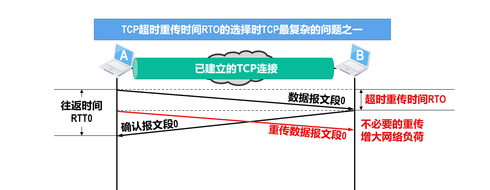

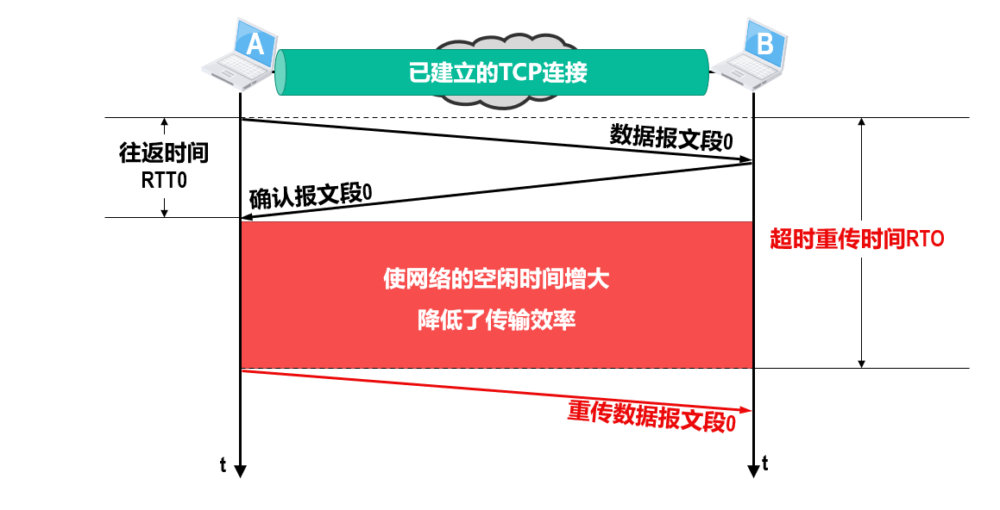

---

超时触发重传存在的一个问题是超时周期往往太长。所幸的是，发送方通常可在超时事件发生之前通过注意所谓的冗余 ACK 来较好地检测丢包情况。

冗余 ACK 就是再次确认某个报文段的 ACK，而发送方先前已经收到过该报文段的确认。TCP 规定当发送方收到对同一个报文段的 3 个余 ACK 时，就可以认为跟在这个被确认报文段之后的报文段已经丢失。

例如，发送方 A 发送了序号为 1、2、3、4、5 的 TCP 报文段，其中 2 号报文段在链路中丢失，它无法到达接收方 B。因此 3、4、5 号报文段对于 B 来说就成了失序报文段，但它们不是 B 所期望收到的下一个报文段，于是 B 就发送 3 个对 1 号报文段的冗余 ACK，表示自己期望接收 2 号报文段。当 A 收到对于 1 号报文段的 3 个见余 ACK 时，认为 2 号报文段已经丢失，这时发送方 A 可以立即对 2 号报文段执行重传，这种技术通常称为快速重传。

当然，冗余 ACK 还被用在拥塞控制中。

## Q&A

> TCP 使用的是回退 N 帧协议 GBN 还是选择重传
>
> TCP 使用累积确认，这看起来像是 GBN 的风格。但是，正确收到但失序的报文并不会丢弃，而是缓存起来，并且发送余 ACK 指明期望收到的下一个报文段，这是 TCP 方式和 GBN 的显著区别。
>
> 例如，A 发送了 N 个报文段，其中第 k 个报文段丢失，其余 N-1 个报文段正确地按序到达接收方 B。
>
> - 使用 GBN 时，A 需要重传分组 k，以及所有后继分组 k+1,k+2,,N。相反，TCP 却至多重传一个报文段，即报文段 k。
> - 另外，TCP 中提供一个 SACK(Selective ACK)选项，即选择确认选项。使用选择确认选项时，TCP 看起来就和 SR 非常相似。因此，TCP 的差错恢复机制可视为 GBN 和 SR 协议的混合体。

> 假定在一个互联网中，所有链路的传输都不出现差错，所有结点也都不会发生故障。在这种情况下，TCP 的“可靠交付”功能仍然不是多余的。
>
> 在以下的情况下，TCP 的“可靠交付”功能是必不可少的：
>
> 1. 每个 IP 数据报独立地选择路由，因此在到达目的主机时有可能出现**失序**。
> 2. 由于路由选择的计算出现错误，导致 IP 数据报在互联网中转圈。最后数据报首部中的**生存时间的数值下降到零**。这个数据报在中途就**被丢失**。
> 3. 某个路由器突然**出现很大的通信量**，以致路由器来不及处理到达的数据报。因此有的**数据报被丢弃**。

# UDP 和 TCP 对比


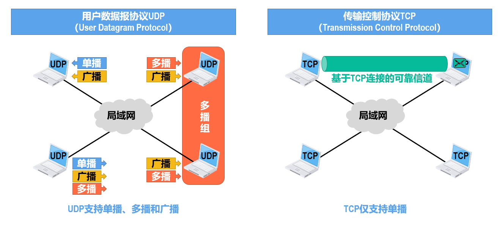

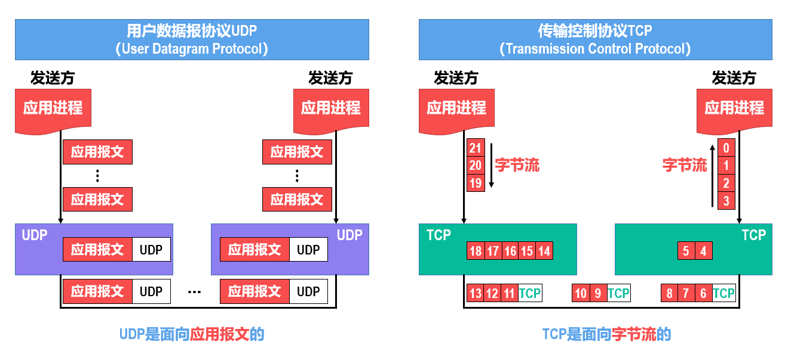


